[toc]

# 感悟

对待任何事情，要有且行且珍惜的态度。

发呆时想起小鸟游六花 / 大户爱以及 friends，顿时很高兴。
🥰

看完四叠半神话大系，意识到总是在心中放一个犹犹豫豫的假想敌，想到了就去做。时刻保持头脑清醒。

your idea is worth nothing without implementation.

想起第一次玩骑马与砍杀，在练习场转圈，如今仍是觉得惊艳。

### 聊天

游戏

为爱好花钱

在忙的时候太希望放弃社交，闲的时候又翻遍列表想找人聊天，可惜忙的日子太多，闲的日子在替忙着急。

### 理论与实操

Theory is when you know everything but nothing works. Practice is when everything works but no one knows why. In the industrial, theory and practice are combined: nothing works and no one knows why.

### 思辨与立场

培养思辨思维--看清事物的关键和本质。
思考，是对大脑输入的深化处理；辨析，是对深入处理后信息的辨别能力。
首先要学会独立思考
从多方面、多角度去评价事、物、人。

深学笃信，精思细悟，知行合一。

广泛涉猎，胸中有墨，下笔成章。

### 为甚么宗教之间会有战争

### 为什么爱情在文学作品中如此重要？

### 大学生出路分化 处于弱势之人

家庭社会经济地位
城乡
地域
父母教育水平

# 关于地理学科的思考

地理学作为显学

5 月在桂林听了关于传染病地理计算的讲座，深感地理必须依附于其他学科发挥作用。

### 中国地图常见的几个问题

中国四至点：
最北端：黑龙江主航道中心点
最东端：黑瞎子岛
最西端：帕米尔高原
最南端：曾母暗沙

藏南地区

### 游戏地图

**7 要素**
时间
地点
人物
事物
事件
现象
场景

相较于工业领域的 数字孪生 ， 地图学的信息空间更像一个对地理环境、社会人文的模拟系统。

**游戏地图虚实结合方式**

- **游戏底图**
  鹰眼地图或环境地图
- **场景地图**

**地点**

- **以实映虚**
- **半虚半实**
- **皆虚类实**

**时间**

### 《当我们谈论“类银河恶魔城”时，我们在谈论什么》

https://mp.weixin.qq.com/s/_BlKcv_5kF3fzvcgEonqjg

**地图设计：箱庭理论**
在有限的场景内借助场景差异、道具变化、数值等理念来拓展和延伸场景的“空间”，进而提升玩家的整体代入感。

“营造数值干”
“和谐感”
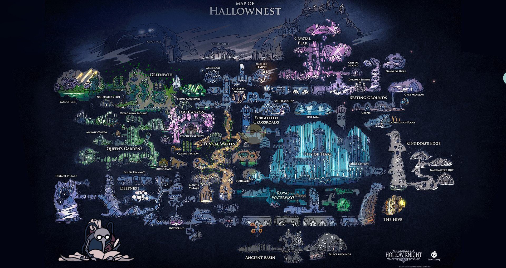

如何安放“契诃夫之枪”问题

对类银河城游戏而言，良好的交互和玩家体验应当是把控地图设计的核心。

在魂游或是类银河恶魔城游戏当中，BOSS 的形象不单单是由玩家直面它的外形构成的。大量的外部碎片化叙事，残存在地图各个角落的零散信息，包括整体关卡的构成、舞台的搭建才能够让 BOSS 的形象足具备张弛力度。这并非是单纯的形象塑造，而是完整且不间断的演绎过程。就比如法环中的初始之王——葛孚雷这一 BOSS，构成他的不仅仅是青筋暴起的夸张的肌肉和那柄硕大的战斧，整个王城罗德尔的一草一木，每一个散落的细节都在为这位曾经的艾尔登之王的登台做铺垫，形象塑造则充当的是“建好摩天大楼的最后一片瓦”这样的作用。

## 关于数字孪生的思考

**业务管理的新视角**
传统信息系统管理基于二维平台交互和显示。

- 虽 GIS 可有效解决空间定位，却无法解决空间高度定位问题。
- GIS 系统基于俯视图视角，不基于人眼习惯。
- 隐蔽工程难呈现空间位置。

**资源组织新方式**

**数字孪生离去 unity 和 ue 还要多久**
技术路线：

- 基于 cesium 的 webgl
- 基于 ue 的游戏引擎技术路线

开源也要看协议

观看了无人机实时指挥平台后，思考数字孪生是否走错了路线

### 《人机融合智能与数字孪生城市研究现状与发展趋势》

### 站在 2023 年审视 GIS 行业

### cesium 的未来思考

- 人工智能和机器学习的发展，使能生成更加丰富的语义元数据；
- 跨行业的时空 3D 地理空间数据使用需求；
- 建模和 仿真领域从仿真模型到实景模型的转变；
- 空间可视化分析逐步开始使用一个通用的空间数据结构；
- 矢量图层叠加 3D 模型的使用需求；
- 围绕 glTF 的开放生态的成长；

3D Tiles 未来：

- 通过扩展 Batch Table 概念提高要素元数据集成的颗粒度；

### 警用 GIS

GIS 公司对公安系统以人工智能/物联网为核心的海量数据处理能力不够，认识深度不够。

### 下一个十年-WebGL 和 WebGPU 的思考

webGPU 从设计上相比 webgl 的优点：

- promise API/async + await 的异步语法加入：对网络数据加载 / 解码等同步耗时操作有更好的支持 ， 一定程度上避免回调地狱问题 。
- 不再使用全局状态机制 ： 使用指令缓冲节约 CPU 到 GPU 之间的信息传递成本。
  （WebGL 切换某个状态如纹理 / 着色器就是在切换全局状态对象）
- 原生支持计算管线 / 计算着色器 ：WebGL 磨蹭实现的 GPU 并行计算功能直接提供出来 ， 并与渲染管线地位对等。

### 基于城市天际线对 GIS 高精地图的思考

玩过城市天际线以后发现，叠加车道对解决拥堵毫无意义，
在算法的加持下， 插队对单一车辆的虚高效被宏观的展现为集中堵在一条车道下 ，

所以最好的方案 我认为仍然是 特斯拉的纯视觉辅助方案

所谓高精地图在城市快速路和高速路已经基本成为了车企的标配了，
目前只是城市区域去高精 ，
所谓去高精不是不用高精地图，
而是把高精地图部分信息附加在导航地图上，
形成 SD+ 地图， 标高精地图，
图商仍然能在其中分一杯羹。

## 理科与文科的共情论
经济基础决定上层建筑

在近代 200 多年的历史里， 理科为自己找到了在资产阶级社会的生存途径：“变现、创造价值”。

作为近现代社会的自由七艺不需要考虑养家糊口的人所追求的东西。

随着大革命，务实的市民伦理崛起。

实际意义成为了大多数人眼中一门学问有无价值、是否应该存在的唯一标准。

# 电影

### 决战之后

备左右寡，备前后寡，处处皆备，则处处寡之。

只有人民，才是创造历史的动力。

历史有时只有回过头来，才能看得清楚。

他的罪恶，不是一种个人行为，而是一个集团，一个阶级的产物。

在很多历史或政治中引用的“阶级”意指“具有不同身份，不同地位、财富等，不同意识形态的多个社会性群体”，通常不同阶级之间都存在压迫与被压迫的不平等关系。对于阶级的大部分学说，都是建立在认为社会存在着分裂和对立的集团，并且集团之间的对立使社会处于持久的冲突之中。指这样一些集团，这些集团在历史上一定社会生产体系中所处的地位不同，对生产资料的关系（这种关系大部分是在法律上明文规定了的）不同，在社会劳动组织中所起的作用不同，因而领得自己所支配的那份社会财富的方式和多寡也不同。
马克思主义对阶级最经典的定义来自弗拉基米尔·伊里奇·列宁：“所谓阶级，就是这样一些大的集团，在社会劳动组织中所起的作用不同，因而领得自己所支配的那份社会财富的方式和数量也不同。所谓阶级，就是这样一些集团，由于它们在一定社会经济结构中所处的地位不同，**其中一个集团能够占有另一个集团的劳动**。

### 杀人回忆

工业化作为现代化的核心内容，不能狭隘的等同于工业发展，与之相配套的还有社会的转型和适应。

## 动漫

**四叠半神话大系**
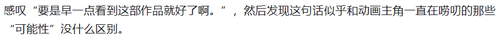

# 计算机

### 语言设计

### 系统架构

系统架构经历了**单体应用架构—垂直应用架构—分布式架构—SOA 架构—微服务架构”yanbian .**

#### 单体应用架构

**将所有的模块写到一个 Web 项目中，再统一部署到一个 Web 服务器中** ，**这就是\*\***单体应用架构\*\*

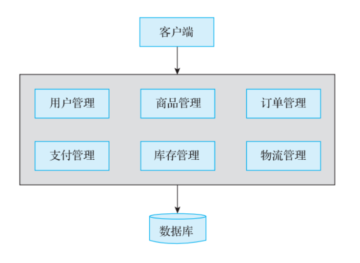

#### 垂直式

**垂直应用架构\*\***就是将原来的项目应用拆分为互不相干的几个应用，以此提升系统的整体性能。\*\*

同样以电商系统为例，在垂直应用架构下，我们可以将整个电商项目拆分为电商交易系统、后台管理系统、数据分析系统

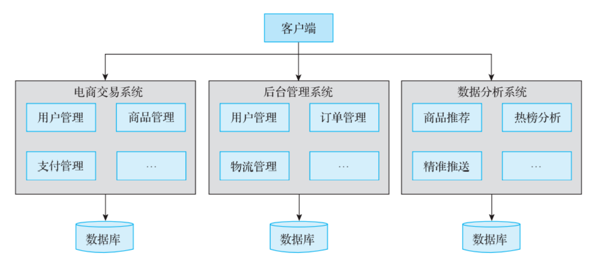

#### 分布式

**将重复的代码抽象出来，形成统一的服务，供其他系统或者业务模块调用，这就是\*\***分布式架\***\*构**

将系统整体拆分为服务层和表现层。服务层封装了具体的业务逻辑供表现层调用，表现层则负责处理与页面的交互操作。

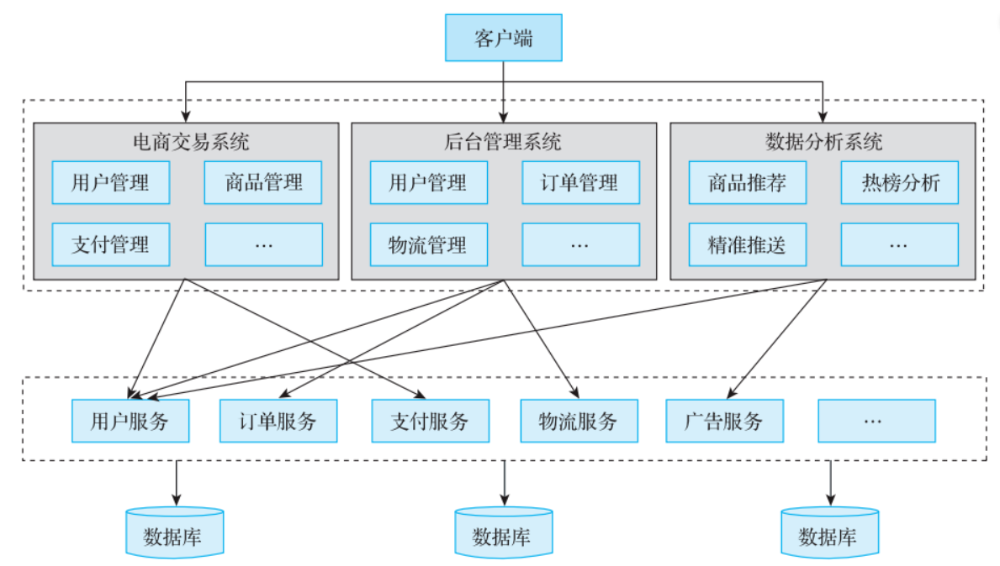

#### 面向服务架构

**增加一个统一的调度中心对集群进行实时管理，这就是** **SOA（面向服务）架构** 。

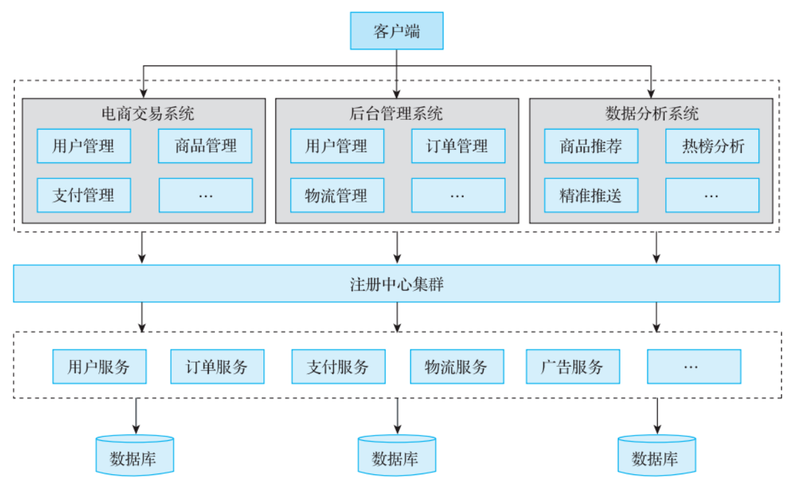

# 文学

### 俄

**普希金/*2**
假如生活欺骗了你，
不要悲伤，不要心急！
忧郁的日子需要镇静，
相信吧，快乐的日子将会来临。

心儿永远向往着未来，
现在却常是忧郁，
一切都是瞬息，
一切都将会过去；
而那过去了的，
就会成为亲切的怀念。

《小鸟》
在遥远的异乡我恪守着
见乡的古老风气
在明媚的春天节日
我放生了一只小鸟
我的心中觉得无限欣慰
为什么还要对上帝唠叨
当我能把自由当礼物
哪怕只送给一个生灵也好

### 强风吹拂

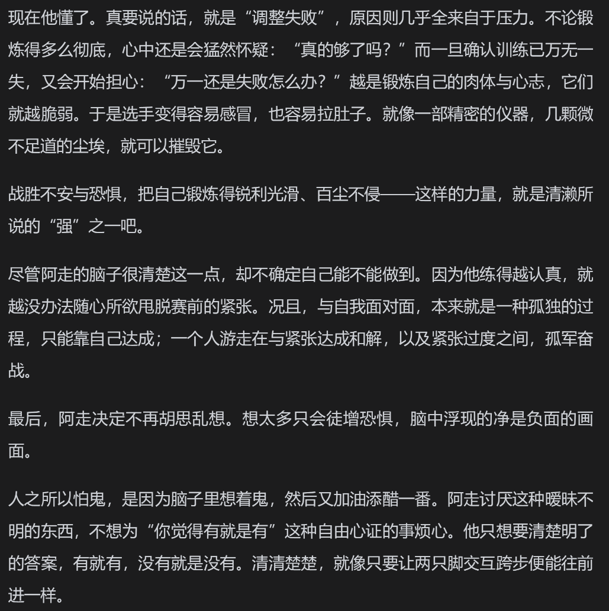

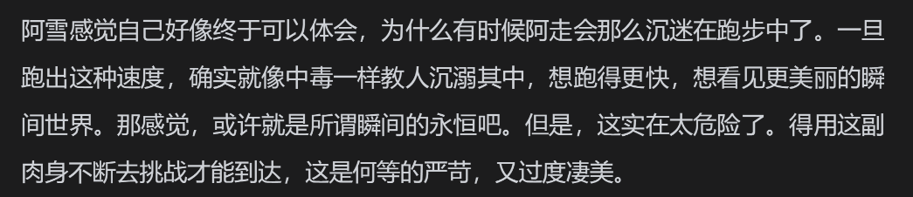

### 基督山伯爵

罗伯斯庇尔

### 近现代

- 徐志摩

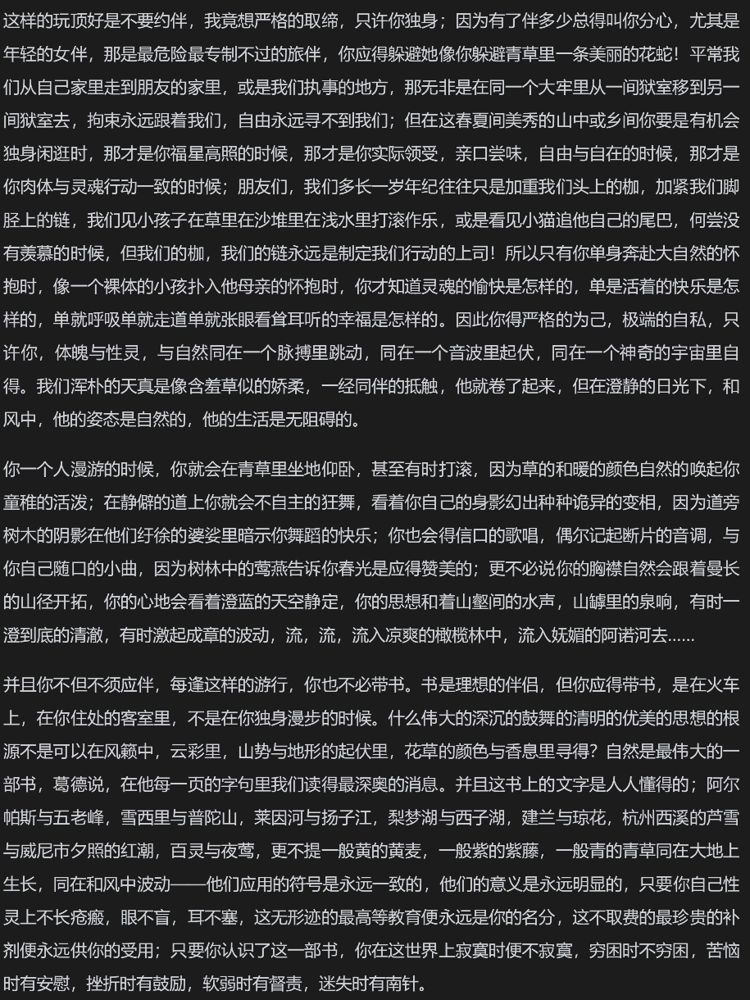

# 论文写作

科技论文特点
创新型——内容/材料/研究方法
科学性——对照组/统计学
理论性——逻辑论证和分析说明
可读和规范性

论文写作前
选题
文献检索管理
文献阅读和综述
课题研究

## 论文检索于管理

web of science 文摘下载
sci-hub 全文下载
researchgate

NOT > AND > OR

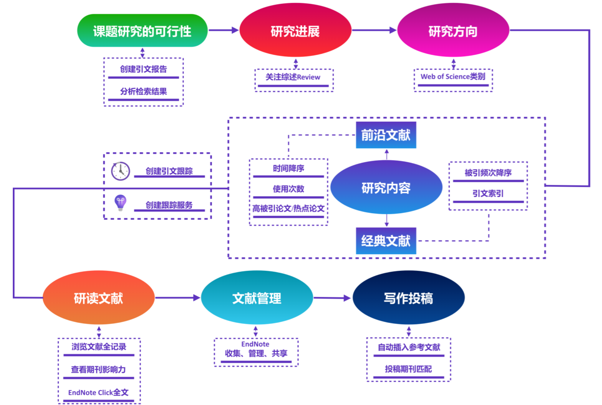

- ? $

### 论文写作顺序

结果-》

**结果和材料一一对应，引言和结果材料讨论一一对应**

## 查询行业规范

查询有效规范
www.biaozhun.org

**工标网**
查询所有规范
www.csres.com

**看过电影**
决战之后
海街日记
两杆大烟枪
首尔之春
杀人回忆

**动画**
万神殿
奇蛋物语
蓝眼武士
中二病
龙与虎
拾荒者统治
佐贺偶像是传奇 1 / 2
魔法少女小圆
恶魔人
更衣室人偶
四叠半 / 春宵苦短

月之暗面

**待看**

攻壳机动队

松本大洋-乒乓

# 乐理

### 钢琴

一组 7 个白键，5 个黑键。

半音
E-F B-C
全音
中间隔了一个键

升 C 降 D
C# Db

重升 / 重降
升或降两个半音

大字组 / 小字组
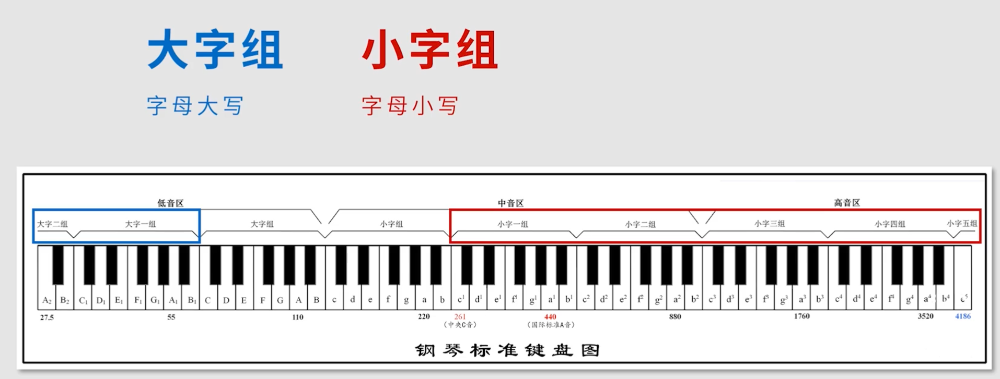

### 音符时值和表示

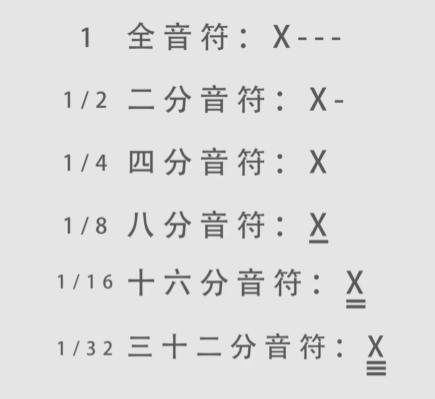

### 拍号

4/4
4 分音符（分母）为一拍，每小节 4 拍（分子）。

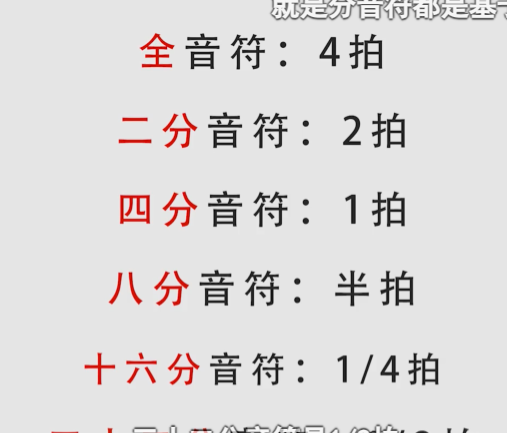

### 歌曲速度 BPM

### 三连音

## 旅游

### 美食

米粉

## 有趣的网站

https://www.allhistory.com/map
最全的历史地图集

https://zhuanlan.zhihu.com/p/196363738
ue 学习
