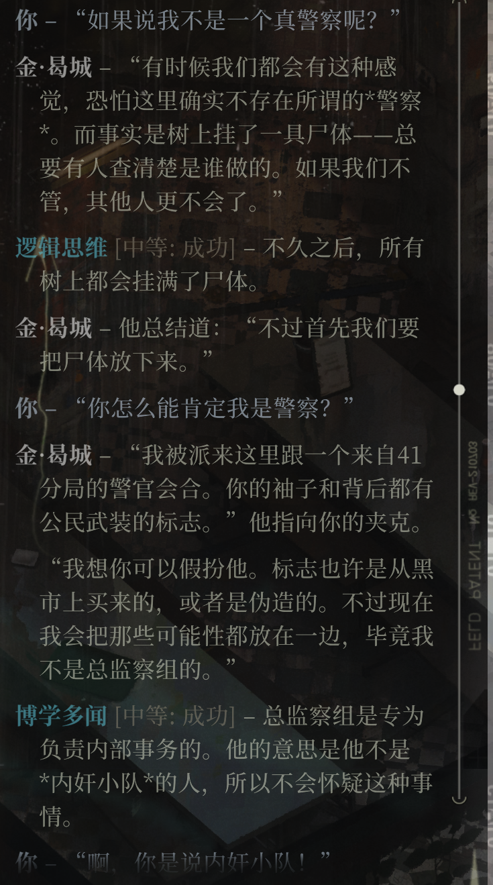

[toc]

## Disco Elysium

极乐世界
既不幻想，也不朋克
奇幻现实主义

- 具有动态的历史时期 ， 能够不断演进。
- 再地缘政治方面高度可信。
- 再这个世界渴望超越历史自身。

### 地方志

- 灰域 pale 71

彩蛋：迈克耳孙-莫雷实验（beta 版）

- 洲 isola 29

伊苏林迪
蒙迪
格拉德
萨马拉
伊尔马
卡特拉
西奥

- 蒙迪
  拉丁语（变革）

occident(意识形态上的西方)
western(地理形态上的西方)
ORG - occident
Oranje(荷兰)
Gottwald

- 伊苏林地
  瑞瓦肖
  RCM（瑞瓦肖公民武装）
  Moralist International（国际道德伦理委员会）

### 瑞瓦肖

- 马丁内斯
- 贾母洛克
- 帕克斯
- 布吉街
- 维拉洛博斯
- 大科戎

the inner og

gray trace

### 术语

（三重脑理论）

- 古老的爬虫脑
  最先出的脑结构，包括脑干、小脑和古老的基底核，执行基础的胜利功能（呼吸、心跳、睡眠）；掌握基础情绪（冲动、恐惧）；
- 边缘系统
  海马、海马旁回及内嗅区、齿轮回。
  参与调解本能和情感行为。

### 德洛里斯 黛

人道主义
国际主义
福利国家

低地德语区
高地德语区

the furies are at home in the mirror , it is their address .
Even the clearest water , if deep enough can drown .

