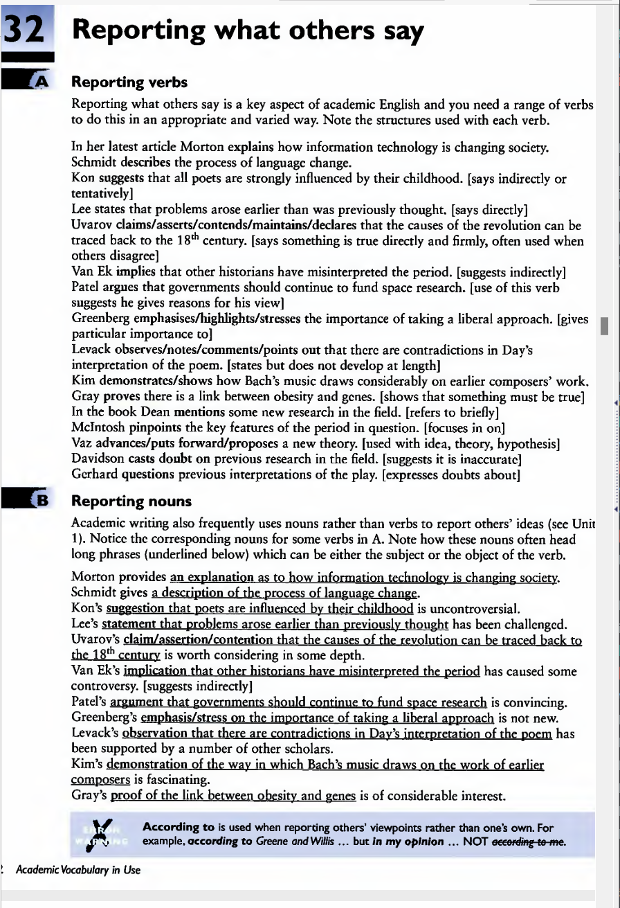
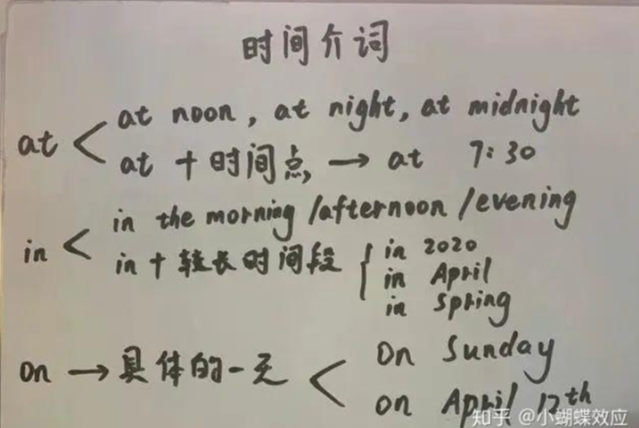
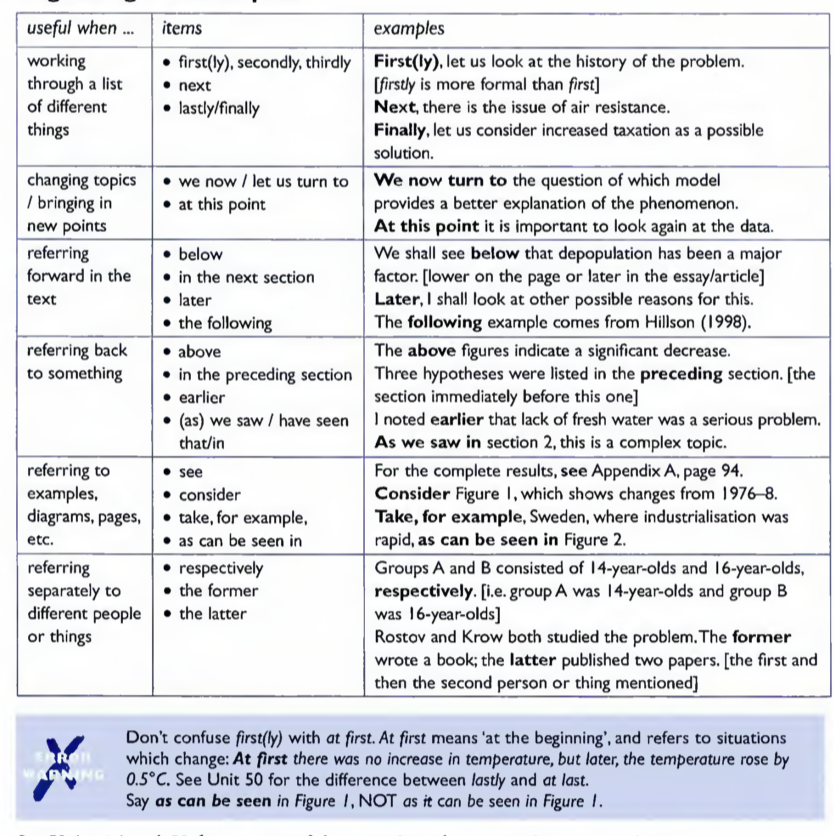
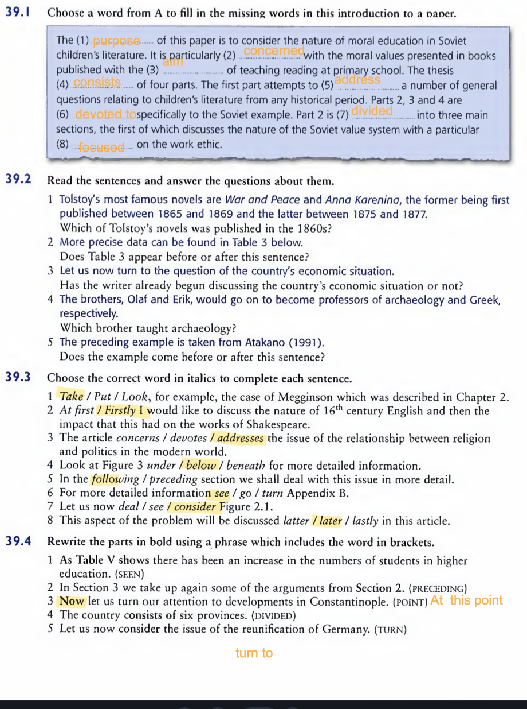
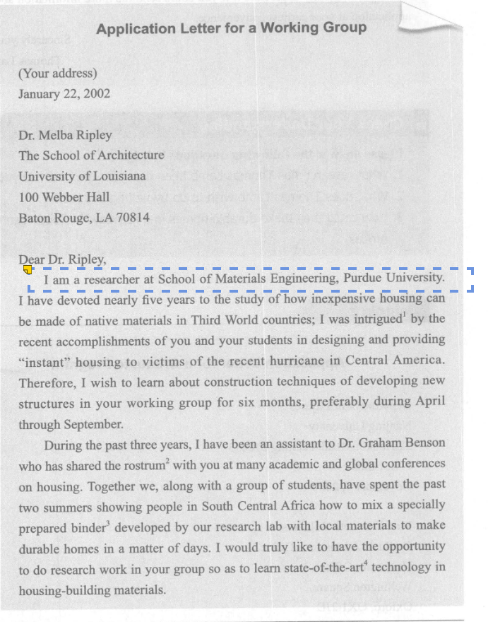

[toc]

## 基本

academic vocabulary

vocabu 39 

考试词汇：
学术交流英语
看 sample
useful expression
课堂讲的不怎么考

Unit6

I have woked hard ->
I have demonstrated excellent academic ability .

53-57
unit2
地址规范

p262
简历 use phrases
不用句子

阅读 4 篇
学术出 1 篇

考试写信
申请交换生
会议

**Academic writing**

p115 selected bibiography -> reference 更好

academic vocabulary 37
**degrees of certainty**

- **being tentative**
- **true or almost certainly true**
  undoubtedly
  it is evident that
  apparently
  presumably 大概
  be likely to
  be liable to do 也许会
- **the writer is unsure**
  allegeddly

1 main content

2 major of the sentence

3 review

has your child have

im sure you know
drinking and

i think you

5 doctor say many people die
after 30'

it illegal

dont forget

7

### 邀请

Dear ... / Professor / Editor / President / Sir or Madam,
1.I'm a student from, as a member of Student Union (学生会). 2.改写题目要求
3.I extend my appreciation / apology / welcome / when I write this letter .

There are several reasons / suggestions /messages to **account for** here .
First,according to the practical situation , it's significant that you could refer to what I told you.

Second , from my perspective , I feel that \_\_.

Third , if you have more ideas aboout \_\_ , you could adjust my information and take specific measures.

### 通知

This notice iss to inform that ** will be held 地点 / 时间 .
and **　 are needed to help us arrange multi-activities.

## A

abide 逗留，遵守
abolish 废除
abrupt 突然的
absence 缺乏
absorb 是全神贯注，承担，对付
absurd 荒谬的
account 赊账，看作，解释，视为
acquisition 获得，购置，收购
acute 急性的，有洞察力的

**address 演讲，说话 对付，处理**
advent 出现，到来
adverse 不利的，反对的
advisable 明智的，可取的
affiliate 附属公司，与。。有关，加入
agent 代理人，动因

alleviate 减轻，环节
allege 断言
alternative 供选择的，可替换的
ambiguous 模糊的
amiable 和蔼的
anology 类比
anticipate 预料
apparatus 仪器，组织，器官
appliance 电器
**arbitrary 主观任意的，专横的**
arithmetic 算术
around 流通中，可得到
arrogant 傲慢的
articulate 擅表达的，清晰的
assemble 聚集
assembly 立法机构，组装，集会
assess 评估
assimilate 理解，吸收，被同化
assumption 假定，承担，获得
attendent 伴随的
apprehensive 担忧的
autonomy 自主权
**assert 断言**

## B

bachelor 单身汉，学士学位
back 回溯，倒退，在背面签字 ，拖欠的
backward 落后的，颠倒，向后，更坏情况
bacterium
bait 诱饵，激怒
ball 舞会
balloon 膨胀，增大
**ballot 投票，表决**
bankrupt 破产
**banquet 宴会，宴请**
bare 赤裸的，of 仅够，基本的
bargain 廉价货，交易，协议，谈判
barrier 障碍物
barrel 炮管
battery 电瓶，殴打
beam 梁，柱，发热
**bear 熊，生子女，结果显示，。。。。**
beard 络腮胡，公然反抗
bewilder 使迷惑
bias 偏见
biography 传记
biology 生物学
bitter 苦的，激烈，怨恨的，严寒的
blank 空白的
bleak 荒凉的，阴沉的，暗淡的，无望的
bleed 流血，（向）勒索钱财
blind sb to sth 使 sb 失去判断力

barley 大麦
blossom 繁荣
blunder 犯大错
blunt 钝的，纯真的
boil 沸腾，愤怒，激动
bonus 津贴
bond 连接，和 sb 建立亲密关系
border 交界，接壤
bound 限制，
bracket 括号，支撑，将...至于同一范畴
brake 刹车，制动，闸
breed 养殖，繁殖，抚养
bribe 贿赂
broad 大概的，清楚的
bruise 挫伤，瘀
**budget 预算，价格低的**
bunch 簇
bureaucreacy 官僚制度
bypass 绕开，搭桥手术
calculate 核算，推测

## C

**candidate 候选人**
cordially 亲切地
capacity 容量，才能，生产力
capital 首要的，资金，大写字母
captive 被监禁，限制的
capture 捕获，准确表达，描述
carry 报道，出售，能记住，承担，支持，输送
cast 投射，挑，演员，铸造，外观，特征
casual 随意的，漫不经心的
cater for 迎合，满足
category 种类，范畴
cement 水泥，巩固，加强
cease 停止，中止
census 人口普查，统计
certificate 证明，文凭
characterise 以..为型，刻画，描述
charter 特权，准许状
cheque 支票
cherish 怜爱
chronic 慢性的
circuit 电路，返回
circumstance 环境，形式，经济状况
clarify 阐明
clause 条款，分句
clergy 牧师，神职人员
**clerk 职员，雇员**
cling 黏住
cloak 掩饰
cognitive 认知的
coherent 合逻辑的，清晰易懂的
coincident 同时（发生）的，观点一致的相接，重叠
collabrate 合作，通敌
collapse 倒塌，贬值，崩溃
collection
collective 集体的，共同的，集团
**commend 称赞，受认可，推荐， 把...托付给**
**comment 评论，职责**
**commission 委托**，
**commit 犯罪，保证，自杀**
commute 上下班往返，减刑
compact 紧密的，压实的，袖珍的
compartment 隔间
compassion 同情，怜悯
compatible 兼容的，协调的，和睦相处的
compel 迫使，使必须，激起
compensate 补偿，弥补
competent 有能力的，胜任的
**complement 补充，使完善**
**compliment 称赞，问候**
compound 混合物，使加重
comprise 组成，构成
compromise 妥协，使陷入危机/受到怀疑
compulsory 必须做，强迫做
conceal 隐藏
concede 承认，允许，
conceive 构想，怀孕
conception 理解，想法，受孕
concession 让步，特许权
concise 简洁的，简明的
concrete 混凝土，具体的，有形的
condemn 职责，证明...有罪
condense 压缩，凝结，浓缩
condition 疾病，决定，支配，条款，使习惯
**conduct 引导，实施，组织管理，举止**
confine 把..局限于，监禁
conform 趋同，遵从，吻合
confront 遭遇，处理
consensus 一致，舆论，合意
consent 同意，准许
consequently 因此
considerable 可观的，相当大的
consist in 存在于 / of 由...组成
**consistant 始终如一的，一致的，连续的，相等的**
**consolidate 使加强，巩固**
**conspicuous 明显的**
conspiracy 阴谋
**constituent 成分，选举人**
**constitute 组成，被认作，章程，宪法**
constrain 限制
contact 触摸，交往，熟人
contain 包含，抑制
contemplate 冥想，凝视，周密思考
**contend 声称，竞争**
**content 满意的，内容，含量**
context 背景，语境
**continual 重复的，连续的**
contract 合同，契约，（使）感染，（使）收缩
contradict 反驳，相矛盾
contrast 对比
contribute 增加 ，增进，是...的原因之一
**convention 习俗，大会，公约**
convict 宣判，罪行，罪人
**conviction 坚定信念，定罪，深信**
coordinate 使协调，配合，坐标
cope 对付，妥善处理，竞争
correlate 相关联，紧密联系
corresponding 符合的
correspondence 符合的，通信
corrider 走廊，通路
**corrupt 贪污，损坏**
cosmic 宇宙的，巨大且重要的
costume 流行服饰，套装
cottage 村舍，别墅
cotton 棉花
**council 委员会**
**counsel 法律顾问，为...提供帮助**
counter 计算器，柜台，抵制，反对，相反的
counterpart 职位相当的人/事
coupon 票证，赠券；将..和..联系在一起
**coutesy 礼貌，客套话**
**cover 包括，涉及，遮掩，报道**
crab 螃蟹/（about）抱怨
crack 裂缝，砸碎，尝试，崩溃，阻止，打击
credit 信用，称赞，认可，把..归于
cripple 使残废，瘸子
crisis 危急，紧要关头
critical 批许的，极重要的
crisp 干脆的
**criterion 标准，尺度**

crop 作物，收获，一批，大量
cross 十字架，穿过，交叉，阻挠，反对，杂交，苦恼，问题
crowd 人群，聚集，给..施加压力
crown 皇冠，圆满完成，结束
**crucial 决定性的，至关重要的**
crude 原油，粗略的，天然的，粗俗的
cruel 残酷
**crush 拥挤人群，压碎，压垮，制服**
crust 面包皮，地壳
cunnnig 狡猾的，精巧的
curb 抑制，起控制作用的
current 当前的，通用的，流，潮流，趋向
**curriculum 大纲，课程**
curse 诅咒
custom 习俗，惠顾，海关税，定制的
**customary 习惯的，某人特有的**
**dedicate 奉献**
**defect 缺点，叛变**
**defer 推迟，to sb 遵从**
desirable 称心的，性感的
descendant 后裔
**derive 衍生**
**deprive 剥夺**
depress 使忧愁
**desperate 情况紧急的，不顾一切的**
**detach 拆，分，派遣**
deteriorate **恶化**
develope 彰显，出现，侵袭
**diffute 扩散，传播**
**diffuse 缓解，冗长，不清楚的**
**diligent 勤勉的**
dilute 稀释的
disard 遗弃，抛弃
discern 分辨，觉察
disclose 暴露
discriminate 区别，歧视
dismay 沮丧
**disperse （使）分开，分散**
disposition 处置，让渡，性情
dissolve 溶解
distinction 优秀，差异，区别
**distort 曲解，弯曲**
**distract 分心，分散思想**
disturb 干扰
disturbance 动乱
ditch 水沟，抛弃，摆脱
diversion 转向，小钱
divert 使转向，娱乐
divide 分割，除以，分歧，分水岭
dividend 红利，彩金
doctor 篡改，伪造
domestic 家用的，本国的，驯养的
drama 剧本
drastic 极端的，严厉的
drawer 抽屉
**drift 漂流物，主旨，大意**
drug 滞销货
dubious 怀疑的，不确定的
durable 耐用的
dust sth off 除尘，重新拾起
dwell 居住，~on / upon 细想
decay 使腐烂，使衰退

## E

eccentric 古怪的（人/事）
eggsborn 怂恿
edible 可食用的
elementary 初级的
**elegant 简明的**
elevate 提高
eligible 有资格的
eliminate 消除
embed 把..牢牢嵌入
embrace 欣然接受，包含，拥抱
embryo 胚
emerge 露头，暴露
entrepreneur 企业家
envisage
entitle 使有权，给..命名
enligthen 启发，阐明
endorse 赞同，选产，批注
epidemic 流行的，传染的，（坏事）迅速蔓延
episode 插曲，片段
equation 等式，方程式，综合体，平衡
erect 垂直的，建立
establish 建立，稳固，得到认可，查实，证明
**esteem 尊敬，把..看作**
estimate 评估
evade 逃避，回避，想不出
even
evident 显而易见的
exact 精确的，严谨的，索取，强求
exceed 超过（数量），超越（法律限制）

**exception 例外的，异常**
excessive 过度的，极度的
exclain 惊叫，喊叫
exclusive 独占的，排斥，独家新闻，豪华的，高档的
exemplify 是..的典型，举例说明
**exempt 免除，豁免**
**exert 运用，施加，努力**
**exhibition 暴露**
**expension 扩张，膨胀**
**explicit 清楚的，直言的，不含糊的**
**expoit 利用，剥削，运用，发挥，开采**
**explosive 冲动的，易爆的**
expose 露出，使遭受，使接触，使体验
**exposure 暴露，遭受，面临，挨冻**
extensive 广泛的
**exterior 外观，外部**
**extract 摘录，用力取出，提取，**
**extraragant 奢侈的，过分的，放肆的**
**fabric 伪造，生产，装配**
fabulous
facilitate 有助于
faculty 院系，天赋技能
fade 淡入，褪色，消失
faint 微弱的，昏沉的，虚弱的，昏倒
fatal 致命的，毁灭性的
fatigue 疲劳
feat 技艺，功绩
feasible 可行的
**feature 以..为特色**
**feature in sth 占据..重要地位**
federal 联邦政府的
feeble 虚弱的
fertile 肥沃的
feudal 封建的
field 域，处理（一系列问题）
fierce 激烈的，强烈的
filter 过滤，透过，慢慢传开
finite 有限的
fiscal 财政的，国库的
flap 拍，激动
flaw 裂缝，使有缺陷
**float 提出，交出，汇率浮动**
flock
floor 工资最低水平
flourish 繁荣，茁壮成长，夸张动作，华丽辞藻
flow 流动，流畅，with 有的是
fluctuate 在..间起伏不定
fold 折叠，合拢，褶皱
foremost 最重要的
forge 锻造，伪造，稳步前进
forgive 免除 sb 债务
fork out sth 大量花钱
formation
formidable 可怕的，敬畏的
formulate 规划，确切表达
**forum 论坛，讨论会**
**forward 向前，早熟的，未来的，热心参与的，冒险的，莽撞的；转交，促进**
**foster 促进，鼓励，代养**
**fraction 少量，一部分，分数**
fragment 碎片
freight 货物
frame 体格，骨架，模式，设计
**front 面对，活动范围货领域**
frustrate 懊恼，使挫败
fuss 大惊小怪，烦恼，打搅
future 期货
gap 分歧，差距，缺口
garment 衣物
**generalize 概括，归纳，类\*推**
**generate 创造，引起**
genre （文学）体裁，风格
genuine 真实的，诚实的，名副其实的
a good for 有偿还能力的
grace 优雅，思考，缓刑，宽限
**grant 同意，授予，（勉强）承认，（政府）拨款**
gratitude 感谢
grieve 悲痛
grip 紧握，抓紧
groan 呻吟，受苦
gross 总的，显然的，粗鲁的，毛重
ground 场，海底，感兴趣范围，理由，根据
（使搁浅）， ground sb in sth 教导，训练
**guild 行业，协会**
gum 牙龈，橡胶，口香糖
hail 冰雹，欢呼,from 来自
hamper 阻碍，防止，篮子
handicap 残疾，阻碍，障碍
harmony 和谐，融洽
harness 马具，背带，利用，控制
harsh 粗糙的，刺耳的，严酷的
hazard 危险，冒失提出
heal 治愈
hear 审讯，听证
hedge 限制，篱 / against 规避奉献
hence 因此，所以
heritage 遗产
hierarchy 等级制度，层次
hitherto 到目前为止，至今
hostpitality 好客，殷勤，款待
hostile 有敌意的
hover 盘旋
humble 卑微的
humuliate 使丧失尊严
hugiene 卫生
hypocrisy 伪善
hypothesis 假说
hysterical 情绪激动的

## I

ideal 理想的
idle 空闲的，懒散的
illiterate 文盲的
illuminate 阐明，照亮，使焕发
illusion 错误观念，幻觉
illustrate 说明，解释，加插图，表示，存在
**impact 撞击，巨大影响**
**impair 损害，削弱**
**imperative 紧急的，命令的**
**impetus 动量，促进，动力**
**implication 被牵涉，可能影响，含义，暗指**
**imply 暗示，表名，包含**
**impose 强加，推动**
**impulse 冲动，推动力，刺激**
**incline 使倾斜**
incur 招致
indicative 陈述的，指示的
indignant 慷慨的
indignation 义愤
**inevitable 不可避免的**
infant 婴儿
inferior 较差的（人）
**inflation 通货膨胀**
**magnificent 宏伟的**
infrastructure 基础设施
ingenious 心灵手巧的
ingredient 原料，要素，因素
inhabit 居住，栖息于
inhale 吸气
**inherent 固有的**
initiate 初始
initiative 自发性
inject 注射，投入（资金）
inner 内部的
**inspect 检查**
installment 一期付款
**instant 立即的**
**instinct 本能，天性**
**institution 风俗，习惯**
**instrumental 起重要作用**
insult 侮辱
**integrade 合并，融入**
integrity 完好，正直，诚实
intellectual 智力的
**intense 十分强烈的，严肃紧张的**
intensive 集中精力的
interfere in 干涉 / with 妨碍，打扰
interior 内部的
**intermittent 断续的，间接的**
**internal 内部的，国内的，内心的，自身的**
intervene 干预，调停
intimate 亲密
intimidate 恐吓，威胁
**intricate 错综复杂的**
**intrigue 密谋，串通，勾起..兴趣**
**intrinsic 内在的，固有的**
**intrude 入侵**
**intuition 直觉**

impersonal 理性的

involve 包括，涉及

invent 倒转
invitation 鼓励，怂恿
**irrespective 不顾及的**
irregate 灌溉
irritate 惹恼
issue 问题争端，发行，流出，放出 from 由..产生
judical 司法的，审判的
juvenile 青少年的
knit 针织，接合，联合
labor 劳动，工人
lame 跛的，差劲的
**lateral 侧面的**
lay 放置，平息
leak 泄漏
legislation 法规
legitimate 合法的
lest 唯恐，免得
levy 税款
liability 责任，负债，束缚
liberal 慷慨的
lift 消散，偷袭，抄袭，解除，撤销
literacy 读写能力，文化水平
**literally 确实地**
lobby 门厅，游说团体
lodge 寄宿 with sb 向负责部门提出
lump sb/sth together 把..归于一起

## M

magnitude 巨大，重要性
manifest 表名
**manipulate 暗中控制，影响，操作**
**mature 成熟的**
mobilize 动员
monetary 货币的
monoply 垄断
monotonous 单调乏味的
motivate 成为..动机
mould 模型，浇筑，紧贴，吻合
**mount 组织，开展**
municiple 市政的
**metaphor 修辞**

## N

**negligible 不重要的**
neutural 中立的
**nevertheless 不过**
**nonetheless 虽然如此，但是**
norm 常态，规范，行为标准
**nostalgic 怀旧的**
novelty 新颖事物

## O

**obedient 顺从的**
obligation 义务，职责
oblige 促使，促成，效劳
**obscure 模糊的**
offensive 冒犯的
offspring 后代
omit 省略，遗漏，疏忽
**occassional 临时的**
oppress 令人压抑，烦恼的
orientation 定位，信仰，态度
ornament 装饰
orphane 孤儿
outcome 效果
outrage 暴行，愤怒
ouotward 表象的，外面的
overhead 架空的
overlook 看漏，俯瞰，放任，宽容，忽视
overturn 倾倒，撤销，裁决

orchard 果园

## P

panel 控制权
panorama 全景
parachute 降落伞
paliament 国会，议会
**partial 部分的，钟爱，偏爱**
**particular 专指的，特别的**
partly 一定程度的，不完全的
pastime 消遣，娱乐
peculiar 古怪的，异常的，特有的
peer 同辈，凝视
**pension 退休金，抚恤金**
perceive 察觉，理解
periodical 期刊
perish 死亡，腐化
**perpetual 不间断的，反复的，永久的**
pharmacy 治疗
phenomenon 非凡的人/事
physiology 生理学，机能
pierce 捅，刺破
pilgrim 朝圣者
pinci 紧要关头，匮乏，压力
pipe 管，传送（音乐）
plague 瘟疫
plain 明白的，朴素的，平原，旷野
plant 栽培， sth in 灌输
plateau 高原，平稳状态
**plausible 可信的**
plead ofr 恳求，为..主张
**pleadge 抵押/誓约**
plough 犁， ~through 费力前进，费力取得进展
plunge 跳入，猛冲，着手
poke 捅，about 询问，打探
**policy 政策，保险单**
ponder 思考
postpone 延期
**practically 几乎，实际上，简直**
preach 布道，鼓吹
**precede 先于，以..引导**
**precedent 先例，常规**
**precious 强调太少，矫揉造作**
preferable 更可取的
preliminary 预备的
premium 保险，奖金
preside 主持，负责
prescribe 开处方
prestige 威望
presume 假定
presumably 大概
prevail 流行
prey 牺牲者，被掠食者
prime 典型的
primitive 远古的，原始的
prior 优先的
**priority 首要的事，优先权**
privacy 个人自由，隐私
probe 调查，探测器
procedure 程序
proceed 行进，继续前进 ~from 起源于
proceeding 诉讼程序，事件
process 过程
procession 一队人，川流人群
proclaim 宣告，声明
**profile 侧面，姿态，形象**
**profound 深远的，严重的，知识渊博的**
**progressive 进步的，开明的，改革派**
prolong 延长
prominent 显著的,zhongyao d
prompt 促使，提醒，准时的
prone 倾向于
proof 证据，耐..的
propaganda 宣传机构
propel 推动，驱使
property 财产，不动产
propotion 份额，比例
**proposal 提议，建议，求婚**
**prospect 展望，可能性，前景**
prosper 繁荣
prosperity
**provision 条款，预备**
**prudent 谨慎**
**pursuit 追求，事业，消遣**
**qualitative 定性的**
quarter
quote 引述，举例说明

## R

**radical 根本的，彻底的**
**railroad 迫使，草率通过**
rally 公众集会
rational 理性的，合理的
reach for 伸手够到，臂展，影响范围
readily 乐意的
reap 收割
rear 栽培
rebel 反抗，叛逆者
recall 　回想，撤销，记忆力，召回
**receipt 收据，收到，收入**
**recite 背诵**
reckon 估算
recruit 征募
**recursive 递归的**
reduce 简化，该 u 哦
redundant 过剩的，被解雇的，多余的
refine 精炼，改进
**reform 改良**
refrain 克制，避免
refute 驳斥，否认
refugee 难民
**regarding 关于**
regime 制度
**regulate 控制，管理，调节**
**register 提出，流露，使收到注意**
reign 统治
rejoice 欣喜
relate 叙述
**release 发行，公布，免除**
relevant 切题的，有意义的
reliance 信赖
relieve 减轻， 接替
reluctant 不情愿的
remedy
render 提出，致使
**repel 驱除，拒绝，排斥**
reputation 名誉
resolution 判决
**respetive 分别的，各自的**
**restraint 克制，约束力，安全装置**

**resultant 作为最后结果产生的，合力，合成力，因而发生的**
**resume 重新开始，继续，简历**
retail 零售，述说（别人事）
retain 保持，聘请（律师）
retention 保留（液体），记忆力

retort 反驳
retreat 后退，逃避
retrieve 重得，挽回，检索
retrospect 回顾
revelation 揭露真相
revenue 财政收入，收益
revise 修订，复习
revive 苏醒，再起
**rigid 死板的**
revolt 叛乱，反感，造反
rib sb about 戏弄
riddle 谜 ； ridge 岭，鼻梁
rim 边缘
riot 暴乱
ripe 成熟的，~for 就绪的
ritual 宗教的，典礼的，习惯，规矩
rival 竞争者
roast 批评，嘲讽
robust 强健的，稳固的，坚决的，坚固的
roundabout 迂回的
**rumor 传闻，谣言**
ruthless 残酷无情的

## S

sack 解雇的
sacrifice 牺牲
sacred 神圣的，受尊重的
saddle 鞍，
saint 圣徒
salient 最重要的
salvation 救世，避免方式
**sanction 正式批准，许可，制裁，约束**

sane 精神健全的
sarcastic 讽刺的
satire 讽刺（作品）
saturate 饱和，使浸泡
savage 野蛮的

sauce 酱汁
saucer 茶碟
saw 锯开
scandal 丑闻，流言，民愤
scarce 缺乏，罕见的
scarcely 几乎不，勉强
**scatter 散播，使分散**
scenerio 设想，剧情梗概
scent 气味，察觉
scheme 计划，图谋
scold 咒骂
**scope 机会，能力，范围**
**scorn 轻视，蔑视**
scramble
**screw 螺旋，拧紧**
**script 剧本，广播，标记**
**scrutiny 仔细审查**
sculpture 雕术
seam 接缝，矿层
**seal 封铅，印章，密封**
**second 赞成，附和**
secretary 秘书，大臣
section 部分，领域，阶级，段，节
sector 部门，领域，区域，扇形
secure 保护，拴紧，获得，实现，抵押
security 抵押品，证券
seemingly 外观上，表面上

**segregate （使）分开，区别对待**
seize 夺取，占领
semester 学期
seminar 研讨会
senate 参议院，上院
senator 参议员
**sensaction 感知，经历，轰动，哗然**
setback 挫败，倒退
**severe 极恶劣的，严厉的，艰巨的**
shabby 破，卑鄙的
sham 假冒，虚伪的
**shatter 削弱，驳斥**
shave 掠过
shear 修剪，（使）弯曲
**sheer 完全的，纯粹的，陡峭的**
sheet 薄片

shepherd 牧民，带领，引导人群
shipment 装货
shiver 战栗
shothand 速写
shove 乱塞，猛推
shrewd 机敏的，精明的
shutter 百叶窗，关闭设置
shuttle 梭子，往返（车）

**sideways 从一边，侧身**
signature 签名
**signify 表明**
**simultaeneous 同时发生的**
**singular 非凡的，单数的**
skeleton 梗概
skeptical
skirt 环绕，回避
**slack 淡季，偷懒**
slaughter 屠杀
slender 修长的，微薄的
slight 轻微的
slippery 狡猾的，不可靠的，棘手的
**slot 狭缝，插槽**
**slum 贫民窟，陋巷**
sly 狡猾的，诡秘的
smart 剧痛
smash 粉碎
smooth ~over 消除（痕迹），掩饰
smuggle 走私
snack 曲折，路陡
sneak 偷溜，出其不意的

snobbish 自命不凡的
**soak 浸湿**
soar 翱翔，高飞，飞涨
sob 哭泣
**sober 清醒的，认真的，适度的**
**soil 弄脏**
**sole 唯独的，脚底**
solemn 冷峻的，庄严的，隆重的
**solidarity 团结**
**solitary 独自的，唯一的，独处的**
soluble 可溶的，可解决的
sophomore 二年级生
**sound 健全的，充分的，明智的**
sour 脾气坏的，刻薄的
**soverign 君主，独立权**
**spacious 广阔的**
spade 胡桃，铁锹
**specific 特定的，详情，细节**
**specification 规格，说明**
specimen 样品，标本
spectacular 壮观的，精彩的
spell 招致，一段时间
**sphere 球场，范围，层，阶级**
spicy 香料的，浓郁的
spiral 螺旋形的
spit 唾液
**spoil 损害，赃物，连带利益**
**spontaneous 自发的，自然的**
**spouse 配偶**
**sprinkle 洒，淋**
squirrel 松鼠
stagger 蹒跚
stagnant 不发展的，无变化的
stale 变质的，不新鲜的
stalk 梗，跟踪，趾高气扬的走
stamp 盖章，邮票
staple 主要的
**static 静态的**
stationery 文具
steamer 轮汽船
stereotype 陈规
sting 刺，剧痛
stitch 缝合，针
stoop 弯腰
storey 楼层
strap 带子
straw 稻草，吸管
streamline 流线型的，精简的
streneous 费力的，奋发的
strife 竞争
stroke 抚摸
**sturdy 坚定的，结实的**
submarine 潜水艇，海底的
**submerge 淹没，掩盖（思想）**
substract 减去
successor 继承者
**suffice 足够的**
**summit 峰会**
swell 肿胀，膨胀，增加

solicit 征集

strain 应变 应力 张力 作用力 损伤 拉伤 压力

subjective 主观的
symmetric 对称
sympathise 同情，共鸣，体谅

## T

tablet 药片
taboo 禁忌
tail 跟踪，尾随
tame 驯服的，沉闷的
tangle 缠绕，纠结
tariff 关税
tease 戏弄
tempo 速度，拍子，节奏
tenant 房户，租户，佃户
tender 和善的，柔软的，
testimony 证词
texture 质地
thermal 热力的
thigh 大腿，股
throne 王座
thrust 冲，推，戳
tilt 倾斜，使偏向于
timid 胆小的
tiresome 讨厌的
toe 脚趾，
**torment 折磨，戏弄**
torrent 急流，爆发
trademark （注册）商标
tramp 步行，践踏，流浪者
trash 败类
treason 谋反，叛乱
trench 挖沟，战壕
trifle 琐事，玩弄
trim 整齐的，整理
trolley 手推车，有轨电车
trumpet 喇叭，大声宣传
thrift 节约
thrill 兴奋
throughout 遍及，贯穿，到处
throw 使困惑
thumb 拇指，迅速翻阅
tide 潮汐，趋势
tie 领带，关系
**tight 紧的**
tile 铺瓦
tissue 组织，纸巾
toil 缓慢，艰难前进
tomb 坟，冢
token 标志，代用券，装样子，象征性的
toll 使用费，损失，伤亡
tone 音色，音调，强度，肌肉，定调
toss 向上投
trace 查出，追溯，痕迹，描摹
tractor 拖拉机
tragedy 悲剧
trall 痕迹，小路，蔓延
train 训练
trait 特征
transaction 交易，处理
**transcend 超出，越界**
transfer 转交，转变
transform 使改观
transistor 晶体管
transit 运输，中转，通行
transmission 传播，传送，广播，传媒
transparent 透明的，易解的的
transplant 移植，迁居
trap 陷阱，诱捕，轨迹
tray 盘，托盘
treaty 条约
tramble 战栗
tribute 贡品，（良好）体现
trigger 扳机，诱因，诱发
trip 履行，绊倒，开动
triumph 胜利
**trivial 琐碎的，微不足道的**
troop 军队
tuition 学费，讲授
tune 曲调
tunnel 隧道
turbulent 混乱，动荡的
turnover 人员调整，营业
twist 扭曲，怪癖，偏执
**tupical 不出所料的**

tow 拖，拉，牵引（车、船等）, 拖走（违章停放的车辆）

## U

unanimous 全体同一的
**ultimate 最终的**
_uncover 发现，暴露_

undergo 经历，承受
underlie 成为..的基础，作为..的原因
underlying 表面下的，潜在的
**undermine 暗中破坏，削弱，侵蚀的**
**underneath 在..表面之下**
undertake 承担
undo 松开，废除
unemployment 失业
unfold 打开，呈现
unique 唯一的，罕见的
unity 团结，同一
universal 普遍的，全世界的
upgrade 更新，提高，升级，提拔
**uphold 支持，维持、**
upper 上部的，较高的
upright 直立的，正直的，诚实的
upset 失望，打搅，推翻，爆冷
**upward 向上的，上涨的**
urge 催促
urgent 紧迫的
usage 使用率
utmost 极限的，最远的
vaccum 真空，虚空

## V

vague 模糊，迷茫的
vain 徒劳
vanity 自负，虚荣，无意义，无价值
vanish 不见的
vapour 水蒸气
vast 巨大的
velogcity
ventilate 通风，公开评论
venture 企业，商业，投机活动
verbal 口头的，言语的
**verdict 裁决**
**verge 核对，证明**
vessel 血管
veteran 老兵，老手
**vicious 恶毒的，道德败坏的，凶猛的**
**victim 牺牲品，受害者**
**vigorous 精力充沛的，强健的**
**violate 违背，冒犯，亵渎**
virtue 美德
**visible 明显的，可见的**
**vital 充满活力的，必不可少的**
vival 生动的，耀眼的
volume 卷，总量
vowel 元音
vulgar 粗俗的
vulnerable 脆弱的，易伤的
wage 工资，报酬，开展
waist 腰部
**warrent 许可状，委任状**
weary 疲倦
weave 编织
wedge 楔形
weld 焊接
welfare 幸福，健康，福利
whereas 反之，却，然而
wholesome 有益健康的，道德的
**withdraw 撤离，拜托，取回，停供，脱离**
**withhold 抑制，保留**
**withstand 抵抗，经受住**
witness 目击，是..的迹象，为..的
**worship 崇拜，敬仰，信奉**
wrap 缠，披巾

## Y

## Z

zone 划分
zeal 热心
