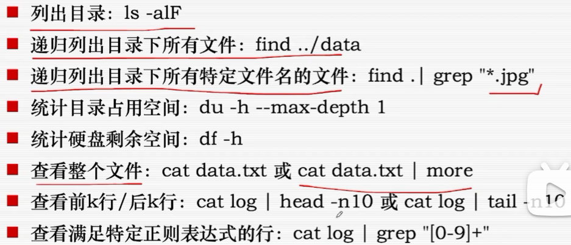
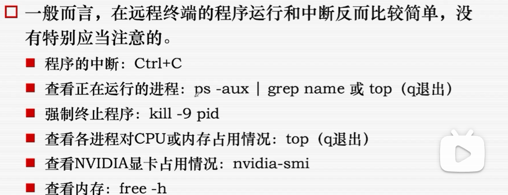

### 从hello world 开始

+ echo -将参数输出到屏幕

```
echo hello world 
echo hello\ world
echo "hello world"
echo `hello world'
```

### shell 工作原理

+ 本质：调用程序
  echo实际上是系统内置的程序
+ 命令行第一个词是程序名称，后面是参数
  词之间用空格分割
+ shell 也是一个程序，只是敲下回车之后会开启一个子进程跑相应程序。

### shell 如何找到要调用的程序：

通过环境变量PATH


## linux常用命令


### linux中的路径

绝对路径； linux和unix中，"/"称为根目录
相对路径；

切换路径：pwd


### 重定向

+ shell 中每个指令都有输入、输出流。

管道：创建一个管道，使一个输出流重定向到另一个输入流。

+ < 输入流，> 输出流
+ '>>' 在文件末尾追加，而不是覆盖掉原来

```
//运行了一个python脚本，想要将输出结果保存成文件（而不是显示在终端上，因为输出过长容易丢失）
python main.py > log.txt
python main.py >> log.txt

//既想显示在终端，也想保存到文件
python main.py | tee log.txt
python main.py | tee -a log.txt
```

### 管道  |

+ a | b， a 的输出作为b的输入。

### 权限


用'chmod'修改权限位


->

->


**root权限 - sudo以root身份执行**
（super do）


采用下面的方式；
因为上面的方式sudo只管到'echo' ，不能管 ''>''

**账户权限**
windows中三类不同权限的账户：

为程序提升权限——“以管理员身份运行”

**文件权限**
访问控制列表Access Control List , ACL
（属性-> 安全）

### 包管理


### 变量


**赋值仅仅添加shell变量，shell变量每次关掉会清空，赋值语句前添加export可以添加环境环境变量，但是一次性；
+永久添加：

- 将export赋值语句放入home下的.bashrc文件中。
- source ~/ .bashrc

### 命令替换&进程替换（一般用不上）


## shell脚本

### 脚本语言

脚本语言--通过解释器运行。不需要提前编译成机器码，而是由解释器在运行时逐行解析和执行。

+ Bash / python 都是脚本语言。

||

想要写脚本：


## CMD脚本

### CMD & powershell


shift+右键单机空白处->在此路径打开powershelll

### CMD指令


### CMD常用命令对照


### CMD中权限

**账户权限**
windows中三类不同权限的账户：

为程序提升权限——“以管理员身份运行”

**文件权限**
访问控制列表Access Control List , ACL
（属性-> 安全）

### CMD中变量


## PowerShell指令

又称为cmdlets(command-lets)


### PowerShell对象

查看对象：

### PowerShell脚本

+ 脚本 文件为.psl文件。
+ 比CMD更接近高级语言。

### tmux

 

## 文件

### 文件传输

一般通过SFTP协议网络传输

### 文件：查看、编辑、比较

文件操作：

+ python脚本
+ 查看：ls / find / du / df / grep / cat / more / vim / head / tail
+ 编辑：echo / vim / sed / mv / cp / rm
+ 比较：diff



### 程序

### 程序：运行、中断



### 程序：返回值和多命令组合


##　服务器　和远程连接

### 终端：连接

云服务器可以通过SSH（Secure Shell）在终端连接

验证方式：密码或密钥

### 终端:退出

+ 主动推出：Ctrl+D / logout /exit
+ 被动退出：远程主机关闭了连接/重置了连接（如意外关闭电脑）

### 终端：多路复用

```
//连接到远程服务器
ssh username@hostname

//使用私钥进行认证
ssh -i /paht/to/privatekey username@hostname

//传输文件（SCP）
scp -i path/to/privatekey localfile username@hostname

//传输文件（SFTP）
sftp username@hostname

//5.端口转发
//动态 端口转发（SOCKS代理）：
ssh -D 1080 username@hostname

//静态端口转发
ssh -L 8080:localhost:8080 username@hostname


```

### 远程控制工具

### 命令行环境

+ 用户在终端输入 - shell
+ 服务器执行操作
+ 运行
+ 


## 远程编译

+ 本地编译：IDE
+ 远程编译：
  + vscode SSH remote
  + 命令行
    + g++ main.cc -o main -O2
    + 一旦复杂一些，将很繁琐
  + 写成脚本：bash compiler.sh


