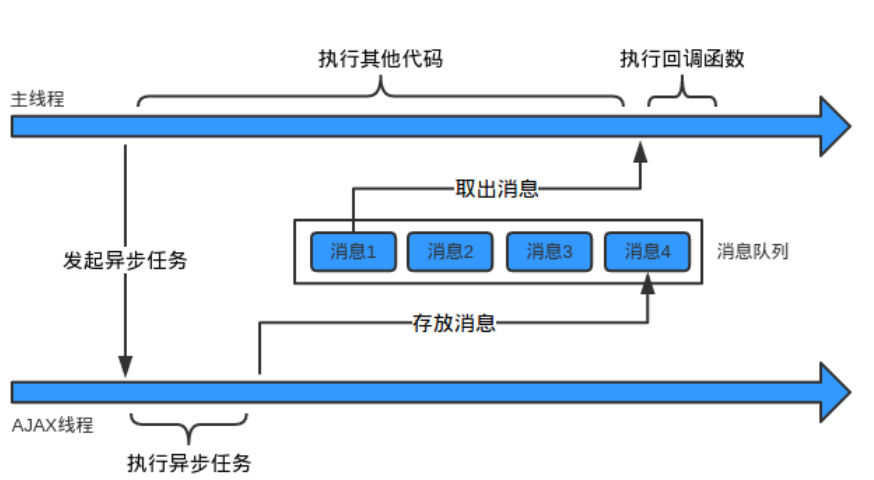

[toc]

## 总览

参考蒋岩岩

## GUI（Graphic User Interface）

带有图形界面的操作系统，如windows，linux。。

## Shell

基于文本、命令行的操作系统。

操作系统处于内核态中（核心态）

用户接口程序（GUIorShell）处于用户态中

## CPU

和内存交互，从内存中提取指令并执行

**寄存器：** 由于访问内存获取执行或数据比执行指令花费时间长，所以所有CPU内部都包含一些寄存器来保存关键变量和临时结果。

**包括程序计数器、堆栈指针、程序状态字寄存器。**

**程序计数器（program counter）：** 指示下一条需要从内存提取指令的地址**。**

**堆栈指针（stack pointer）：** 指向内存中当前栈的顶端。包含输入过程中有关参数、局部变量和没有保存在寄存器中的临时变量。

**cache:**

**主存（RAM）**

## 阻塞
线程若在执行中遇到磁盘读写或网络通信（I/O操作），通常会耗费较多事件，这时操作系统会剥夺这个线程的CPU控制权，使其暂停执行，同时把资源让给其他工作线程，这种线程调度方式称为**阻塞**。
当I/O操作结束，操作系统会把这个线程阻塞状态解除，回复其对CPU的控制权，令其继续执行。这种称**同步式I/O。**

**异步式I/O**遇到I/O操作时，不是以阻塞方式等待，而是将I/O操作请求发送给操作系统，然后执行下一条语句。
当操作系统完成I/O操作，以事件形式通知执行I/O操作的线程，线程会在特定时间处理这个事件。
这个**通知机制**的实现是**消息队列和事件循环**。

### javascript中异步任务

在javascript 中所谓的单线程是指在JS引擎中负责解释和运行JS代码的线程只有一个，称为**主线程。**

实际还有其他线程。如
处理AJAX请求的线程，处理DOM事件的线程，读写文件线程，称为**工作线程。**

**工作线程**将消息放在消息队列，主线程通过事件循环去获取消息。

**事件循环**

**微任务**
一个需要异步执行的函数，执行时机是在主函数执行之后，当前宏任务结束之前。
+ Promise.then
+ MutaionObserver
+ Object.observe（已被Proxy替代）
+ process.nextTick（Node.js）

**宏任务**
执行时间不能精确控制，对一些高实时性需求不太符合。
+ script（外层同步代码）
+ setTimeout/setInterval
+ UI rendering
+ I/O（Node.js）

执行一个宏任务，如果遇到微任务就把它放到微任务事件队列中。
当前宏任务执行完成后，会查看微任务事件队列，然后将里面所有微任务依次执行完成。

主线程运行时，会产生堆（heap）和栈(stack)，当栈中的代码调用DOM事件绑定/AJAX请求等外部API时就会交给浏览器内核的其他模块，即工作线程进行处理。

## 进程线程
**根本区别：进程是操作系统资源分配的基本单元，线程是处理器任务调度和执行的基本单位。**

### 进程
一个在内存中运行的应用程序，每个进程占独立的一块内存空间。一个进程可有多个线程。

### 线程
进程中的一个执行任务（控制单元），负责当前进程中程序的执行。
同类的多个线程共享进程的堆和栈方法区资源，但每个线程有自己的程序计数器、虚拟机栈和本地方法栈，所以系统在产生一个线程，或是在各个线程之间作切换工作时，负担要比进程小得多，也正因为如此，线程也被称为轻量级进程。

