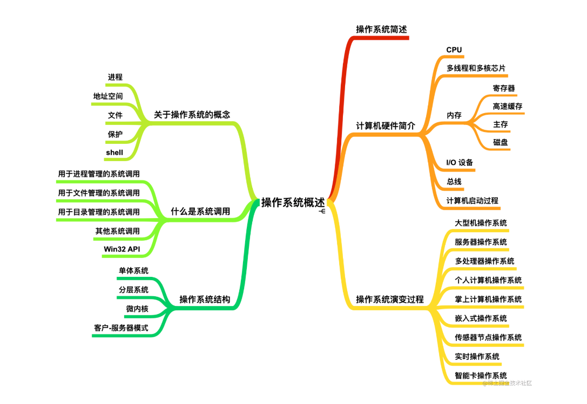
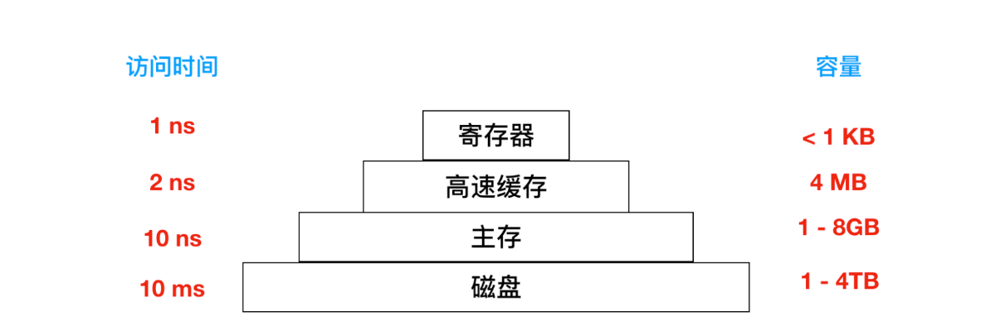

[toc]

## 总览

参考蒋岩岩

## GUI（Graphic User Interface）

带有图形界面的操作系统，如windows，linux。。

## Shell

基于文本、命令行的操作系统。

操作系统处于内核态中（核心态）

用户接口程序（GUIorShell）处于用户态中

## CPU

和内存交互，从内存中提取指令并执行

**寄存器：** 由于访问内存获取执行或数据比执行指令花费时间长，所以所有CPU内部都包含一些寄存器来保存关键变量和临时结果。

**包括程序计数器、堆栈指针、程序状态字寄存器。**

**程序计数器（program counter）：** 指示下一条需要从内存提取指令的地址**。**

**堆栈指针（stack pointer）：** 指向内存中当前栈的顶端。包含输入过程中有关参数、局部变量和没有保存在寄存器中的临时变量。

**cache:**

**主存（RAM）**

## 进程线程
**根本区别：进程是操作系统资源分配的基本单元，线程是处理器任务调度和执行的基本单位。**

### 进程
一个在内存中运行的应用程序，每个进程占独立的一块内存空间。一个进程可有多个线程。

### 线程
进程中的一个执行任务（控制单元），负责当前进程中程序的执行。
同类的多个线程共享进程的堆和栈方法区资源，但每个线程有自己的程序计数器、虚拟机栈和本地方法栈，所以系统在产生一个线程，或是在各个线程之间作切换工作时，负担要比进程小得多，也正因为如此，线程也被称为轻量级进程。

