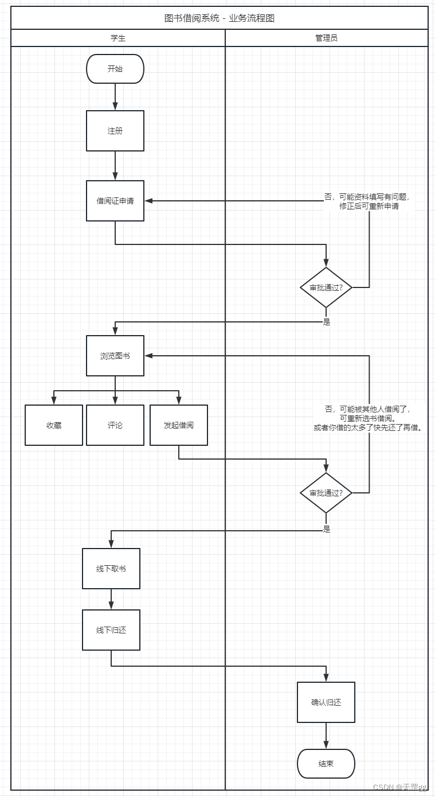
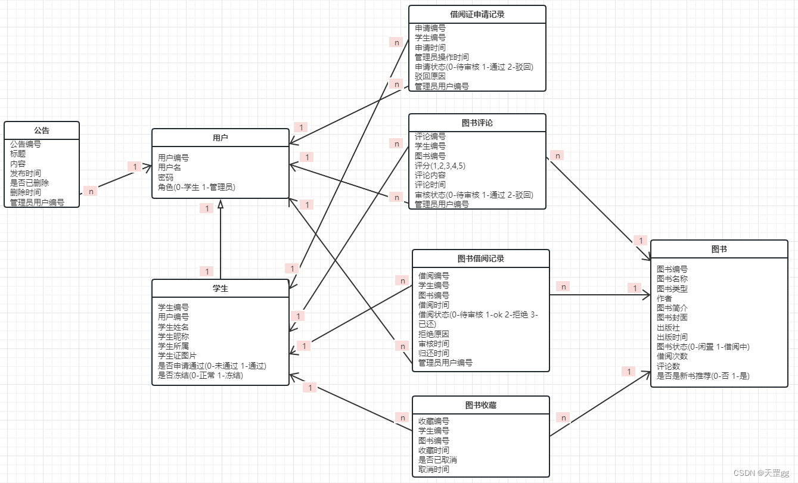

## 数据库设计基本步骤

- 需求设计
- 概念结构设计
- 逻辑结构设计
- 物理结构设计
- 数据库实施
- 数据库运行和维护

## 背景和需求分析

### 信息需求

主要针对两种身份：`管理员` / `学生`。

### 功能需求

#### 管理员

- 图书管理

**图书信息：**
图书编号、图书名称、图书类型、作者、图书简介、图书封面、出版社、出版时间
**修改功能**
新书推荐
借阅审批
书评管理
确认归还

- 学生管理
- 公告管理

#### 学生

- 学生注册
  注册时填写用户名和密码。
  注册后填写：
  学生编号、学生姓名、学生昵称、学生所属、学生证照片
- 首页
- 我要借阅
- 个人中心

