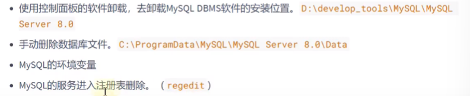
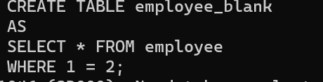
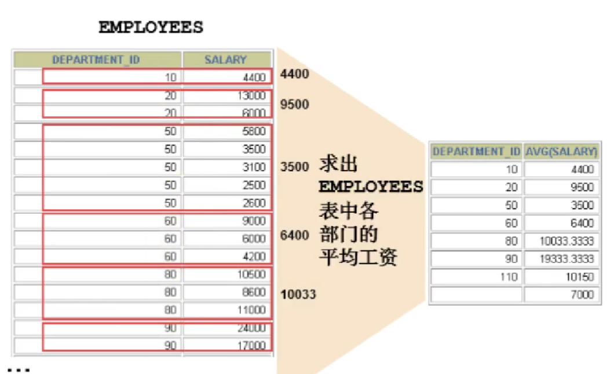
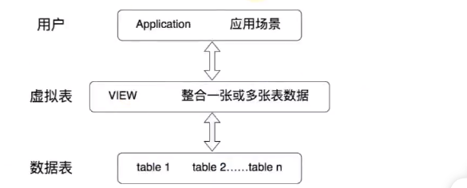

[toc]

- 关联式数据库
  mysql
  orable
  postgresql
  sql server
- 非关联式数据库
  mongoDB
  redis

## 答疑

### mysql 配置

我电脑中的位置：
`./DProgramFiles/MySQLdata/`

`my.ini` mysql 配置

可以同时装 5.7 和 8.0，前提是使用时进程的端口号不同。

### 安装好 MySQL 之后可 在 windows 系统中那些位置看到 mysql?

以此为例：


### mysql 卸载

关闭服务
卸载软件 mysql installer/控制面板
卸载 mysqldata 删除数据
之前的版本服务不会自动删除：解决方法：调取注册表(regedit)

务必重启电脑

### Mysql 5.7 在配置玩后，如何修改配置文件？

- 为什么要修改 my.ini 文件。默认字符集是 latin1 , 需修改为 utf8
- 修改信息
  
  修改玩重启电脑（重启服务）

### 如何导入现有的数据表、表的数据？

- **在命令行下导入 source 文件的全路径名**

`source D:\foo.sql`

- **基于具体的图形化界面的工具可以导入数据**

## SQL 通用语法

- **DDL**
  数据定义语言：用来定义数据库对象：数据库/表/列等。
  **`CREATE / ALTER / DROP / RENAME / TRUNCATE`**
- **DML**
  数据操作语言：对表中记录进行更新。
  **`INSERT / DELETE / UPDATE `**
- **DCL**
  数据控制语言：定义数据库的访问权限和安全级别，即创建用户。
  **`COMMIT / ROLLBACK / SAVEPOINT / GRANT / REVOKE`**
- **DQL**
  数据库查询语言
  **`SELECT`**

## 关系

概念是建立在笛卡尔积概念基础上的。

**满足一定语义的 D1 × D2 x ... x Dn 的子集叫做在域 D1/D2/.../Dn 上的关系。**

### 关系模型

| 概念模型     | 关系模型     |
| ------------ | ------------ |
| 实体         | 关系         |
| 属性         | 属性         |
| 域           | 域           |
| 关键字（码） | 候选键（码） |
| 实体型       | 关系模式     |
| 实体集       | 关系实例     |

### 规范化

- **第一范式**
  数据库的每一列都是不可分割的基本数据项，下面情况属于可分割情况：

  - 学生（姓名，电话号码）可分割为
  - 学生（姓名，手机号码，座机号码）

- **第二范式**
  表中必须存在主键，且其他属性必须完全依赖于主键：

  - 学生（学号，姓名，性别）
    学号是每个学生唯一标识

- **第三范式**
  满足第二范式情况下，所有属性都**不传递依赖于主键**，满足第三范式

  - 学生借书情况（借阅编号，学生学号，书籍编号，书籍名称，书籍作者）
    书籍编号依赖于借阅编号，书籍作者依赖于书籍编号，存在传递依赖情况
  - 学生借书情况（借阅编号，学生学号，书籍编号）
  - 书籍（书籍编号，书籍名称，书籍作者）

- **BCNF**
  作为第三范式的补充

### tables and keys

`primary key` 设置为主键的 key 可以唯一区分。

`foreign key` 设置为外键，可以对应别人的表格也可以对应自己的表格。


## SQL 语句--创建 / 修改 / 删除

- 创建数据库

```sql
CREATE DATABASE 数据库名;
```

- 创建数据库并指定字符集：

```sql
CREATE DATABASE 数据库名 CHARACTER SET 字符集;
```

- 判断数据库是否已存在，不存在则创建数据库（recommend)

```SQL
CREATE DATABASE 数据库名 IF NOT EXISTS CHARACTER SET 'UTF8';
```

- 修改数据库

```SQL
ALTER DATABASE 数据库名 CHARACTER SET 'UTF8';
```

- 删除数据库(推荐，如果要删除的数据库存在，则删除成功；如果不存在，则默默结束结束不报错)

```sql
DROP DATABASE IF EXISTS 数据库名;
```

创建一个表 employee_copy，实现对 employee 表的复制，包括表数据：


创建一个表 employee_blank，实现对 employee 表的复制，不包括表数据：

（山无棱，天地合，乃敢与君绝）

## DCL / DDL 中 COMMIT & ROLLBACK / TRUNCATE TABLE & DELETE FROM

- **COMMIT-提交数据，一旦执行 COMMIT , 则数据被永久保存在数据库中，意味着数据不可以回滚。**
- **ROLLBACK-回滚数据，一旦执行 ROLLBACK , 则可以实现数据的回滚。**

**TRUNCATE TABLE & DELETE FROM**

- 相同点：都可以实现对表的所有数据的删除，同时保留表的结构。
- 不同点：
  - **TRUNCATE TABLE:一旦执行，表数据全部删除。同时数据不可回滚。**
  - **DELETE FROM:一旦执行，表数据全部删除（不带 WHERE）。同时，数据可以回滚。**

**DDL 操作一旦执行不可回滚，DML 默认情况也不可以回滚。但是若执行 DML 之前，执行了 SET autocommit = false ， 则执行 DML 操作可实现回滚。**

将 C_CONTACT 字段移动到 C_BIRTH 字段后面：


## SQL 语句--查询

(AS 全称：alias 别名)

```SQL

[CONTRAINT <外键名>] FOREIGN KEY 字段名 [, 字段名二 , ...] REFERENCES <主表名> 主键列1 [, 主键列2 , ... ]
//创建外键

ALTER TABLE `表名` DROP PRIMARY KEY
//删除主键

SELECT DISTINCT * FROM `表名`;
//去除重复行,把重复数据合并成一行

DROP DATABASE `NAME`;
//删除数据库

SHOW DATABASE;
//查看已创建的数据库

USE  `database`;
//使用数据库

CREATE TABLE `table`
//创建表格

DESCRIBE `TABLE`;
//查看表格 属性

ALTER TABLE  `table` ADD `property` INT;
//为表格添加属性

ALTER TABLE `table` MODIFY `property` INT;
//修改表格属性

ALTER TABLE `table` CHANGE `旧属性` `新属性` int;
//重命名表格一个字段

RENAME TABLE `table` TO `NEW_table`;
ALTER TABLE `table` RENAME TO `NEW_table`;
//重命名表

ALTER TABLE  `table` DROP `property` INT;
//删除表格属性

INSERT INTO `student` VALUES()
//填入资料

INSERT INTO `table`(pro1 , pro2 , pro3)
VALUES(val1 , val2 , val3)
//指明要添加的字段


更新表记录
UPDATE `TABLE` SET `FIELD = VALUE`

```

### DDL DML 案例

- 按照 note 分类统计书的库存量，显示库存量超过 30 本的。
  

- 查询所有图书，每页显示 5 本，显示第二页：
  

- 按照 note 分类统计书的库存量，显示库存量最多的：

**空值参与运算**
空值：NULL

```SQL
SELECT * FROM `table`;
//解决方法：引入IFNULL
```

### 条件查询

- 算术运算符
  **取模运算：`% mod`**
  
  **被模数是负则是负 ，根模数没有关系**
- | 比较运算符 | < = > <= >=                                                   |     |
  | ---------- | ------------------------------------------------------------- | --- |
  | BETWEEN    | 某一区间的值                                                  |
  | IN(SET)    | 显示在 IN 列表中的值，如：IN(200 , 300)                       |
  | LIKE       | 模糊查询，有两种通配符：%用于匹配多个字符，\_用来匹配一个字符 |
  | IS NULL    | 判断是否为空                                                  |


**<=>安全等于**
用来判断 NULL 值：
当两个操作数均为 NULL 时，其返回值为 1 而不为 NULL；
而当一个操作数为 NULL 时，其返回值为 0 而不为 NULL。

或


**模糊查询**


- REGEXP 运算符
  **`^`匹配以该字符串后面的字符开头的字符串**
  **`$`匹配以该字符前面的字符结尾的字符串**
  **`[...]`匹配在方括号内的任何字符。表示范围内的用 `[a-z]`表示任何字母，`[0-9]`表示任何数字**
  **`*`匹配零个或多个在他前面的字符**
- 逻辑运算符

  - AND
  - OR
  - NOT

**优先级**


**一定范围内，左移 1 位相当于乘 2**

### 排序查询

```sql
SELECT * FROM `TABLE` WHERE `CONDITION` ORDER BY `COLUMN` ASC|DESC
```

### 分组和分页查询

每页显示 pageSize 条记录，此时显示第 pageNo 页：

```sql
LIMIT (PAGENO - 1) * PAGESIZE , PAGESIZE;
```


```sql
SELECT SUM(*) FROM 表名 WHERE 条件 GROUP BY 列名 HAVING 约束条件
//使用GROUP BY 对查询结果进行分组，需结合聚合函数，还可添加HAVING 限制分组条件

SELECT * FROM 表名 LIMIT 数量
//通过limit限制查询数量，只取前n 个结果

```

- HAVING 和 WHERE 区别：
  - HAVING 是在分组后对数据进行过滤，后面可以使用分组函数
  - WHERE 是在分组前对数据进行过滤，后面不能使用分组函数

查询工资和大于 2000 的工资总和大于 9000 的部门名称和工资和

```sql
SELECT `department , GROUP_CONCAT(salary).SUM(salary)`
FROM `employee`
WHERE salary > 2000
GROUP BY `department`
HAVING SUM(salary) > 9000
ORDER BY SUM(salarDy) DESC;
//降序排列
```


### 多表查询

**分类**

- **等值连接和非等值连接**
- **自连接和非自连接**
- **内连接和外连接**

通过连接转换为单表查询


（建议在多表查询时，每个字段前都指明所在的表）


如果给表起了别名，则使用时，必须使用表别名，不能再使用原名。

**如果有 n 个表实现多表查询，则需要至少 n-1 个连接条件。**

```sql
SELECT * FROM 表1 , 表2
这样会得到两张表的笛卡尔积
```

### 内连接查询

**合并具有同一列的两个以上的表的行，结果集中不包含一个表和另一个表不匹配的行（即交集）**
将表本身和表进行笛卡尔积计算，得到结果。
由于表名相同，需要先起一个别名：

```sql
SELECT * FROM 表名 别名1 , 表名 别名2
```

### 外连接查询（用于联合查询）

**合并具有同一列的两个以上的表的行，结果集中除了包含一个表和另一个表匹配的行之外，还查询到了左表 或 右表中不匹配的行。**

- **左外连接**
- **右外连接**
- **满外连接**


- **INNER JOIN** 进行内连接，返回连个表满足条件的交集部分
  
- **LEFT JOIN** 进行左连接

### 联合查询 UNION

- **UNION**
  
  返回两个查询结果的并集，去除重复记录。
- **UNION ALL**
  
  返回连个查询结果的并集，同时对两个结果集的重复部分，不去重。

### SQL99 新特性--NATURE JOIN

自动查询两张连接表中所有相同的字段，然后进行 `等值连接`。

### 嵌套查询 / 子查询

```sql
SELECT * FROM 表名 WHERE 列名 = ( SELECT 列名 FROM 表名 WHERE CONDITION)
```

- **从内查询返回的结果的条目数：**

  - 单行子查询
  - 多行子查询

- **内查询是否被执行多次：**

  - 相关子查询
  - 不相关子查询

如：
相关子查询需求：查询工资大于本部门的平均工资的员工信息。
不相关子查询的需求：查询工资大于本公司的平均工资的员工信息。

查询最低工资大于 50 号部门最低工资的部门 ID 和其最低工资：


显示员工的 employee_id , last_name 和 location。
其中，若员工 department_id 和 location_id 为 1800 的 department_id 相同，则 location_id 为 Canada ，其余则为'USA'。


- **子查询中的空值问题**
  若内查询中查询结果为空，则不报错但结果为空。

#### 多行子查询

- 也称集合比较子查询
- 内查询返回多行
- 使用多行比较操作符

| 操作符 | 含义                                                       |
| ------ | ---------------------------------------------------------- |
| IN     | 等于列表中任意一个                                         |
| ANY    | 需要和单行比较操作符一起使用，和子查询返回的**某个值**比较 |
| ALL    | 需要和单行比较操作符一起使用，和子查询返回的**所有值**比较 |
| SOME   | ANY 的别名                                                 |

#### 相关子查询

如果子查询的执行依赖于外部查询，通常情况都是因为子查询的表用到了外部的表，并进行了条件关联，因此每执行一次外部查询，子查询都要重新计算一次。


例中主查询 el 和 子查询中 el 构成了相关性的概念。（外部表存在于内部查询中）

**mysql 中聚合函数不能嵌套使用**

会报错
正确写法：


## 数据类型

| 类型             | 类型举例                                                                                                               |
| ---------------- | ---------------------------------------------------------------------------------------------------------------------- |
| 整数类型         | TINYINT / SMALLINT / MEDIUMINT / INT(INTERGER) BIGINT                                                                  |
| 浮点类型         | FLOAT                                                                                                                  |
| 定点数类型       | DECIMAL                                                                                                                |
| 位类型           | BIT                                                                                                                    |
| 日期时间类型     | YEAR / TIME / DATE / DATETIME / TIMESTAMP                                                                              |
| 文本字符串类型   | CHAR / VARCHAR / TINYTEXT / TEXT / MEDIUMTEXT / LONGTEXT                                                               |
| 枚举类型         | ENUM                                                                                                                   |
| 集合类型         | SET                                                                                                                    |
| 二进制字符串类型 | BINARY / VARBINARY / TINYBLOB / BLOB / MEDIUMBLOB / LONGBLOB                                                           |
| JSON 类型        | JSON 对象 / JSON 数组                                                                                                  |
| 空间数据类型     | 单值：GEOMETRY / POINT / LINESTRING / POLYGON ; 集合：MULTIPOINT / MULTILINESTRING / MULTIPOLYGON / GEOMETRYCOLLECTION |

### 文本字符串类型--含 EMUM , SET

- CHAR(M) 固定长度 / 空间上浪费存储空间
- VARCHAR 可变长度 / 空间上节省存储空间。


**现在 InnoDB 建议用 VARCHAR**

### 二进制字符串类型

BINARY / VARBINARY / TINYBLOB / BLOB / MEDIUMBLOB / LONGBLOB

### JSON 格式


### 空间类型

支持地理特征的生成、存储 和分析。

### 选择建议

阿里巴巴《Java 开发手册》：

- 任何字段非负，加 unsigned;
- 【强制】小数类型为 decimal，禁止使用 FLOAT DOUBLE 。
- 【强制】如果存储的字符串长度几乎相等，使用 CHAR 定长字符串类型。
- 【强制】VARCHAR 是可变长字符串，长度不超过 5000，若大于此值，定义字段类型为 TEXT，独立一张表，用主键来对应，避免影像其他字段索引效率。

## 函数

### 数值函数

### 字符串函数

- CONCAT()
  
  //MYSQL 字符串函数

- LOWER() / UPPER()
- LENGTH() / CHAR_LENGTH()
- SUBSTRING()
- TRIM()
- INSTR()
- REPLACE()
  查询书名达到 10 个字符的书，不包含里面的空格：
  


**SQL 中字符串索引从 1 开始**


### 时间函数

### 流程控制函数

- IF
- IFNULL
- CASE


- LOOP
- LEAVE
- ITERATE
- REPEAT
- WHILE

### 加密和解密函数

`PASSWORD() / ENCODE() / DECODE()`在 8.0 被弃用，
MD5() , SHA() 不可逆。


### 信息函数


### 聚合函数

**MYSQL 中聚合函数不能嵌套使用**
聚合函数作用于一组数据，并对一组数据返回一个值。


#### AVG / SUM

#### MAX / MIN

#### COUNT

作用：计算指定字段在查询结构中出现的个数。

COUNT(\*)
COUNT(1)
COUNT(具体字段)
都能计算表中记录数

#### 方差 、标准差 、 中位数

#### GROUP BY

将表中的数据分成若干组。


#### GROUP BY 中使用 WITH ROLLUP

使用 `WITH ROLLUP`关键字后，在所有查询出的分组记录之后增加一条记录，该记录计算查询出的所有记录的总和，即统计记录数量。

#### HAVING

过滤数据

#### SQL 底层执行原理

- **SQL99 语法**

```sql
SELECT ... , ... (存在聚合函数)
FROM ... (LEFT / RIGHT) JOIN ... ON 多表的连接条件
(LEFT / RIGHT) JOIN ... ON ...
WHERE 不包含聚合函数的过滤条件
GROUP BY ... , ...
HAVING 包含聚合函数的过滤条件
ORDER BY ... , ... (ASC / DESC)
LIMIT ... , ...
```

- **SQL 语句的执行顺序**
  

## SQL 语句--控制

image.png

### 用户授权

```SQL
GRANT ALL|权限1 , 权限2 , ... (列1 , ...) ON 数据库.表|* TO USER [WITH GRANT OPTION]
//WITH GRANT OPTION 被授权的用户能将以获得的授权继续授权给其他用户

REVOKE ALL|权限1 , 权限2 , ... (列1 , ...) ON
数据库.表|* FROM 用户
```

## 约束 CONSTRAINT

### WHY?

- 实体完整性 entity intergrity：同一个表中，不能存在两条完全相同无法区分的记录。
- 域完整性 domain intergrity：年龄范围 0-120，性别范围“男/女”。
- 引用完整性 referential intergrity：员工

- **列级约束**
  
- **表级约束**
  
  （约束名：uk_test2_email，作用在：email 字段）

### NOT NULL 非空约束

### UNIQUE 唯一性约束

---

- 在 ALTER TABLE 时添加约束

法 1：


法 2：

- 复合的唯一性约束
  

- 删除唯一性约束
  添加唯一性约束的列上也会自动创建唯一索引；
  删除唯一约束只能通过删除唯一索引方式删除；
  删除时需指定唯一索引名；
  若创建唯一性约束时未指定名称，若是单列，就默认和列名相同；若是组合列，则默认和()中排在第一个的列名相同，也可自定义唯一性约束名。

```sql
SELECT * FROM `information.schema.table_constrains` WHERE `table_name` = `表名`;
# 查看有哪些约束
ALTER TBALE USER DROP INDEX `uk_name_pwd`;
```

\*\*注意：可以通过`SHOW INDEX FROM 表名称`查看表的索引。

删除唯一性索引：


### PRIMARY KEY 约束

作用：用来唯一标识表中的一行记录。

**相当于唯一约束+非空约束组合**

- **自增列**
  

### 外键

- 删除外键约束
  
  

### CHECK 约束

用于限制列中的值的范围。

- 定义多个列的 CHECK 约束：
  

### DEFAULT 约束

### 约束练习题

- 建表时，加`NOT NULL DEFAULT ''`或`DEFAULT 0`。
- AUTO_INCREMENT 约束字段可以指定第一条插入记录的自增字段的值。

---


- 向表 emp2 中添加列 dept_id，并在其中定义 FOREIGN_KEY 约束，与之相关联的是 dept2 表中的 id
  
  

## 视图（类比 C++中的引用）


是一个查询结果。

- 是一种`虚拟表`,本身不具有数据，占有很少内存空间。
- 建立在已有表的基础上，视图赖以建立的这些表称为基表。
  

- 视图的创建和删除只影响视图本身，不影响对应的基表。但对视图数据进行增删改操作，数据表中数据回响应发生变化，反之亦然。
- 可将视图理解为存储起来的 SELECT 语句。
- 针对小型项目，不推荐使用视图；针对大型项目，推荐使用。

```sql
CREATE VIEW 视图名称（列名） as 子查询语句 [WITH CHECK OPTION];
```

- 情况 1：视图中的字段和基表的字段有对应关系。
  

- 情况 2：视图中的字段可能在原表中没有对应字段。
  

- 针对于多表
  

- 利用视图对数据进行格式化
  

### 基于视图创建视图


### 查看视图

```sql
# 1
SHOW TABLES;
# 2
DESC vu_emp;
# 3 查看视图的属性
SHOW TABLE status LIKE `view`;
# 4 查看视图详细信息
SHOW CREATE TABLE `view`;
```

### 更新视图中的数据

更新视图的数据，会导致基表中 的数据的修改。


- 删除数据，会导致基表中的数据的删除。
  

- 不能更新视图中的数据（视图中字段和基表中字段没有对应关系的情况）


### 修改视图

- **使用 CREATE OR REPLACE VIEW 字句修改视图。**
  

- **ALTER VIEW**
  

### 删除视图


## 存储过程 Stored Procedure

即一组预先编译的 sql 语句的封装。

```sql
CREATE PROCEDURE 存储过程名(IN | OUT | INOUT 参数名 参数类型 , ...)
[characteristics ...]
BEGIN
  存储过程体
END
```


- 存储过程的调用

```sql
CALL select_all_data();
```

- 创建存储过程 select_all_data()，查看 employee 表的所有数据：
  
  类似 JAVA 中的方法：

```java
修饰符 返回类型 方法名(参数类型 参数名...){
  方法体;
}
```

### 调用格式


### 带`out`


### 带`IN`


### INTO


调用：


## 存储函数

```sql
CREATE FUNCTION 函数名(参数名 参数类型...)
RETURN 返回值类型
[characteristic]
BEGIN
  函数体 # 函数体中肯定有RETURN语句
END
```


## 索引

当数据量特别庞大时，通过创建索引，能够大大提高查询效率，就像 Hash 表一样，能够快速定位元素存放的位置。

```sql
--创建索引
CREATE IINDEX 索引名 ON 表名 (列名)

--查看表中的索引
SHOW INDEX FROM student
```

## 触发器

在某种条件下自动触发。
触发器用于检查内容的安全性，相比直接添加约束，触发器更加灵活。

```sql
CREATE TRIGGER 触发器名 [BEFORE|AFTER] [INSERT|UPDATE|DELETE] ON [表名|视图名] FOR EACH ROW FROM student WHERE student.sno = new.sno
## FOR EACH ROW 表示针对每一行都生效
```

## 事务

当要进行很多操作时，如依次删除很多个表的数据，需要执行大量 SQL 语句完成。这些操作语句可以构成一个事务，

```SQL
SHOW ENGINES;
```


MYSQL 默认采用 InnoDB 引擎，可以修改为其他引擎。

**事务特性**

- **原子性(Atomicity)**
  一个 transaction 中的所有操作，要么全部完成，要么全部不完成，不会结束在某个中间环节。
  事务执行过程中如果发生错误，就会回滚（rollback）到事务开始前的阶段。
- **一致性(consistency)**
  在事务开始前或结束后，数据库完整性未被破坏。表示写入的资料必须完全符合所有的预设规则。
- **隔离性(isolation)**
  数据库允许多个并发事务同时对其数据进行读写和修改的能力。
  隔离级别：

  - 读未提交
  - 读提交
  - 可重复读
  - 串行化

- **持久性(duration)**
  事务处理结束后，对数据的修改就是永久的，即使系统故障也不会丢失。

```sql
BEGIN ; # 开始事务
...
ROLLBACK ; # 回滚事务
SAVEPOINT ; # 回滚点/添加回滚点
ROLLBACK TO ; # 回滚点/回滚到指定回滚点
...
COMMIT ; # 提交事务
```

**一旦提交，就无法再回滚！**

## 数据库规范化

## INDEX 索引

### classification

- **from the storage structure**
  B-tree
  Hash
  Full-Index
  R-Tree

**hash**
虽然可以快速定位，但是没有顺序，IO 复杂度高。

**二叉树**
树的高度不均匀，不能自平衡，查找效率和数据有关（树的高度），并且 IO 代价高。

**红黑树**
树的高度随着数据量增加而增加，IO 代价高。

- **from the application level**
  normal index 普通索引
  unique index 唯一索引
  composite index 复合索引
- **from the logical order relationship between the physical order of data and key values in**:
  clustered index
  non clustered index

**普通索引**
一个索引值只包含单个列，一个表可有多个单列索引

**唯一索引**
索引列的值必须唯一，但允许有空值。

**复合索引**
一个索引包含多个列

**聚集索引**
InnoDB 在同一个结构中保存了 B-TREE 索引

## mysql 遇到问题

mysql 本地服务器上 Mysql 服务启动后停止。某些服务在未由其他服务或程序使用时将自动停止。

此处我只是清除了 datadir 下面的 data，而非 mysql 安装路径下的 data 文件夹中的内容

## DDL 原子化

8.0 自带事务处理。

事务执行中报错则回滚。

## B+树

O(n) -> O(logN)
