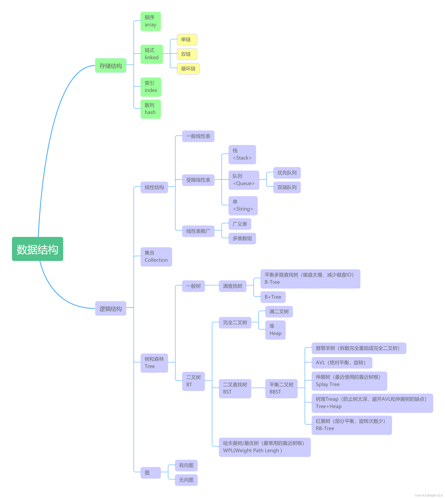
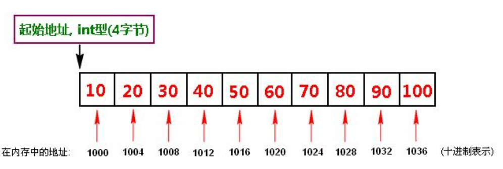
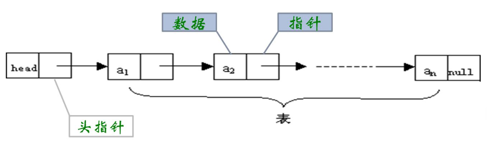
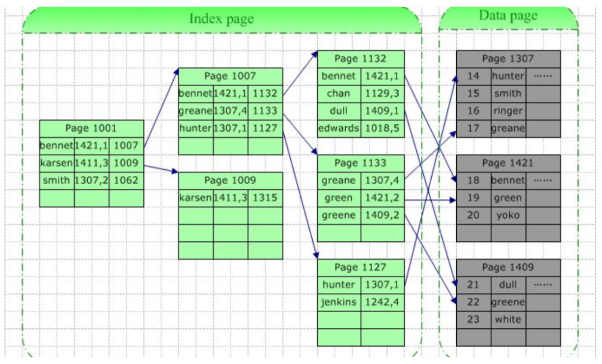
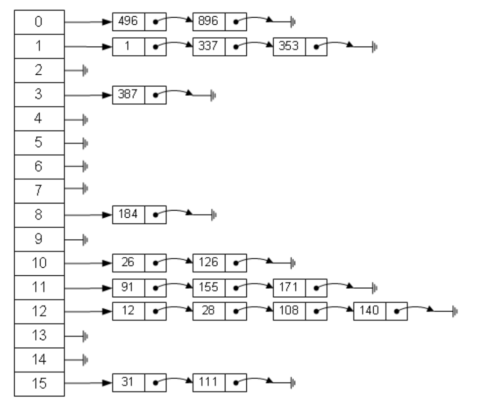
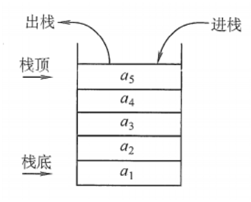
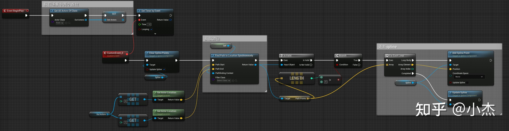
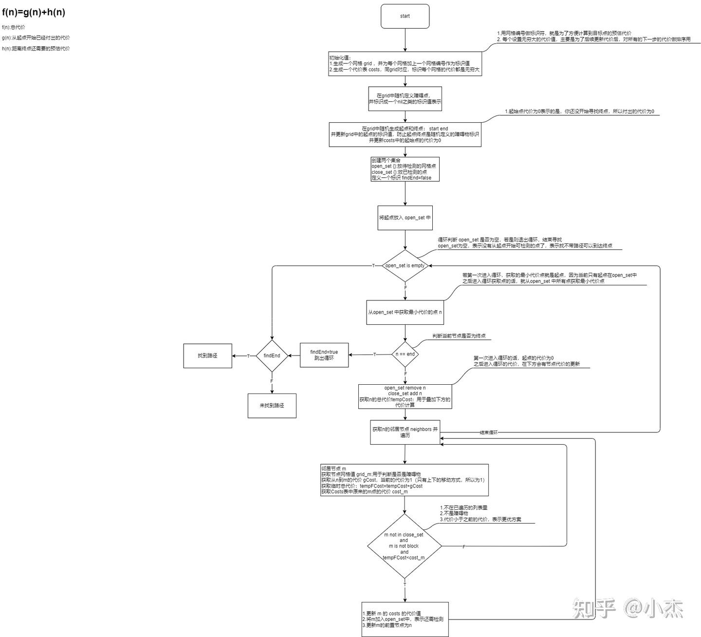
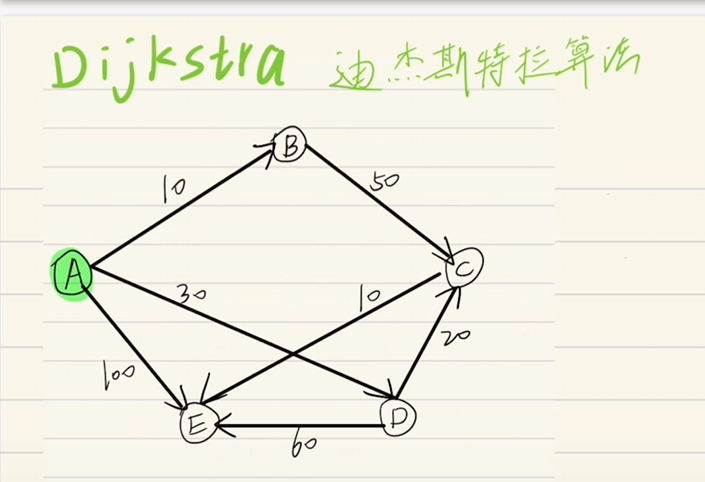
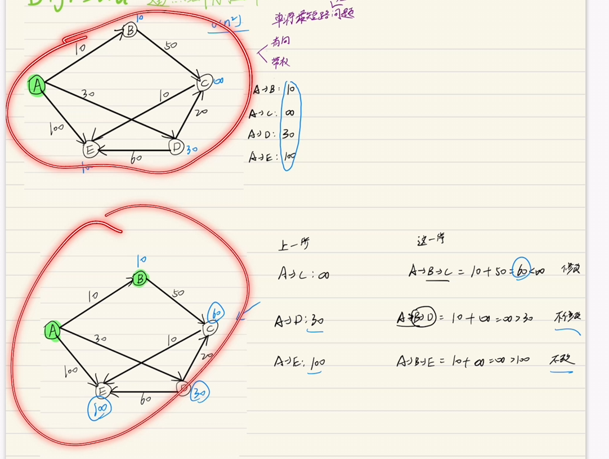

[toc]

## 总览



## 物理结构

数据的逻辑结构在计算机存储空间的存放形式称为数据的物理结构。

### 顺序存储结构



### 链式存储结构



### 数据索引存储结构



### 数据散列存储结构-hash



## 逻辑结构

### 集合

### 线性结构

### 树形结构

### 图


## 链表


## 栈 stack

是一种只能在某一端进行插入和删除操作的线性表。



**栈顶**top
**栈底**bottom，不允许插入和删除的一端。

LIFO 结构

**操作**

- InitStack(&S)：初始化一个空栈 S。
- StackEmpty(S)：判断一个栈是否为空，若栈为空则返回 true，否则返回 false。
- Push(&S, x)：进栈（栈的插入操作），若栈 S 未满，则将 x 加入使之成为新栈顶。
- Pop(&S, &x)：出栈（栈的删除操作），若栈 S 非空，则弹出栈顶元素，并用 x 返回。
- GetTop(S, &x)：读栈顶元素，若栈 S 非空，则用 x 返回栈顶元素。
- DestroyStack(&S)：栈销毁，并释放 S 占用的存储空间（“&”表示引用调用）。

### 栈的顺序结构

```cpp
#define MAXSIZE 10


```

## （面试向）理解数据结构


### 存储结构


## 堆

**二叉堆**


```c
//获取给定节点的左侧子节点位置：
2*index+1
//获取给定节点的右侧子节点位置：
2*index+2
//获取给定节点的父节点的位置：

```


# 算法


### 冒泡排序

```CPP

```


# 路径规划算法


## D* Lite


### 实例


https://zhuanlan.zhihu.com/p/528796465



## A*




## Dijkstra



时间复杂度：

 - 适用于单源最短路径问题

- 必须是**有向**的
- 必须**带权值**
- 


