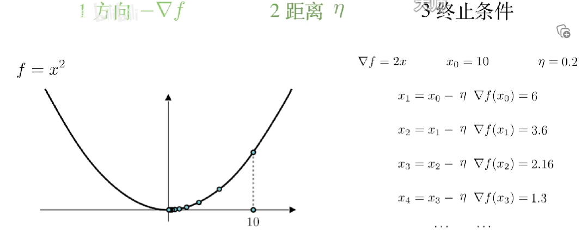

[toc]

### 教材

雷明--机器学习原理--机器学习的数学
李航--统计学习方法
周志华 机器学习
机器学习公式详解

1-18 章，第 3 章不单独讲授。

## 用到数学

[label](https://mmbiz.qpic.cn/mmbiz_jpg/75DkJnThACnTA9mJlVxPZ0jXfeg8adewErpqRPczFKndWFboAzFBvEVCUJw0VV7giaFQfq4THb7ScWz90FYwgKA/640?wx_fmt%3Djpeg%26wxfrom%3D5%26wx_lazy%3D1%26wx_co%3D1)

### 微积分

导数和偏导数
梯度向量
极值定理
雅可比矩阵
hessian 矩阵
凸函数定义和判断方法
泰勒
拉格朗日求解带等式约束的极值问题

### 线性代数

向量 -- 加减 数乘 转置 内积
范数
矩阵
逆矩阵
行列式
二次型
正定性
特征值 特征向量
奇异值分解
共轭梯度法

### 概率论

随机事件
随机变量和概率分布
条件概率和贝叶斯
常用概率分布
随机变量均值和方差，协方差
随机变量独立性
最大似然估计

- 判定规则
- 监督分类/非监督分类
- 训练
- 训练样本

ImageNet

机器学习本质：模型的选择和模型参数的确立

数据：

- 音频：向量
- 数字图像
  - 二值图像：一个矩阵
  - 灰度图像：一个矩阵(0-255)
  - 彩色图像：三个矩阵
  - 遥感图像：多矩阵
- 视频：很多彩色图像
- 文本

补充
传统模式识别系统

特征是什么？
手工设计特征
自动学习特征

## 变换

affine 仿射变换

### 数据集划分

- 训练集
- 测试集
- 验证集

d 维空间中任意一点：

凹函数、凸函数：解决局部最优是否全局最优问题。

两个向量内积：两个向量之间夹角的余弦值。
几何意义——投影
逆矩阵

偏导数
梯度
梯度为 0 的点称多元函数的驻点。
梯度方向（反方向）是函数值上升（下降）最快的方向。

hessian 矩阵
多元凹/凸函数
正定矩阵

正交矩阵——戈列向量都是单位向量，且两两正交

主成分分析/计算机视觉中奇异值分解--是对成矩阵对角化问题

二次型

验证公式

最优化方法
算法依据：寻找梯度值为 0 的点
解析解和数值解
使用迭代法寻找最优解

梯度下降法

数值优化算法面临问题
梯度为 0 的点可能：
是局部机制而非全局
甚至不是局部极值

## 贝叶斯

## 梯度下降法

## 最小二乘拟合

## 决策树

### CART 决策树

### GINI 指数

走到栈底最大的值

### 决策树的剪枝

**过拟合 / 欠拟合**
