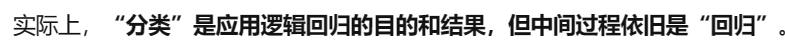
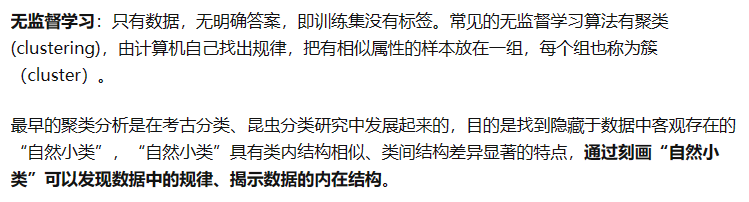
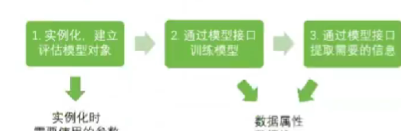
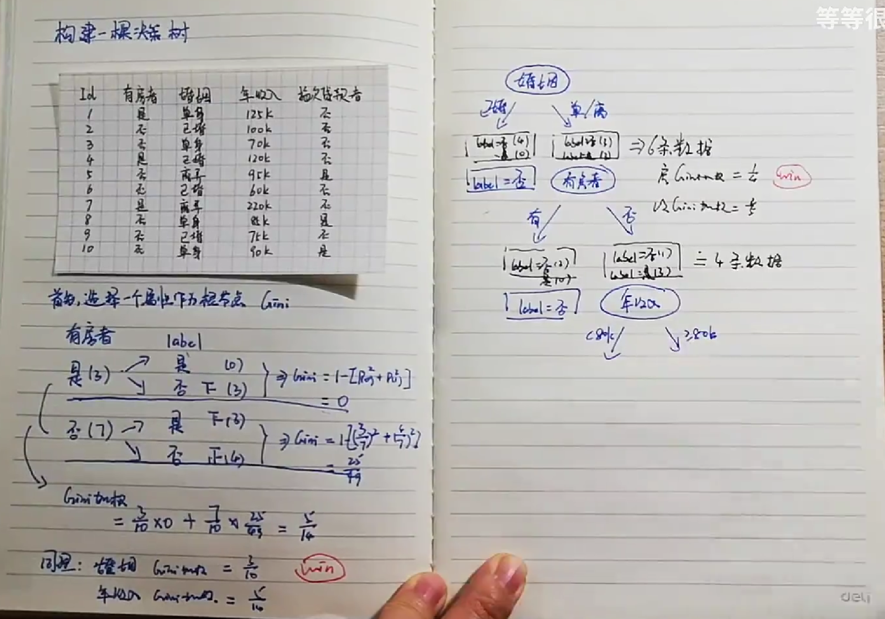
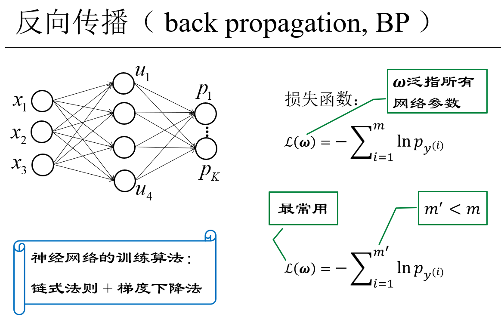

[toc]

### 教材

雷明--机器学习原理--机器学习的数学
李航--统计学习方法
周志华 机器学习
机器学习公式详解

1-18 章，第 3 章不单独讲授。


## 基础

### 回归和分类





**误差**


### 逻辑回归


定义向量

为`coef_（系数）`

定义

（截距）

### 逻辑回归算法的拟合函数--sigmond 函数


### 监督和非监督


 h

### 损失函数

**残差**


损失函数：残差平方和


β0 和 β1 怎么算出来？

残差平方和公式图像


### 梯度下降 gradient descent

对于多元函数，**梯度是把求的偏导数以向量的形式写出来**

多元线性回归方程


（即向量内积）


（推导过程略）

**梯度下降**通过一步步迭代，让所有偏导数下降到最低。


### 似然函数

**似然性**：一个事件 已经发生，反推在什么参数条件下， 这个事件发生的概率最大。


### 对偶问题


## 用到数学

[label](https://mmbiz.qpic.cn/mmbiz_jpg/75DkJnThACnTA9mJlVxPZ0jXfeg8adewErpqRPczFKndWFboAzFBvEVCUJw0VV7giaFQfq4THb7ScWz90FYwgKA/640?wx_fmt%3Djpeg%26wxfrom%3D5%26wx_lazy%3D1%26wx_co%3D1)


### 微积分

导数和偏导数
梯度向量
极值定理
雅可比矩阵
hessian 矩阵
凸函数定义和判断方法
泰勒
拉格朗日求解带等式约束的极值问题


### 线性代数

向量 -- 加减 数乘 转置 内积
范数
矩阵
逆矩阵
行列式
二次型
正定性
特征值 特征向量
奇异值分解
共轭梯度法

### 概率论

随机事件
随机变量和概率分布
条件概率和贝叶斯
常用概率分布
随机变量均值和方差，协方差
随机变量独立性
最大似然估计

- 判定规则
- 监督分类/非监督分类
- 训练
- 训练样本

ImageNet

机器学习本质：模型的选择和模型参数的确立

数据：

- 音频：向量
- 数字图像
  - 二值图像：一个矩阵
  - 灰度图像：一个矩阵(0-255)
  - 彩色图像：三个矩阵
  - 遥感图像：多矩阵
- 视频：很多彩色图像
- 文本

补充
传统模式识别系统

特征是什么？
手工设计特征
自动学习特征

**特征提取**
+ 进行数据降维
+ 提取出适合特定场景的事物本质的东西

**分类器设计**


## 变换

affine 仿射变换

### 数据集划分

- 训练集
- 测试集
- 验证集

d 维空间中任意一点：

凹函数、凸函数：解决局部最优是否全局最优问题。

两个向量内积：两个向量之间夹角的余弦值。
几何意义——投影
逆矩阵

偏导数
梯度
梯度为 0 的点称多元函数的驻点。
梯度方向（反方向）是函数值上升（下降）最快的方向。

hessian 矩阵
多元凹/凸函数
正定矩阵


正交矩阵——戈列向量都是单位向量，且两两正交

主成分分析/计算机视觉中奇异值分解--是对成矩阵对角化问题

二次型

验证公式

最优化方法
算法依据：寻找梯度值为 0 的点
解析解和数值解
使用迭代法寻找最优解

梯度下降法

数值优化算法面临问题
梯度为 0 的点可能：
是局部机制而非全局
甚至不是局部极值

## 贝叶斯

## 梯度下降法


## 最小二乘拟合

## 决策树

决策树是个从根到叶的递归过程，在每个中间节点寻找划分属性，重要的是**设置停止条件**：

### sklearn 中决策树


sklearn 基本建模原理：



`criterion`

- 输入 entropy ， 使用信息熵
- 输入 gini ， 用基尼系数


### 决策树基础

关键问题：

- 


### ID3-信息增益

熵 entropy-系统由不稳定态到稳定态所需要丢失的部分

信息增益=划分之前的信息熵-划分之后的信息熵，越大意味着得到的信息越多，再往下的划分就少了。

### CART 决策树

### GINI 指数

gini：从数据集 D 中随机抽取两个样本，类别标记不一致的概率。GINI(D)越小，数据集 D 纯度越高。


走到栈底最大的值




### 决策树的剪枝

**过拟合 / 欠拟合**
过分贴合数据集


```python
from sklearn.tree import DecisionTreeRegressor

import numpy as np
import pandas as pd
from sklearn.model_selection import train_test_split
from sklearn.metrics import mean_squared_error

data = {
    '目标人口': [100, 120, 150, 180, 200, 220, 250, 270, 300, 320, 350, 380, 400, 420, 450],
    '人均可支配收入': [2000, 2200, 2500, 2800, 3000, 3200, 3500, 3700, 4000, 4200, 4500, 4800, 5000, 5200, 5500],
    '销量': [500, 550, 600, 650, 700, 750, 800, 850, 900, 950, 1000, 1050, 1100, 1150, 1200]
}

df = pd.DataFrame(data)

print(df)

# 划分数据集和测试集
X = df[['目标人口', '人均可支配收入']]

y = df['销量']

X_train, X_test, y_train, y_test = train_test_split(X, y, test_size=0.2, random_state=42)
# train_test_split: 这是用于划分训练集和测试集的函数。它将数据集按照
# 指定的比例划分为训练集和测试集，其中test_size参数指定了测试集所占的
# 比例，random_state参数用于设置随机种子，以确保每次划分的结果一致。

# 建立决策树模型
model = DecisionTreeRegressor()
model.fit(X_train, y_train)

# 预测销量
y_pred = model.predict(X_test)
print('预测销量：', y_pred)
```


## 随机森林


ensemble learning 


- 集成学习算法，由多棵决策树组成
- 用对训练集随机抽样得到的样本训练决策树
- 不仅对训练集随机抽样，还对特性向量的分量随机抽


### 控制基评估器的参数


### 集成学习

**bootstrap 抽样**

- 如果训练集大小为 N，对于每棵树而言，随机且有放回地从训练集中的抽取 N 个训练样本（就是 bootstrap sample 方法, 拔靴法采样）作为该树的训练集；从这里我们可以知道 k：每棵树的训练集都是不同的，而且里面包含重复的训练样本

没有被抽到的数据：包外数据

**bagging(bootstrap aggregating)算法**


### 训练算法

- 样本随机抽样：均匀分布的随机数
- 特征分量随机抽样：随机洗牌
- 如何确定决策树数量？
  观察包外误差，在他稳定后停止训练新的决策树
- 如何确定特征数量？

## boosting 算法

从弱学习方法触发，反复学习，得到一系列弱分类器，然后组合这些弱分类器，构成一个强分类器。

### adaboost 算法

验证集作用

为社么验证臭皮匠数量要在验证集上观察，而不是测试集上？


```python
train_test_split()

```


## 预剪枝和后剪枝 吧吧

## K 近邻算法

基本思想：

- k 近邻
- 最近邻
  
  懒惰学习

**决策规则**


！！！

！！！
三要素：

- **距离度量**
- **k 值选择**
  K 越小容易过拟合；
  K 越大容易欠拟合。
  

- **决策边界**
  

KNN 决策边界一般不是线性的，即是一种非线性分类器：


交叉验证

kd 树

- 线性扫描的弊端（linear scan）
- 二叉搜索树

## 线性回归

### logistic 回归--多分类学习方法


p1 / p2 分别表示模型判断属于第一第二类别的概率。

训练目标：
确定 w 和 b，使[p1+p2+p3+p4+p5]最大，每个 p 越靠近 1.
/
找出 w 和 b，使目标函数 l(w) = ∑lnp 最小

### softmax 回归

先处理成 e^t 即处理成正数

参数有(D+1)K 个。


此上述两种模型都是广义线性模型，先做线性变化，在做非线性变换。
目的————把非凸函数转换为凸函数。

## 人工神经网络


转换为 e 保证转换为正数

激活函数是非线性是因为


.................................................
`针对此，有4*4+5*10个参数`

回归问题：预测模型
分类问题：预测输进来的是什么


对数字问题分类

## 支持向量机


---


---


**本质：i 号样本分错，只更新 αi**


**问题：为了得到唯一的解，需要对分离超平面增加什么约束条件？**

### 感知机算法的对偶形式


上处是**规定**，即人为规定。

2 范数即：


**间隔最大化**

**对偶最优化问题**


**拉格朗日对偶性**

可用**SMO**算法求解对偶最优化问题。（不需要知道）


**只有间隔边界上的样本（支持向量）才满足**

**对于分线性支持向量机**


椭圆一般方程：——————`\|/`


在原始空间求核函数相当于在更高维空间求内积。

常用核函数


## K-Means

循环迭代过程


疑问:


## 线性判别分析

（降维分析）同 PDA


类内差距尽量小，类间差距尽量大。

衡量方法：方差。


## 聚类 cluster


### 层次聚类

从 m 个点中求两两之间的距离，在 Cm2 个距离中找出最小距离，将最小距离对应的两个点圈成一类。

共执行 m-1 次。

**两个类之间的距离**
最短距离
最长距离
**平均距离**
中心距离：质心
离差平方和


### k-均值聚类

P 值越小，我们拒绝原假设的理由越充分。


## 深度学习
机器学习-泛化能力有限

**深度学习特点**
+ 自动学习特征
+ 特征通用性好，描述能力强
+ 端到端的学习框架...
+ 

卷积层——根据图像自己学出模板
（局部连接，权值共享）


池化层-数据降维


