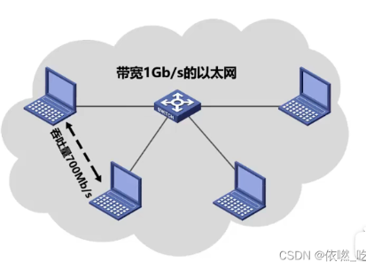
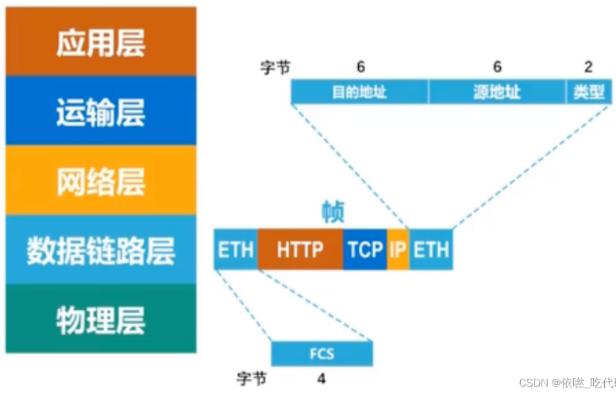
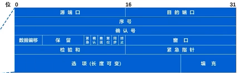
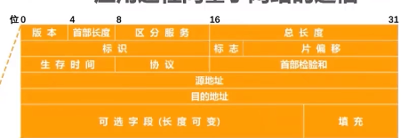
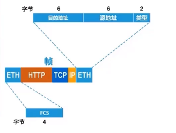
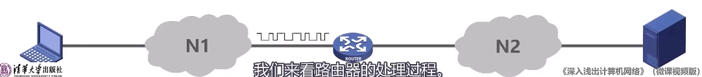
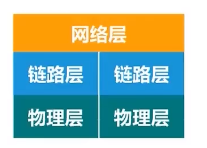

[toc]

# 1 发展

### 批处理atch Processing 

### 性能指标

**时延**

发送时延=分组长度（b)/发送速率（b/s)

传播时延=信道长度(m)/信号传播速率(m/s)

**吞吐量**

**单位时间内**通过某个网络（或信道、接口）的数据量。

### 分时系统

多个终端和同一个计算机连接，允许多个用户同时使用一个计算机，实现了一人一机的目的，体现独占性。

# 1. 七层结构

结构：

链路层首部-网络层首部-运输层首部-应用层报文-链路层尾部

## 输入网址后，发生了什么

**
+ DNS解析：将域名解析成IP地址
+ TCP连接：TCP三次握手
+ 发送HTTP请求
+ 服务器处理请求并返回HTTP报文
+ 浏览器解析渲染页面
+ 断开连接：TCP四次挥手
  
**

应用层按HTTP协议构建一个HTTP请求报文。

应用层将HTTP请求报文交给运输层处理

运输层给HTTP请求报文添加一个TCP首部，作用是区分应用进程及实施可靠传输。

运输层将tcp报文转给网络层。

网络层添加IP数据报，使能通过路由器转发

数据链路层IP数据报一个ETH首部，使网帧在一个链路上或网络上传输，能够被相应主机接受

首部添加FCS，检测所接收到帧是否有误码

数据链路层将帧交给物理层，物理层将帧看为比特流，在比例流前添加前导码，作用让目的主机做好接受帧的准备。

路由器处理过程

## 物理层

为上层协议提供一个传输数据的物理媒体。

+ **中继器repeater，也叫放大器。**
+ 集线器

## 数据链路层

在物理层基础上向网络层提供服务，最基本服务是将来自网络层的数据可靠地传输到相邻节点的目标机网络层。

+ 基本数据单位为帧。
+ 主要协议：以太网协议。
+ 两个重要设备名称：网桥和交换机。

## 网络层

负责对子网间数据包进行路由选择，目的是实现两个端系统间的数据透明传输。

+ 基本数据单位为ip数据报。

协议：

### IP协议

### ARP协议（address resolution protocol，地址解析协议）

如何通过IP地址找到其对应的MAC地址？（ARP协议）

主机中存在高速缓存表

### 路由器

## 传输层

主机到主机的层次。负责将上层数据分段并提供端到端，可靠或不可靠的传输。

网络层只根据网络地址将源节点发出的数据包传送到目的节点，而传输层负责将数据可靠的传送到相应端口。

+ 信息传送的协议数据单位称**段或报文**。

协议：

### TCP协议（Transmission Control Protocol传输控制协议）

TCP协议负责发现传输问题，出现问题即发送信号，要求重新传输，直至所有数据安全正确传输到目的地。IP地址给每台联网设备规定一个地址。

### UDP协议（User Datagram Protocol，用户数据报协议）

## 应用层

+ 数据传输基本单位为报文。
+ 包含应用层、会话层、表现层。

协议：

### FTP协议（文件传送协议）

### DNS协议

### HTTP协议（Hyper Text Transfer Protocol)

# IP地址

**网络地址：** 由网络号和主机号组成，网络地址的主机号为全0。

**广播地址：** 和网络地址的主机号相反，主机号为全1。

**组播地址： D类地址。**

每8位分为一组，

### 子网掩码

为了区分网络位和主机位。进行按位与。

(司村和司马村的故事)

## MAC地址

局域网地址或物理地址，用于在网络中唯一标识一个网卡。共48位，

> **与IP地址区别：**
>
> 寻址协议不同：IP地址用于OSI模型的网络层，MAC地址用于OSI模型的数据链路层

### VPN和网络地址转换NAT

虚拟专用网vpn

## socket 
是一套用于不同主机间通信的API,工作在TCP/IP协议上。

