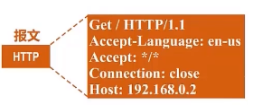
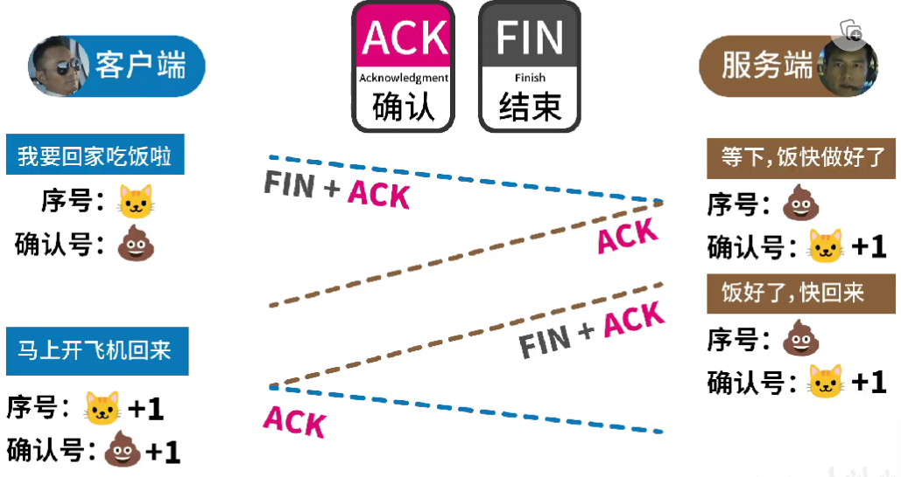

[toc]

# 1 总览

### 批处理 atch Processing

### 性能指标

**时延**

发送时延=分组长度（b)/发送速率（b/s)

传播时延=信道长度(m)/信号传播速率(m/s)

**吞吐量**

**单位时间内**通过某个网络（或信道、接口）的数据量。

### 分时系统

多个终端和同一个计算机连接，允许多个用户同时使用一个计算机，实现了一人一机的目的，体现独占性。

### 端口
包括逻辑端口和物理端口
物理端口是用于连接物理设备之间的接口，如ADSL Modem、集线器、交换机、路由器上用于连接其他网络设备的接口，如RJ-45端口、SC端口等等 [2]。逻辑端口是指逻辑意义上用于区分服务的端口，比如用于浏览网页服务的80端口，用于FTP服务的21端口等。

**作用**
端口号的主要作用是表示一台计算机中的特定进程所提供的服务。网络中的计算机是通过IP地址来代表其身份的，它只能表示某台特定的计算机，但是一台计算机上可以同时提供很多个服务，如数据库服务、FTP服务、Web服务等，我们就通过端口号来区别相同计算机所提供的这些不同的服务，如常见的端口号21表示的是FTP服务，端口号23表示的是Telnet服务端口号25指的是SMTP服务等。

# 1. 七层结构

结构：

链路层首部-网络层首部-运输层首部-应用层报文-链路层尾部

## 输入网址后，发生了什么

\*\*

- DNS 解析：将域名解析成 IP 地址
- TCP 连接：TCP 三次握手
- 发送 HTTP 请求
- 服务器处理请求并返回 HTTP 报文
- 浏览器解析渲染页面
- 断开连接：TCP 四次挥手

\*\*

应用层按 HTTP 协议构建一个 HTTP 请求报文。

应用层将 HTTP 请求报文交给运输层处理

运输层给 HTTP 请求报文添加一个 TCP 首部，作用是区分应用进程及实施可靠传输。

运输层将 tcp 报文转给网络层。

网络层添加 IP 数据报，使能通过路由器转发

数据链路层 IP 数据报一个 ETH 首部，使网帧在一个链路上或网络上传输，能够被相应主机接受

首部添加 FCS，检测所接收到帧是否有误码

数据链路层将帧交给物理层，物理层将帧看为比特流，在比例流前添加前导码，作用让目的主机做好接受帧的准备。

路由器处理过程

## 物理层

为上层协议提供一个传输数据的物理媒体。

- **中继器 repeater，也叫放大器。**
- 集线器

## 数据链路层

在物理层基础上向网络层提供服务，最基本服务是将来自网络层的数据可靠地传输到相邻节点的目标机网络层。

- 基本数据单位为帧。
- 主要协议：以太网协议。
- 两个重要设备名称：网桥和交换机。

## 网络层

负责对子网间数据包进行路由选择，目的是实现两个端系统间的数据透明传输。

- 基本数据单位为 ip 数据报。

协议：

### IP 协议

### ARP 协议（address resolution protocol，地址解析协议）

如何通过 IP 地址找到其对应的 MAC 地址？（ARP 协议）

主机中存在高速缓存表

### 路由器

## 传输层

主机到主机的层次。负责将上层数据分段并提供端到端，可靠或不可靠的传输。

网络层只根据网络地址将源节点发出的数据包传送到目的节点，而传输层负责将数据可靠的传送到相应端口。

- 信息传送的协议数据单位称**段或报文**。

协议：

### TCP 协议（Transmission Control Protocol 传输控制协议）

TCP 协议负责发现传输问题，出现问题即发送信号，要求重新传输，直至所有数据安全正确传输到目的地。IP 地址给每台联网设备规定一个地址。

### UDP 协议（User Datagram Protocol，用户数据报协议）

## 应用层

- 数据传输基本单位为报文。
- 包含应用层、会话层、表现层。

协议：

### FTP 协议（文件传送协议）

### DNS 协议

### HTTP 协议（Hyper Text Transfer Protocol)

# IP 地址

**网络地址：** 由网络号和主机号组成，网络地址的主机号为全 0。

**广播地址：** 和网络地址的主机号相反，主机号为全 1。

**组播地址： D 类地址。**

每 8 位分为一组，

### 子网掩码

为了区分网络位和主机位。进行按位与。

(司村和司马村的故事)

## MAC 地址

局域网地址或物理地址，用于在网络中唯一标识一个网卡。共 48 位，

> **与 IP 地址区别：**
>
> 寻址协议不同：IP 地址用于 OSI 模型的网络层，MAC 地址用于 OSI 模型的数据链路层

### VPN 和网络地址转换 NAT

虚拟专用网 vpn

## socket

是一套用于不同主机间通信的 API,工作在 TCP/IP 协议上。

## 三次握手四次挥手

握手之后就建立了连接

关闭请求：

