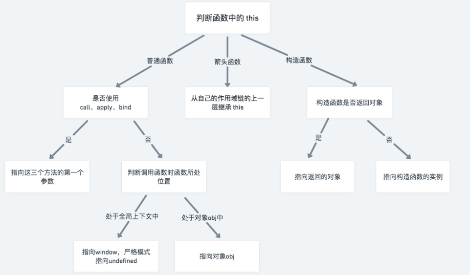
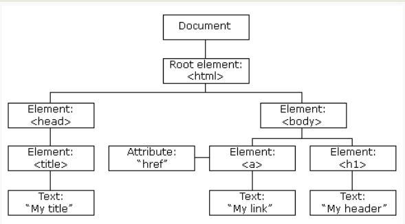
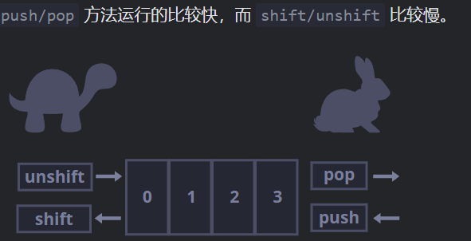
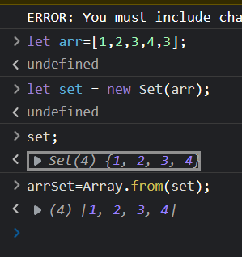
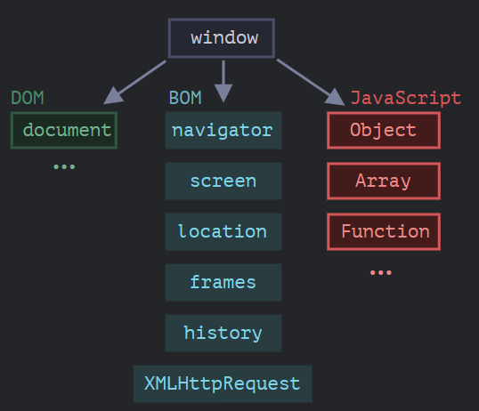
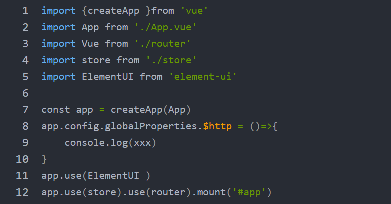
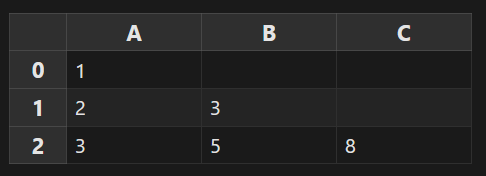
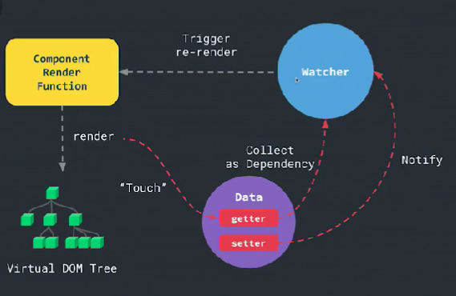
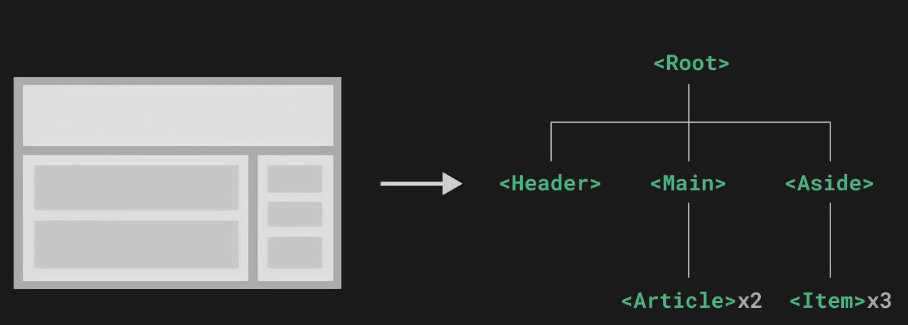
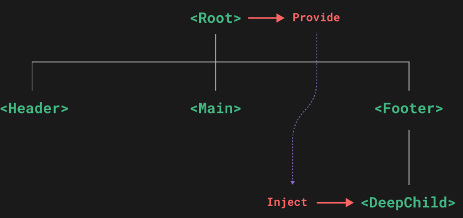

[toc]

## HC

### GIS 开发

- 师大维智

BIM + GIS
倾斜三维/人工建模/激光点云/BIM 等数据技术标准
各类型高精度 GIS 数据的三维重建，优化 3D 重建技术
海量三维数据栅格化/LOD 方案的设计
AUTOCAD 3DMAX MAYA
OBJ GLTF FBX
revit bently fuzor

# 面试

## 常见问题

- 自我介绍
- 技术栈
- 项目承担任务
- 对数据库是否了解
- 对 xxx 的理解
- 目前是否单身？
- 职业规划
- 家庭情况

### 创建一个现代应用程序我们需要什么

- javascript framework
  choose vue.js
- webpack and vite
  在开发中支持热模块替换和生产中捆绑代码的捆绑器。
- latest javascript syntax
  编译器 esbuild
- server side
  开发中为应用服务的服务器，支持服务端渲染或 API 路由。
- routing library
  处理客户端导航的路由库，选择 vue-router。

## 开发人员评测

(micro_frank)

### 素质结构

1.事业心 2.战略观念（你怎么看待 arcgis） 3.开拓性 4.协作性 5.进取心 6.坚韧性

### 智力结构

1.基础理论（数据结构） 2.专业知识（项目） 3.观察力（发现 bug) 4.判断力（发现 bug 在哪)

### 能力结构

1.发现问题的能力 2.获信息的能力（分配任务，查找论坛学为己用） 3.创新能力

### 绩效结构

1.技术经济效益（社会经济效益）

## 技术管理人员

### 素质结构

1.法制观念 2.事业心 3.技术经济概念 4.责任心

### 智力结构

1，专业知识 2.知识面（前端后端交互） 3.对新技术新产品敏感性 4.思维力

### 能力结构

1.科学技术鉴别能力 2.灵活性 3.信息沟通能力 4.协调能力

### 绩效结构

1.科学技术的成果 2.社会经济效益

## 开发杂谈

### spring / drango express 等框架的出现是为了解决什么问题？应用在哪些方面？

- first what is the framework?

don't repeat yourself


## javascript

浅拷贝是复制一个对象的引用，深拷贝是克隆一个新的对象。与原对象有不同的内存地址。

```javascript
//浅拷贝实现形式：
Object.assign();
//针对对象自身可枚举的属性
function cloneDeepAssign(obj) {
  return Object.assign({}, obj);
}

//JSON实现深拷贝
function cloneDeepJson(obj) {
  return JSON.parse(JSON.stringify(obj));
}
```

### js 代码规范

- 驼峰命名
- 运算符 `= + - * /`添加空格
- 全局变量为大写（UPPERCASE），常量大写。
- HTML 和 CSS 横杠。

### 为甚么要实现深度克隆？

### 为什么 vue 中的 data 要用 return 返回

**组件就是一个可复用的 vue 实例**

及如果 data 是一个普通的对象，那么所有复用此实例的组件都将引用同一份数据，造成数据污染。

    此时若将data封装成一个函数，在实例化组件的时候知识调用了此函数生成的副本，避免了数据污染。

### 对象和原始类型类型区别

对象通过引用存储和赋值，原始类型：字符串、数字、布尔值作为一个整体复制。

### 谈谈 map 和 forEach()的区别

### vat let 和变量提升问题

```javascript
function getNum() {
  console.log(num);
  var num = 1;
}
getNum();
//会输出undefined,因为等价于
//|
//\/
function getNum() {
  var num;
  console.log(num);
  var num = 1;
}
getNum();
```

作用域控制了变量和函数的可见性和生命周期。
**问题** 1.会导致变量被覆盖 2.变量没有被销毁
**解决**：var & let

- 暂时性死区

```javascript
var tmp = 123;
if (true) {
  tmp = "abc"; //referenceError
  let tmp;
}
```

尽管存在全局变量 tmp,但在块级作用域内 let 声明了一个局部变量 tmp,在声明之前就使用了，会报错。

### 为什么 Object.prototype.toString()能精确进行类型判断？

获取 this 指向的对象的[[Class]]属性的值。（这是用 call 改变 this 指向的原因）

### bind() call() apply()用法区别



### 箭头函数和普通函的区别

1.this 指向不同； 2.普通函数，谁调用这个函数,this 指向谁； 3.箭头函数，在哪里定义这个函数，this 指向谁；

```javascript
var obj={
  name:"xiaoming";
  setTimeout(()=>{
    console.log(this.name);
  }，500)
}
obj.setTimeout();
//输出xiaoming,因为此时箭头函数指向上一级对象

var obj={
  name:'xiaomign';
  setTimeout(function(){
    console.log(this.name);
  }，500)
}
obj.setTimeout();
//输出undefined，因为此时指向setTimeout()方法是全局对象
```

### 谈谈闭包

函数嵌套函数，内部函数就是闭包。
正常情况下，函数执行完成，会释放内存空间。

```javascript
function outerFun() {
  function innerFun() {
    //...此时内部就是闭包
  }
}
```

### DOM 树



- addEventListener()

```javascript
  element.addEventListener(event,function,useCapture);
  //(第一个事件类型，第二个调用函数，第三个布尔值用于描述事件是冒泡还是捕获（可选）)
```

- appendChild()创建新的 HTML 元素在尾部
- insertBefore()创建新元素添加到开始位置
- removeChild()移除元素（需要知道父元素所在位置）
- replaceChild()替换 HTML 元素

### 网址的组成部分 （协议 主机 端口 路径 查询参数 锚点）

`https://www.example.com:80/path/to/myfile.html?key1=value1&key2=value2#anchor`
**协议**https://是默认协议
**主机**host 是资源所在网站名或服务器名字，又称域名。
**端口**同一域名下可能多个网站，之间通过端口(port)区分。
**路径**资源在网站的位置
**查询参数**parameter 是提供给服务器的额外信息。用 key-value pair（键值对）形式。
**锚点**anchor 内部定义点，

### 函数表达式和函数声明式有什么区别？

```javascript
sayHi("john");

function sayHi(name) {
  alert(`hello,${name}`);
}
//函数声明式是在声明之前就可被调用
```

```javascript
sayHi('john')

let sayHi = function(name){
  alert(`hello,${name}`)
}
//函数表达式在声明之前不能调用
`
```

### 深拷贝浅拷贝

- **浅拷贝**
  当拷贝引用类型时，源对象也会被修改。
- **深拷贝**
  在内存堆区域重新开辟空间，修改拷贝对象不会影响到源对象。

**浅拷贝方法**： 1.直接赋值

```javascript
var user1={
  name:'法医',
  age:14;
}
var user2=user1;
use2.name='狼人';
console.log(user1);//{name:'狼人',age:14}
```

2.Object.assign()方法
如果拷贝的是基本数据类型，拷贝的就是基本上数据类型的值；如果拷贝的是引用数据类型，拷贝的就是引用内存地址。

### 基本类型和引用类型

**基本类型：undefined/boolean/number/string/nul**
基本类型的值是存放在栈内存中的

**引用类型**
**即对象**
引用类型数据保存在堆内存中，
引用类型的值是按引用访问的。

### 代码空间/堆/栈空间

### new 一个对象时发生了什么？

```javascript
var obj = new Base();
obj.proto = Base.prototype;
Base.call(obj);
//创建一个空对象
//将空对象的_proto_成员指向Base函数对象的prototype成员对象
//Base函数对象的this指针替换为obj,然后调用Base函数
```

### new 和 Object.create()区别

### 谈谈数组



### 类数组对象

**必须具有 length 属性的对象**

```javascript
let arrayLike = {
  0: "tom",
  1: "54",
  2: "男",
  3: ["a", "b", "c"],
  length: 4, //必须有此属性，若没有，转换后数组是个空数组
};
let arr = Array.from(arrayLike);
console.log(arr); //['tom','54','男',['a','b','c']]
```

**类数组转为真正数组条件：** 1.必须具有 length 属性，用于指定数组的长度。 2.属性名必须为数值型或字符串型数字。

### Array()有哪些方法？

**Array.from()** 1.将一个类数组对象或可遍历对象转换为一个真正数组。


### 存取器函数 set get

`get`关键字将对象的属性和函数进行绑定，当属性被访问时，对应函数被执行。

```javascript
const obj = {
  log: ["example", "latest"],
  get latest() {
    if (this.log.lenth == 0) return undefined;
    return this.log[this.log.length - 1];
  },
};
console.log(obj.latest);
//'latest'
```

`set`关键字当改变属性值时，对应函数被执行。

```javascript
const language = {
  set current(name) {
    this.log.push(name);
  },
  log: [],
};
language.current = "en";
language.current = "fa";
console.log(language.log);
//['en','fa']
```

### Promise 和 Async/Await 区别

都是处理异步请求；

- Promise

```javascript
fetch("https://jsonplaceholder.typicode.com/posts/1")
  .then((response) => response.json())
  .then((json) => {
    console.log(json);
  })
  .catch((err) => console.error(err))
  .finally(() => {
    stopLoadingAnimation();
  });
```

- ecmascript2017 中加入 async/await

```javascript
async function f() {
  const response = await fetch("https://...");
  const json = await response.json();
  console.log(json);
}
f();
```

### 探讨一下浏览器环境和规格



## vite

### 使用 vite

安装 vite

```node
yarn add -D vite
//-D代表开发依赖
```

## vue2 & vue3 distinction

| vue2.x                  | vue3         |
| ----------------------- | ------------ |
| beforeCreated           | 使用 setup() |
| created                 | 使用 setup() |
| Object.defineProperty() | 使用 proxy   |

### 使用 proxy 代替 Object.defineProperty()

vue2 中实现代理方式:"**数据劫持**"

## vue

### vue 中 index.html / main.js / App.vue 联系

- index.html---主页 ，项目入口
- App.vue---根组件
- main.js---入口文件

vue3 中 main.js


### vue 中生命周期

**onMounted()**
注册一个回调函数，在组件挂载完成后运行。

```javascript
import {ref ，onMounted } from 'vue'

const el = ref()

onMounted(() => {
  el.value // <div>

})


<template>
  <div ref = "el"></div>
</template>
```

### v-bind 指令修改属性内容

```javascript
export default {
    data(){
        return {
            name : "Jack",
            age : 23,
            id : "d1"
        }
    }
}

<template>
    <div v-bind : id = "id"></div>
</template>
```

### v-model 原理

本质是两个操作：

1. v-bind 绑定一个 value 属性
2. v-on 给当前元素添加一个 input 事件

```javascript
//不使用v-model 实现双向绑定

export default{
    methods:{
        changeValue(e){
            this.msg = e.target.value
        }
    }
    ,
    data(){
        return {
            msg : "hello world"
        }
    }
}
<template>
<input type = "text" :value = "msg" @input = "changeValue">
<h2>{{ msg}} </h2>
</template>
```

**v-model 修饰符**

- `.lazy`
  在每次 input 事件触发后将输入框中的值和数据进行同步
- `.number`
  自动将用户的输入值转化为数值
- `.trim`

```javascript
<input type = "text" v-model.lazy = "msg">
//.lazy当输入框失去焦点，再去同步输入框中的数据
<input type = "text" v-model.number = "counter">
<input type = "text" v-model.trim = "dd">
```

### 代理中的 get / set 是什么？

**使用代理的意义**
**原来的方法 `obj.name`只是单纯地修改属性
当设置了 `get`后，是调用 `get`方法。
被包装成了方法。**

```javascript
const obj = {
  name:"孙悟空",
  age:18,
}

//为对象创建一个代理
const handler = {
  //get用来指定读取数据时的行为， 返回值是最终读取到的值
  //指定get后， 在通过代理对象读取对象属性时， 就会调用get方法来获取值
  //target 被代理的对象
  //prop 读取的属性
  //receiver 代理对象
  get(target, ){
    //在vue中，data()返回的对象会被vue所代理 ，vue代理后， 当我们通过代理去读取属性 时 ， 返回值之前， 他会先做一个跟踪的操作
    //当get被调用时，vue 会记录谁使用了此数据
    console.log(args)
    return target[prop]
  }

  //set会在通过代理修改对象时调用
  set(target , prop , value , receiver){
    target[prop] = value

    //trigger() 触发所有的使用该值的位置进行更新
  }
}//handler来指定代理的行为

//创建代理
const proxy = new Proxy(obj , handler)
//修改代理的属性
proxy.age = 28
```

### 类似问题 java 类为何要用 set / get 方法

在 java 中喜欢定义一个 private 变量，在这个私有变量上加上 get / set 方法，为何不直接定义一个 public 方法？

### 代理对象

```javascript
//定义一个普通对象obj
const obj = {
  name:'yu',
}


const objProxy = new Proxy(obj , {
  //get 捕获其
  get : function(target , key){
    console.log(`捕获到对象获取${key}属性的值操作`);
    return target[key];
  }
}

  set : function(target , key , value){
    console.log(`捕获到对象设置${key}属性的值操作，新值为${value}`);
    target[key] = value
  }
)

console.log(objProxy.name)
//捕获到对象获取name属性的值操作
//yu

console.log(objProxy.name = 'si');
//捕获到对象设置${name}属性的值操作，新值为si
```

**设定值约束**

```javascript
set : function(target , key , value){
  if(key === 'age' && typeof value === 'number'){
    target[key] = value;
  }
  else
    throw new TypeError('该属性的值必须是number类型')
}
```

```javascript
<script>
  const obj = {
    count : 0
  }
  export default{
    data(){
      return {
        count:0
      }
    }
  }
</script>
<template>
  <button @click = "count++">{{count}}</button>
</template>

```

此时 import button.vue

```vue
<button></button>
<button></button>
```


值是相同的，因为都指向了一个对象地址

**解决办法**
生成四个代理对象：

```javascript
<script>

  export default{
    data(){
      return count:0
    }
  }
</script>

<template>
  <button @click = "count++">{{count}}</button>
</template>
```

### 事件处理

**事件修饰符**

- .stop
  //阻止事件冒泡 ，

```javascript
<div @click = 'divClick'>
<button @click = "btnClick">按钮</button>
</div>
//两个click 一个是父元素 ，一个是子元素

divClick (){
    console.log("父元素展示")
}

// btnClick(){
//     console.log("子元素展示")
// }
//点击btn ， 会执行完子元素后冒泡执行到父元素。
//正确如下

btnClick.stop(){
    console.log("子元素展示")
}

```

- .prevent

```javascript
<form action = "">
    <input type = "submit" value = "提交" @click.prevent = "submitClick">
</form>

submitClick(){
    console.log("提交数据成功");
}
```

- .once
  只触发一次回调

### 深入响应式


`update()`产生一个 `effect()`，更改程序里的状态。

A0 / A1 是这个作用的依赖（`dependency`），因为他们的值被用来执行这个之哟用。

`whenDepsChange(update)`

- 当一个变量被读取时进行追踪。
- 探测一个变量的变化。

**javascript**中有两个劫持 propety 的方式：**`getter`/`setter`（vue2)和 `proxies`（vue3）**。

```javascript
function reactive(obj) {
  return new Proxy(obj, {
    get(target, key) {
      track(target, key);
      return target[key];
    },
    set(target, key, value) {
      target[key] = value;
      trigger(target, key);
    },
  });
}

function ref(value) {
  const refObject = {
    get value() {
      track(refObject, "value");
      return value;
    },
    set value(newValue) {
      value = newValue;
      trigger(refObject, "value");
    },
  };
  return refObject;
}
```

为保证访问代理的一致性，对同一个原始对象调用 reactive()会返回同样的代理对象，而对一个已存在的代理对象调用 reactive()会返回其本身。

```javascript
const raw = {};
const proxy = reactive(raw);

console.log(reactive(raw) === proxy); //true
console.log(reactive(proxy) === proxy); //true
```

### reactive()局限性

- 当将一个响应式对象的属性解构为一个局部变量时，响应式会断开连接，因为对局部变量的访问不再触发 get/set 代理捕获。
- 利用===可以区分原始对象和响应式对象。
- 只对对象类型有效（Object/Array/Map/Set 等集合类型），对 string/number/boolean 等原始类型无效。

### ref()和 reactive()

ref()将传参值包装为一个带.value 的属性的 ref 对象。

- ref 被传递给函数或是从一般对象上被解构时，不会丢失响应性,需要 `.value`。（在 js 中使用，需要添加.value 后缀）
- 当 ref 再模板中作为顶层属性被访问时，会自动解包，不需要 `.value`。（在模板中使用 ref 申明的响应式数据，可以省略.value）。

```javascript
const object = {foo: ref(1)}

{{object.foo + 1}}
//[object Object]1

//可通过将foo改成顶层属性来解决此问题
const {foo} = object
{{foo + 1}}
//2
+

```

**DOM 更新时机**
vue 将缓冲他们直到更新 周期 的下个时期，以确保无论进行多少次状态修改，每个组件只更新一次。

```javascript
nextTick()

//等待下一次DOM更新刷新的工具方法
function nextTick(callback?: () => void):Promise<void>
```

### 表单输入绑定

再 javascript 中的表单输入框中的内容需要同步给 javascript 中响应变量：

```javascript
<input
:value = "text"
@input = "event => event.target.value">
```

利用 `v-model`指令简化步骤：

```javascript
<input v-model = "text">
```

### 计算属性

```javascript
<scritp setup>
  import {reactive , computed} from 'vue'

  const author = reactive({
    name:'Jack' ,
    books:[
      'one',
      'two',
      'three'
    ]
  })

  const publishedBookMessage = computed(() => {
    author.books.length > 0 ? 'yes' : 'no'
  })
</script>

<template>
  <span>{{publishedBookMessage}}</span>
</template>
```

**计算属性缓存和方法**

**每一个计算属性默认有 getter 方法，计算属性一般没有 setter 方法**

- **简写版**

```javascript
computed:{
    reversed(){
        return this.books.reverse()
    }
}
```

- **完整版**

```javascript
computed:{
    reversed(){
        get : function(){
            return this.books.reverse()
        }
    }
}
```

**不同：计算属性会基于其响应式依赖被缓存**
**只在相关响应式依赖发生改变时他们才回重新求值。**
即只要 author.book.length 还没有改变，多次访问 calculateBookMessage 计算属性回立即返回之前的计算结果，**不必再执行函数**。

### 侦听器

计算属性允许我们声明式计算衍生值。
侦听器允许我们再状态变化时执行一些“副作用”。（异步或开销较大的操作）。

**基础版**

```javascript
export default{
    data(){
        return {
            message : "helloWorld",
        }
    },
    watch{
        message(newValue , oldValue){
        console.log(newValue);
        console.log(oldValue);
        }
    }
}

<template>
    <div>{{ message }}</div>
    <button @click = "mesage = '你好'">change message</button>
</template>

//你好
//helloWorld
```

**进阶版**

- 选项式 API

```javascript
export default {
  data(){
    return {
      question : '',
      answer : 'question usually contain a question mark'
    }
  },
  watch():{
    //每当question改变时，这个函数就会执行
    question(newQuestion , oldQuestion){
      if(newQuestion.includes('?')){
        this.getAnswer()
      }
    }
  },
  methods:{
    async getAnswer(){
      this.answer = 'thinking...'
      try{
        const res = await fetch('https://yesno.wtf/api')
        this.answer = (await res.json()).answer
      } catch(error){
        this.answer = 'error! could not reach the API' + error
      }
    }
  }
}
```

- 组合式 API

```javascript
<script setup>
  import {ref , watch} from 'vue'

  const question = ref('')
  const answer = ref('question usually contain a question mark')

  //可以直接监听一个ref
  watch(question , async(newQuestion , oldQuestion) => {
    if(newQuestion.indexOf('?') > -1 ){
      answer.value = 'thinking...'
      try{
        const res = await fetch('https://yesno.wtf/api')
        answer.value = (await
         res.json()).answer
      } catch(error){
        answer.value = 'error! could not reach the API' + error
      }
    }
  })
</script>

<template>
  <p>
    ask a yes/no question:
    <input v-model = 'question' />
  </p>
  <p>{{ answer}}</p>
<template>
```

### watch()

监控 data 数据对象中的属性值发生改变。

```javascript
//导入watch函数
import { watch } from "vue";

watch : {
    key1 : function(newVal , oldVal){

    },
    "obj.key1" :
}
```

**深度监听**

```javascript
export default {
  data() {
    return {
      user: {
        name: " 张三丰",
      },
    };
  },
  watch: {
    //监听不到对象的属性变化，需要使用深度监听
    user: {
      handler: function (newValue) {
        console.log(newValue);
      },
      deep: true, //表示是否深度监听
    },
  },
};
```



### 什么是 nextTick()

vue 在更新 DOM 时是异步执行的。
本质是一种优化策略。

```javascript
{
  {
    num;
  }
}
for (let i = 0; i < 1000; i++) {
  num = i;
}
```

如果没有 nextTick，上面 num 每次更新都会触发视图更新（触发 1000 次更新），有了 nextTick，只需要更新一次。

\*\*

### 讲述一下组件

组件把 UI 划分为独立的/可重用的部分，并对每个部分进行单独的思考。
再组件实例中，组件常被组织成层层嵌套的树状结构：


### vue 组件的 data 为什么是一个函数

让每一个组件对象都返回一个函数，避免组件间数据污染。

### 组件实例实际上是一个代理对象

在 vue.js 中， 每个组件都是由 vue 实例化的代理对象。
这个代理对象负责管理代理组件的行为， 并将其渲染到 DOM 中。

### 有哪些组件实例

this 上暴露的内置属性和方法。

```javascript
interface ComponentPublicInstance {
  $data:object
  //

  $props:object
  //表示组件当前已解析的props对象

  $el:Node | undefined
  //该组件实例管理的DOM根节点
  //$el直到组件挂载完成（mounted）之前都是undefined

  $options:ComponentOptions
  //已解析的用于实例化当前组件的组件选项


}

```


### 通过 props 向子组件**传递**值

在 Hello.vue 中：

```javascript
props :{
  //对象
  //属性一：类型限制
  //属性二：默认值
  //属性三：必传值
  message : {
    type : [String , Number] //有多种可能可以用数组形式./0
    default : "你好" ,
    required : true
  },
  list:{
    //对象或数组的默认值必须从一个工厂函数返回
    type : Array ,
    default(){
      return []
    }
  }
}
```

**父组件访问子组件，$refs 开发中常用**

**子组件访问父组件，$parent 在开发中尽量少用。原因：组件的耦合性很高，复用性很高。**

**子组件访问根组件，$root**

### 通过 `$refs`父组件**访问**子组件或子组件访问跟组件（需要搭配 ref 指令使用）

**用来给元素或子组件注册引用信息时，`ref`;访问信息时，`$refs`**

在 Content.vue 中：

```javascript
<Hello :message = "msg" aa = "123" :list = "list" ref = "hello"></Hello>
<p ref = "p"></p>

<script>
  import Hello from 'vue'
  export default{
    data(){
      return {
        msg : "helloworld" ,
        list : [1 , 2 , 3 , 4],
      }
    },
    methods:{

    },
    mounted(){
      console.log(this.$refs),
    },
    components:{
      Hello
    }
  }
```

### 通过$emit 来子传夫

在子组件 Content.vue 中，通过$emit 来触发事件
**子组件中**

```javascript
//templat中
<h2>{{ msg}}</h2>
<button @click = "sendParent">提交数据给父组件</button>

//script中
methods:{
  sendParent(){
    //this.$emit('自定义事件的名称' , '发送的事件参数')
    this.$emit('injectMsg' , this.msg)
  }
}
```

**父组件中：**

```javascript
//template中
<div>
  <!--拿到子组件中Content.vue的数据，通过自定义事件-->
  <!--在父组件中，通过v-on监听子组件中自定义的事件-->
  <Content @injectMsg = "getChildMsg"></Content>

<script>
  methods:{
    getChildMsg(){
      console.log(value);
      this.message = value;
    }
  }
</script>
```

**父组件 Content.vue**

```javascript
//父组件Content
<template>
  <Hello :message = "msg"></Hello>
</template>

<script>
  import Hello from './Hello.vue'

  export default {
    data(){
      return {
        msg : "helloworld"
      }
    }
  }
</script>
```

**子组件 Hello.vue**

```javascript
<template>
  <div>{{ message }}</div>
</template>

<script>
  export default{
    props:['message']
  }
</script>
```

### 依赖注入 `provide`和 `inject`

**prop 逐级透传**


```javascript
<script setup>import {provide} from 'vue' provide('注入名' , '值')</script>
```

**`inject`注入上层组件提供的数据**

```javascript
import { inject } from "vue";

const message = inject("注入名");
```


### 如何绑定 Class？

```javascript
const classObject = reactive({
  active: true,
  'text-danger': false
})
const errorClass = ref('text-danger')

<div :class = "[classObject,errorClass]"></div>
//可以给：class绑定一个数组来渲染多个css class
```

也可以使用三元表达式：

```javascript
<div :class="[isActive ? activeClass : '' , errorCLass]"></div>
```

### 插槽`v-slot` 具名插槽和匿名插槽

向子组件的**指定位置**插入一段内容， 这个内容可以是**html**或者**其他的组件**。
（ 在页面上预留坑 ，未来想使用时 ， 可以自己决定 。）

**结论：在父组件的 template 中，只能访问父组件的数据，不能访问子组件的数据**

- **具名插槽 && 匿名插槽**
  Child.vue 中：

```javascript
<template>
  <main>
    <slot></slot>
    //匿名插槽
  </main>
  <footer>
    <slot name="footer"></slot>
    //具名插槽
  </footer>
</template>
```

Parent.vue 中：

```javascript
<div slot = "footer">
  <h1>header</h1>
  //会放到footer插槽中
</div>
<div>
  <p>一段内容</p>
  //会放到匿名插槽中
</div>
```

- **插槽作用域问题**

Child.vue 中：

```javascript
<template>
  <a :href = "url" class = "nav-link">
    <slot :url = "url"></slot>
  </a>
</template>

<script>
  export default {
    props : ['url']
  }
</script>
```

Parent.vue 中：

````javascript
<template>
  <div id = "parent">
  <h1>插槽</h1>
  <Child url = "https:baidu.com" v-slot = "slotProps">
    访问 {{ slotProps }}
  </Child>
</template>

<script>
  import Child from './Child';

  export default{
    components :{
      Child
    },
  }
  </script>


### 什么是组合式 API 和选项式 API?

通常与 `<script setup>`搭配使用。

包含以下方面 API

- 响应式 API：直接创建响应式状态/计算属性/侦听器。
- 生命周期钩子：onMounted()/onUnmounted()，使能在组件各生命阶段添加逻辑。
- 依赖注入：如 provide()/inject()。

能够实现逻辑复用

```javascript
<script setup>
  import {ref,onMounted} from 'vue'

  //响应式状态
  const count = ref(0)

  //用来修改状态/触发更新的函数
  function increment(){
    count.value++
  }

  //生命周期钩子
  onMounted(()=>{
    console.log(`this initial count is ${count.value}`)
  })
  </script>
  <template>
    <button @click = "increment">count is :{{count}}
    </button>
````

**可以将同一个逻辑关注点的代码整合在一起。**

- 选项式 API
  可以用包含多个选项的对象来描述组件的逻辑，如 `data/methods/mounted。`选项定义的属性会暴露在函数内部 this 上，指向当前的组件实例。

```javascript
<script>
  export default {
    data(){
      return {
        count:0;
      }
    },
    methods:{
      increments(){
        this.count++
      }
    },
    mounted(){
      console.log(`the initial count is ${this.count}`)
    }
  }
  </script>
  <template>
    <button @click="increments">count is :{{count}}
    </button>
  </template>
```

### v-bind v-on v-model 区别

v-model 是标签外 value 的双向绑定，v-bind 是标签内属性的单向绑定，同时都支持数据的动态变化。

v-bind 缩写：

```javascript
<a v-bind:href="url">..</a>

//缩写
<a :href="url">..</a>
```

### 前端路由实现方式？

常见路由实现方式：history&hash

路由工作：通过一定机制，监听用户的行为动作，从而做出对应变化。

- hash
  浏览器通过 `hashchange`方法，

## es6

### 为什么子类 super()一定要放在 this 之前？

## git

### zip 和 ssh 区别

ssh 可以将历史修改提交记录也 clone

## 自我答疑

- git

  目前对 git 常用指令有所掌握，不过还没有应用到实际团队协作的工作开发中。所以这一方面也是我想在贵公司实践并提升的技能。

# C

### c 中的 return 0 有什么用

return 0 代表函数正常终止。
也可返回一个变量内的值或指针，表示返回为空。
return 1 代表函数非正常终止。

# C++

### 结构体和类有什么区别？

**相同**

- 都有成员变量/成员方法/构造函数
- 类中的成员结构都可以定义（除析构函数外）

**distinct**

- 结构是值类型，存储在栈中；类是引用类型，存储在托管堆中。结构在声明时就已为其分配栈上的内存，而类需要 new 为其分配堆上的内存。
- 结构是隐式密封，不能使用**sealed**（只能在当前项目中访问 ，不能继承只能实例化）和**abstract**（只能在当前项目中访问，不能实例化只能继承）。
- **使用场景**
- 结构是值类型在栈中，栈的存取速度比堆块，但是容量小，适合轻量级对象。
  如点/矩形/颜色。
- 类是引用类型，存储在托管堆中，托管堆容量大，适合重量级对象。
- 如需要描述大量字段，又较抽象，需要继承，就用类。
