赵耀龙 GIS 4 1
舒娱琴 GIS 2 1
梅志雄 GIS 2 1
付迎春 RS 4 2
李卫红 GIS 3
刘亦书 RS 2
邢汉发 GIS 3
胡伟平 RS 2 2
罗文斐 RS 1 1
刘桂林 RS 2 1
孙彩歌 RS 2
丁浒 GIS 2

严嘉琛
电子信息 生物光电子研究院

刘树功
电子信息 生物光电子学院

蔡文蒨
电子信息 生物光电子学院

黄程
激光生命科学

周泓达
激光生命科学

任玲灵

窦振铎

巩成龙

李育骏

李健才

陈海宗

王思敏
河南农业大学
地理信息系统

沈天淇
天津师范大学 地理儿科学
地理信息系统

林文轩
测绘工程

吴永洲
测绘工程

黎耀勇

华南农业大学
测绘工程

郑文
测绘工程

谢铭杰
测绘工程

几何重心
优化几何

犯罪地理

**周泓达**
net logo

空间分析 自回归模型

城市街道 网络上设计街道网络警务区划问题
SNPDP

基于 Agent 模型的用于改进日常生活城市犯罪模拟

key words:
urban crime
ABM

ubuntu 系统

ubuntu 系统中安装未来编程环境
pytorch

tensorflow

**蔡文蒨**
基于元胞自动机的建筑火灾预测与疏散系统

- 火灾预测模型元胞自动机预测模型

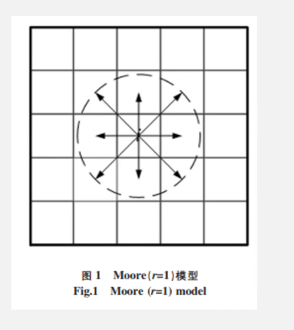

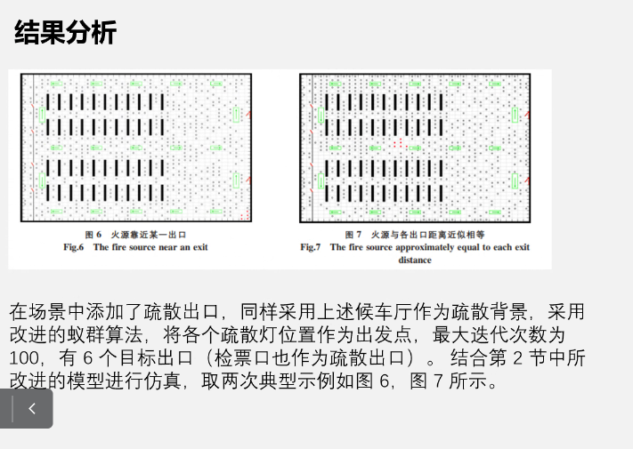

- 基于 A\*算法的深部地下空间火灾疏散路径动态规划

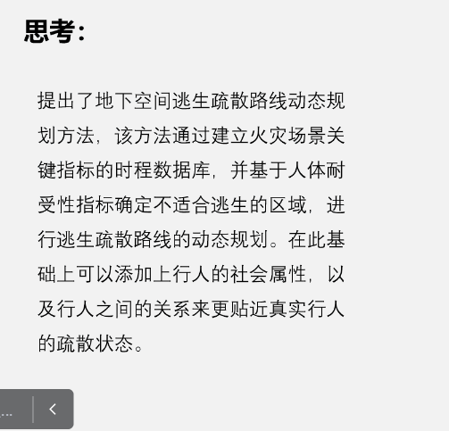

小论文方向：做火灾

夏吉喆

**巩成龙**

陈业滨师兄
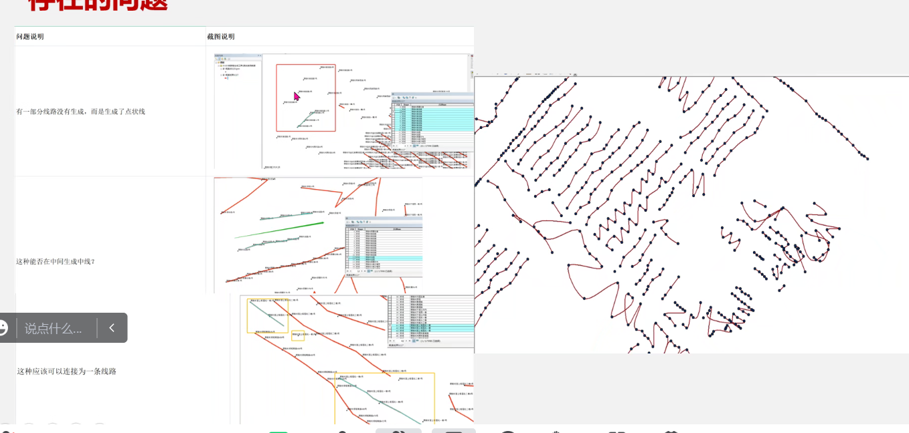

判断连接阈值

连线时同名点分组

最小二乘拟合曲线

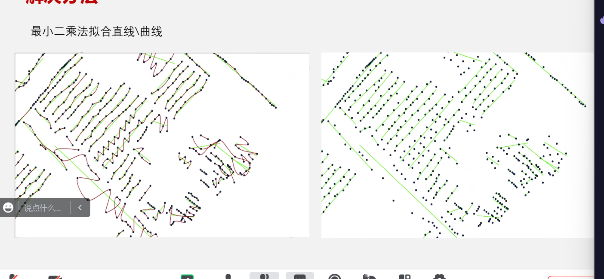

讨论需求，继续代码优化
分析 KRED 数据集（微软 MINST）

**陈海宗**

- 解决地址分词项目剩下问题并结题
- 文献阅读

《博弈论视角下的缉捕战略研究》

《面向突发事件的安保巡逻选址-路径优化研究》

analogic
对抗模拟仿真

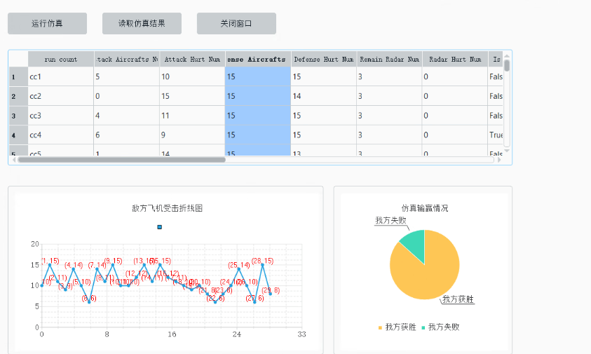

看一下科研软件

**窦振铎**
地理知识图谱

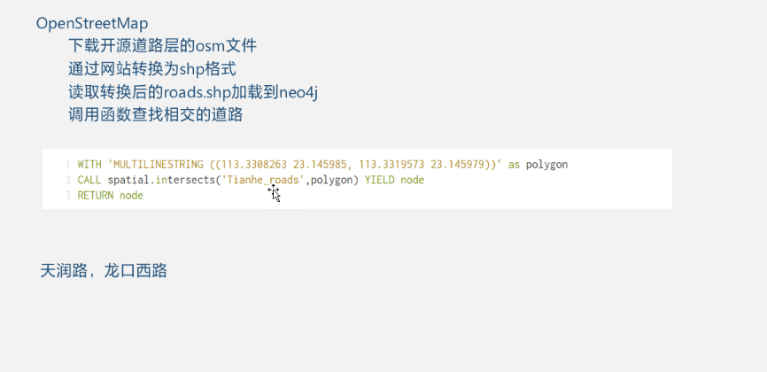

**黄程**

杨光

跨视域
跨视频

最优路径估计

多目标车辆跟踪

通过位置进行约束

摄像头做标定

畸变参数标定

硕士论文题目--多摄像头协同 多目标识别

**任玲灵**
武汉大学硕士论文

刑侦案件笔录的要素抽取和知识化表达研究
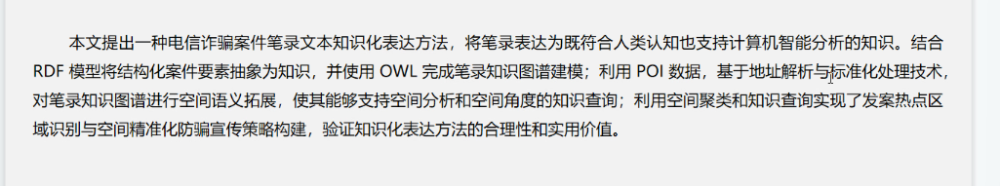

基于空间聚类的发案热点区域探索

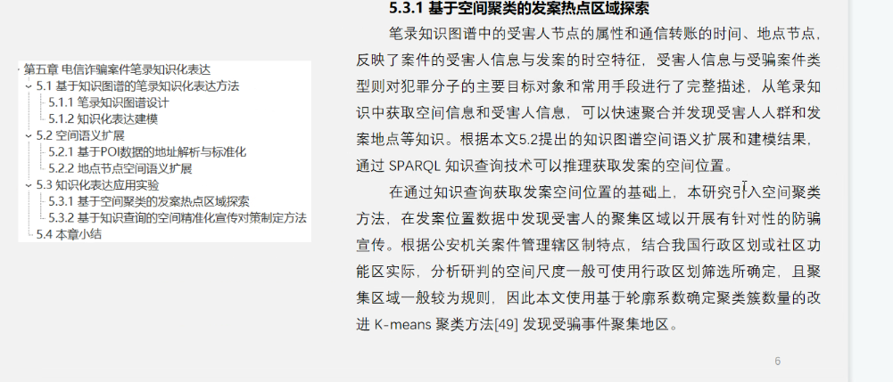

K-Means

**陈洁莹**
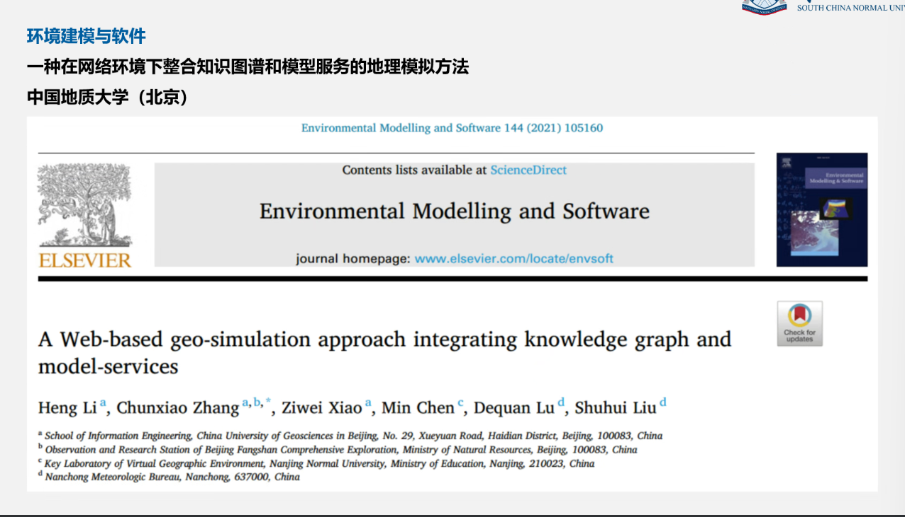

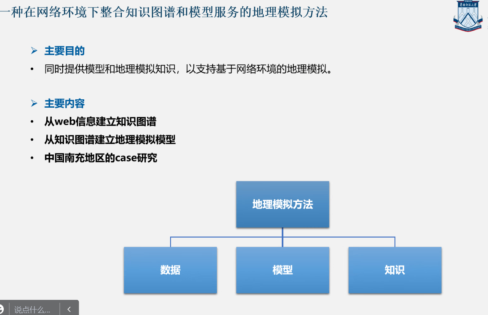

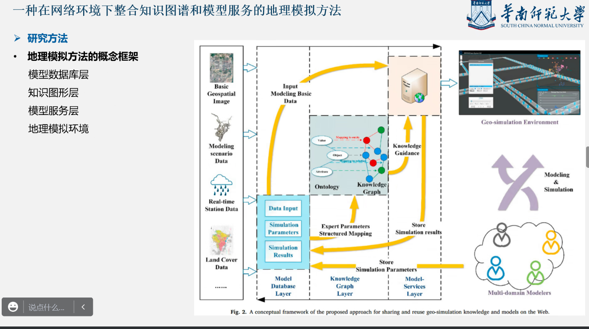

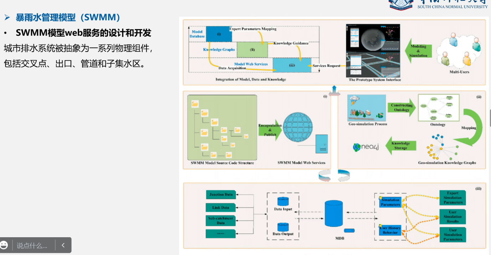

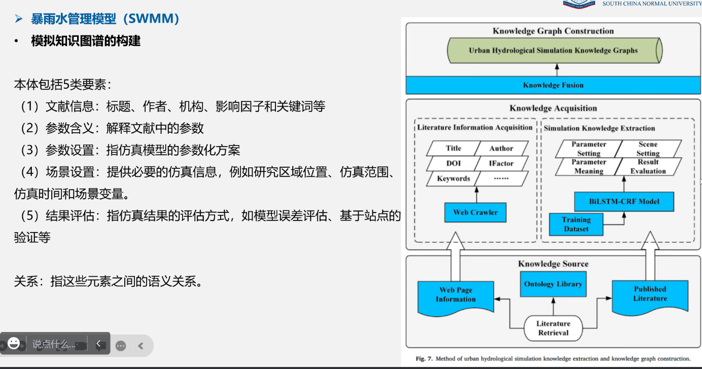

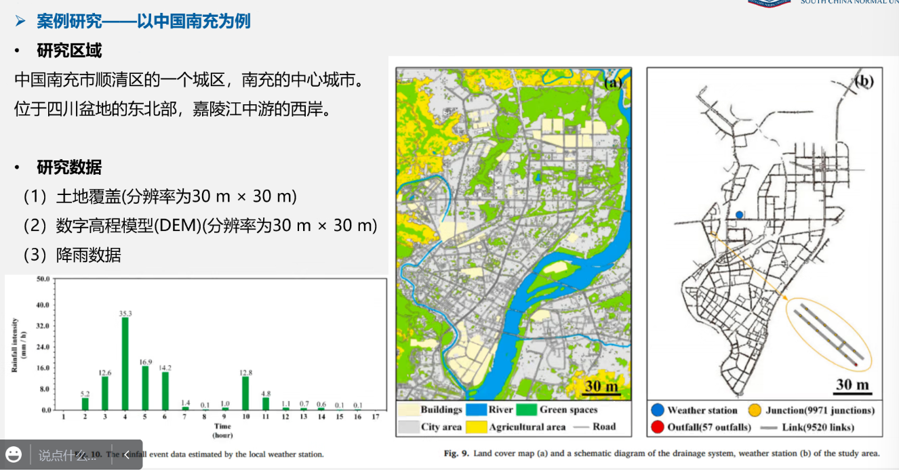

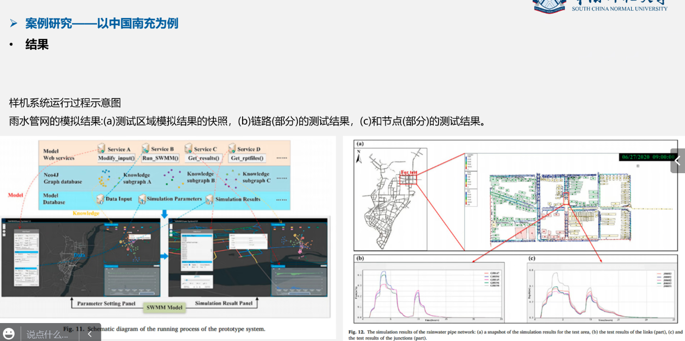

地理知识图谱
双碳知识图谱

**严嘉琛**
杨光老师

监控视频遮挡

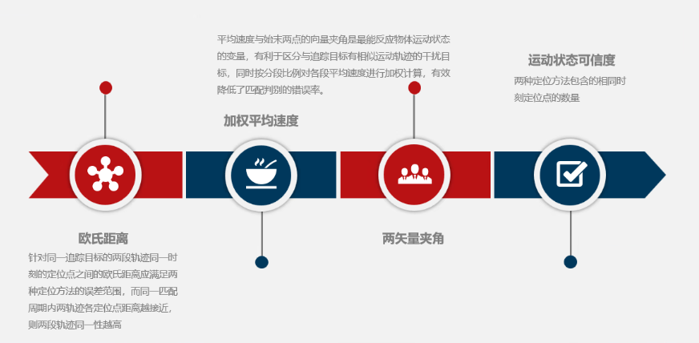

室内定位
摄影测量

孙彩歌
城市环境遥感

夏吉喆
地理信息时空大数据优化和数据挖掘

陈业滨
地理信息 智慧城市

## 7.7 组会

**周泓达？**
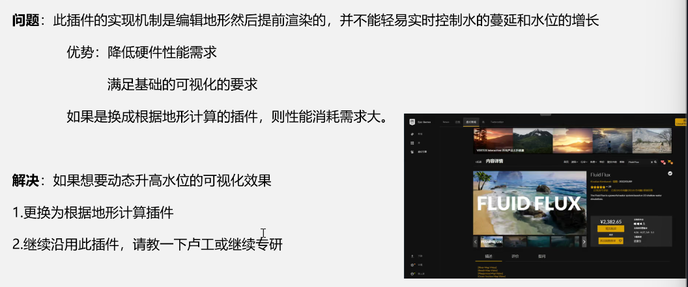

solve : 需要一个平台 。

**巩成龙**

huggingface
一个开源社区， 提供了先进的 NLP 模型。

google bert chinese
专门处理中文的模型

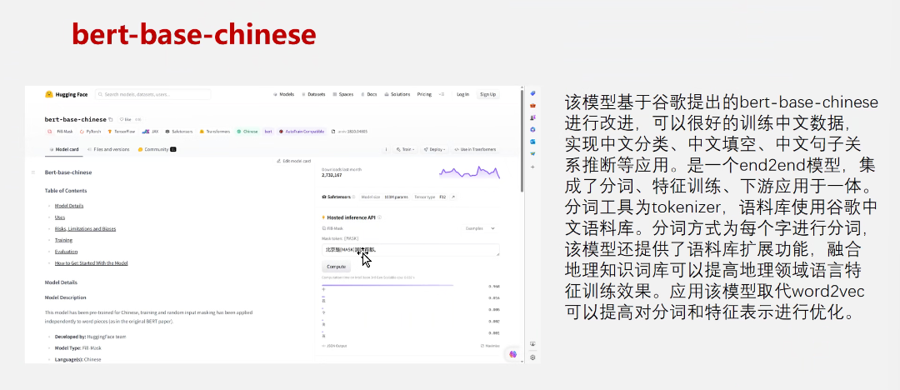

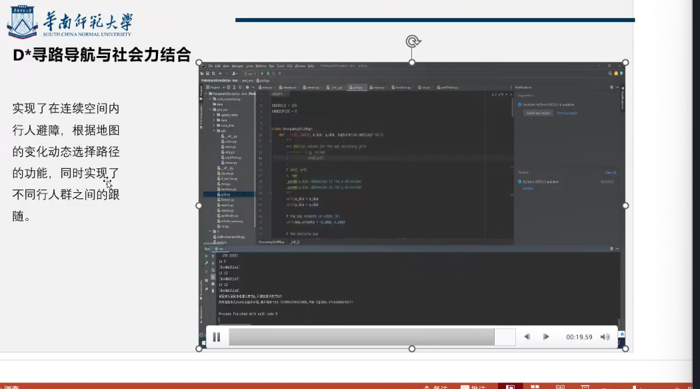

**陈海宗**
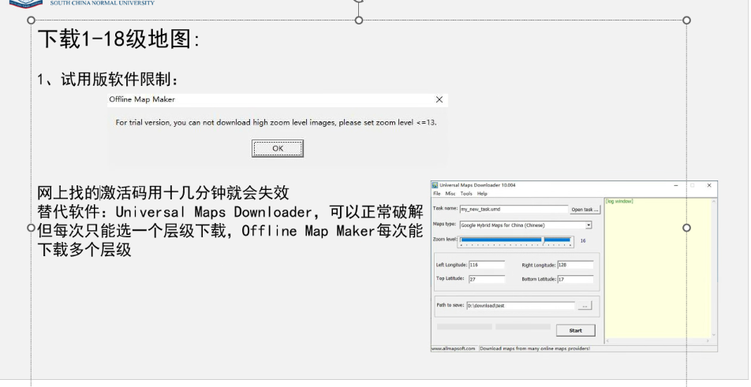

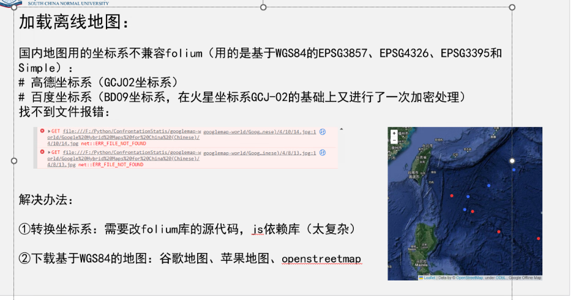

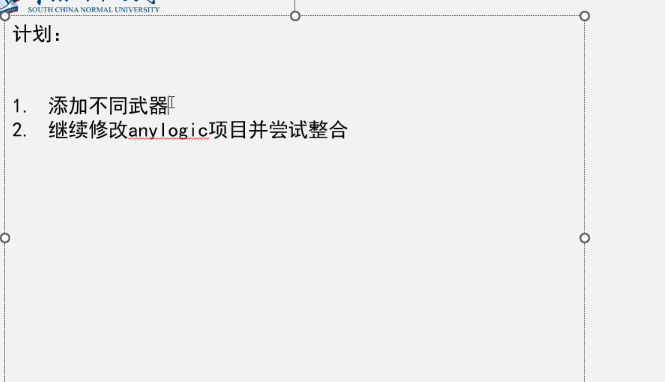

**蔡文蒨**

**任玲灵**

**陈洁莹**
