[toc]

372研友61 86 105 120
347莫
333彭63 68 78 124
331郭68 69 63 131  9
330张65 68 74 123  10
328于65 76 62 125  11
325俞70 75 66 114
322卢68 80 57 117

## 流程
专业能力考察
英语听说能力
实验技能
学科前沿知识

## 常见口语
projection and registration 
投影和配准

**1.introduce yourself**
Dear tutors , 
  It is my great honor to attend the retest of your university this year .
  My name is Yu Jiazhi . I come from Guilin , Guangxi Province . I once studied human geography and urban rural plannning in the School of Resources and Environmental Engineering , Wuhan University of Science and Technology . 
  In college , I was determined to improve myself in all aspects . After four years , my undergraduate GPA is 3.21 , and I have passed the CET-4 and CET-6 , and the National Computer Examination Level 2 . In addtion , I have won the national third prize in the National English Competition for College Students twice .
  During my undergraduate study , I majored in computer science and technology , and now I mainly study and apply front-end language . I have been interested in geography since I was a child . I especially like to read maps . I also pay much attention to the features around me when I got out and have drawn many maps myself . I used to make a lot of stereoscopic maps out of cardboard . In the process of learning , I found it fascinating to display geographical models . In my sophomore year , I also made a video of the process that I built a city in a game , exploring its technology and found it closely connected with webgis . Therefore , if I can be admitted by your university , I sincerely hope to devote myself to the field of geographic modeling . 
  In terms of social pracice , I served as a volunteer to guild the venues of the World Military Games during my university years . These activities have cultivated my ability to communicate with others and work under pressure , and exercised my ability to deal with problems calmly .
  In terms of extracurricular activities , I was a member of the dance team of the university art troupe for two years , and also performed in the graduation party of graduates . 

2.**how to take the social responsibility?**

3.**（更愿意生活在大城市还是小城市？）**

4.**introduce your hometown**
我的家乡是桂林，它是广西的北大门，可以坐火车三小时直达广州。

5.**（介绍你父母是否支持你深造？）**

6.**do you have any hobbies?**
我平时喜欢做一些运动，比如说慢跑打篮球之类。
其实在考研阶段， 我大概胖了十斤左右，所以考完研之后，我也是经常晚上慢跑。
I like to do some sports , such as running and playing basketball.
  In fact , I got 5kilograms fat during my postgraduate entrance examination . So after the examination , I make jogging every night . 

另外，我在大学里面也参加过大学生艺术团的舞蹈队，担任popping 舞成员。现在平时在家也会稍微联系一下。
In addition , I attended the dancing team in my university experience . And also I usually practise at home .

Well , in a word , I enjoyed sport for it keeps my body fit and mind healthy . 

7.**why you choose the south china normal university?(为什么选择华南师范大学？)**
我认为当时选择华南师范大学时，我考虑了两点因素，一是学校因素，二是城市因素。（专业因素）
第一我知道华南师范大学学术氛围很浓厚，同时学校的泛地理学相关的专业实力是很强的，我本人是从小就很喜欢地理学科，我希望接受更多的学术熏陶，在专业上进行更加深入的研究。
第二我家离广州也算比较近，广州也是我来过很多次的城市，我很喜欢这个城市的历史，文化嗯还有饮食，而且我认为这个城市是很包容的，这也是我作为一个外来学子非常向往的原因。
嗯还有一点，我看官网华师马上要九十周年校庆，我也想来参与一下，当个华师人。

8.**how about your undergraduate school?Introduce your school（介绍你本科学校）**
我本科是就读于武汉科技大学，（本科专业是人文地理与城乡规划）

 9.**家庭情况（home condition)**
我家现在有三口人，我爸，我码和我
我妈今年退休了在家，
我爸是在佛山一个纺织厂做一个小管理，

There are three members in my family , my father , my mother and I .
  My father is a little manager in a textile mill in Foshan .
  My mother has retired and played a house-wife role at home .
  So usually , I stay with my mom .

10.**Have you paticipated in any activities?**
**(大学参加过什么活动）**
其实我大学进行的学术锻炼活动相对较少，课余活动内容较丰富。
我当过武汉世界军人运动会的引导志愿者，负责国内国际观众和运动员的场馆引导，（疫情之前）
课余我还是校大学生艺术团的舞蹈队队员，在校级毕业生晚会上演出过。
我觉得一方面文娱活动锻炼了我的参与能力，另一方面锻炼了我的表达能力。

因为周末时间其实也是花在双学位的攻读上，而且周末上课是从武汉北到武汉南1个半小时车程，所以回来

11.**（介绍自己的优缺点）introduce your strength and weakness>**
我认为自己最大的优点是对地理足够热爱，虽然听说如果读研做的是地理信息呀遥感呀测绘呀可能跟纯地理打交道较少，但是还是会用到地理学中的很多分析方法。
  我从小就很喜欢研究地图，画地图，还拿硬纸板做过很多立体地图，另外，我感觉自己空间感还行，平时和朋友出去玩都是我带路。
  缺点：

12.**（你最喜欢的书/电影/偶像？）**
**书**
我暂时能想到的应该是以前度过的全球通史吧。
我觉得它直接让我用一种全球的观念去看待历史事件，它分析历史的时候，都是从一个大概的事件段切入，然后详细解释各个文明在这个历史时期的发展情况。
其实还有一点是我比较喜欢看这种比较中立客观的观点的图书，所以其实我读的小说不多。

**电影**
我能说我最喜欢低俗小说吗，虽然电影里面的人物三观可能不是很符合我国社会主义价值观，但是我很喜欢它的叙事方式，它是用环形叙事的方式来讲述事情，可以很丰富地塑造人物，而且，这电影的背景音乐我很喜欢。

**偶像**

13.**what would you do if you didn't pass the postraduate test?**
I admit my math score isn't that hign , and I know that this 

## 考核标准
1.复试科目考核（100分）
2.综合素质考核（外语20分+专业素质考核60分+品德考核20分）

## 招生

**北斗研究院（9人）**
地图制图和地理信息工程
遥感科学和技术
新型测绘技术
泛在定位技术和应用

**地理科学学院（25人）**
地图制图和地理信息工程
遥感信息提取和分析
新型测绘技术
自然资源调查监测技术和应用
数字孪生技术和应用
泛在定位技术和应用
时空大数据科学技术和应用
历史GIS技术

## 导师

**陈浩东**
历史GIS

**刑汉发**
研究方向：地理时空大数据/地表覆盖/城市景观和土地利用分析
课程：
（本科）地图学/时空大数据理论方法和应用
地理信息系统原理/地理信息系统算法基础/网络地理信息系统/
地理信息共享技术/空间分析原理/地理文献阅读和协作/GIS二次开发 

**舒娱琴**
研究方向：空间分析/地理过程模拟/空间数据挖掘

**樊风雷**
研究方向：城市遥感/高光谱遥感
课程：环境遥感/土地信息学

**宋涛**
测量学/数字地图制图和设计/GIS应用开发
研究方向：基于GIS的环境灾害监测和评估

**孙彩歌**
城市遥感/环境遥感

**梅志雄**
研究方向：空间分析和建模/时空数据发掘/土地利用变化模拟和优化配置
课程：
（本科）遥感概论/空间分析和应用
（研究生）地理信息科学和技术进展/空间统计学原理方法和应用

**刘亦书**
研究方向：机器学习/计算机视觉/遥感图像自动解译
课程：
（博士）机器学习
（硕士）地学遥感研究进展/多元统计分析
（本科）遥感图像处理/人工智能和机器学习/线性代数/
高等数学/C/C++程序设计/数据结构/软件工程

（需要数学能力佳者）

**刘桂林**
研究方向：环境遥感/土地系统科学/GIS和可持续发展/农产品地理标志

**李卫红**
课程：
（本科）地理信息系统/数字摄影测量
（硕士）时空数据挖掘/地理信息工程和应用/地理信息系统和科学研究进展

**丁浒**
研究方向：数字地形分析/面向对象影像分析/数字地貌特征提取和制图
课程：GIS概论/遥感软件应用技术/数字高程模型和地形分析

**朱俊锋**
研究方向：摄影测量和遥感/lidar算法

### 培养方案课程
地学遥感进展：付迎春/胡伟平/樊风雷/罗文斐/刘亦书
空间分析建模：舒娱琴
时空数据挖掘：李卫红
城市地理信息系统：胡伟平

## 经验贴https://zhuanlan.zhihu.com/p/149730659

复试20分钟

+ 第一部分 英语文章 翻译和阅读
  英语目的在于在研究生阶段快速阅读文献和书写论文。

+ 第二部分 arcgis envi上机操作
  给一个任务，如何用软件完成此任务，加载什么数据，进行什么操作。
+ 第三部分 专业问题（遥感多）

## 复试问题汇总

一）地理信息系统的科学和技术基础
1、地理信息系统的科学基础，包括地球系统科学、地球信息科学、地理信息科学、地球空间信息科学、地理信息系统。
2、地理信息系统的基础理论，包括地理系统理论、地理信息理论、地理（地球）空间认知理论。
3、地理信息系统概述，包括地理信息系统的基本概念、地理信息系统的构成、地理信息系统的功能、地理信息系统与相关学科的关系、地理信息系统发展简史。
4、地理信息系统的技术基础，包括数据采集技术、计算机网络工程技术、现代通信技术、软件工程技术、信息安全技术、网络空间信息传输技术、虚拟现实与仿真技术。
（二）地理空间数据组织与管理
5、地理空间信息基础，包括地理空间信息的描述方法、矢量数据的属性描述、矢量数据的类型和空间关系、元数据、地图投影。
6、地理空间数据模型，包括地理空间数据模型的概念、地理空间数据的基本特征和描述内容、空间数据的分类编码和数据分层、空间数据的空间索引、空间数据模型。
7、地理空间数据结构，包括无拓扑矢量数据结构、拓扑数据结构、栅格数据结构、数字高程模型数据结构、四叉树和八叉树数据结构、其它数据结构。
8、地理空间数据库，包括数据库的概念、数据库的系统结构、数据库管理系统的功能与组成、空间数据库管理系统的管理模式、地理数据库中的时间维。
（三）地理空间数据的获取与处理
9、地理空间数据获取，包括数据源的种类、数据采集的方法，遥感影像处理。
10、空间数据的编辑，包括图形数据的编辑、图形数据的几何纠正、图幅的拼接、网络特征元素的编辑、文本数据的编辑。
11、空间数据的处理方法，包括图形屏幕编辑的基本操作算法、空间数据的拓扑关系自动生成、空间数据的压缩编码方法、空间数据的格式转换、矢量数据和栅格数据的转换。
12、地理空间数据的质量，包括GIS数据质量的概念、GIS数据质量的研究方法、空间数据的不确定性。
（四）空间分析基本原理和方法
13、空间数据分析的计算模型，包括关于分析计算模型的一般知识、GIS的空间计算模型。
14、空间查询与统计方法，包括GIS常用的空间统计分析模型、空间数据的查询、属性数据的查询统计。
15、空间分析方法，包括栅格数据分析的基本模式、矢量数据分析的基本方法、网络分析应用、基于地形的空间分析。
（五）地理信息系统产品输出及可视化
16、地理信息系统产品输出，包括地理信息系统产品的输出系统、地理信息系统产品的类型。
17、空间信息可视化技术方法，包括可视化的概念、可视化的技术方法、三维虚拟GIS（VR-GIS）的应用。
（六）地理信息系统工程设计与标准化
18、地理信息系统工程设计，包括地理信息系统工程的设计模式与程序评价模式、地理信息系统工程设计的内容与过程、地理信息系统工程的系统分析、地理信息工程的系统设计、地理信息系统工程的实施设计、地理信息系统工程的运行维护设计。
19、地理信息系统的标准化，包括地理信息系统标准化的作用、地理信息系统标准化的内容。
（七）地理信息系统的高级技术
20、分布式地理信息系统，包括GIS计算环境发展回顾、分布式地理信息系统的概念、分布式地理信息系统的体系结构、分布式地理信息系统的计算模式、分布式地理信息系统的计算技术
21、空间信息基础设施与数字工程，包括空间数据基础设施、“数字地球”的概念与框架、
“数字城市”的概念、框架和建设技术、“数字流域”的概念和框架
22、空间信息网格，包括空间信息网格的概念、空间信息网格的计算、空间信息网格技术与GIS、网格GIS的体系结构
23、空间数据的互操作，包括空间数据互操作的概念、互操作的实现技术、练习与思考题。
24、地理信息系统的集成，包括地理信息系统集成的概念、“3S”技术集成、多源数据的集成、GIS与专家系统的集成、GIS与应用分析模型的集成。
25、地理时空大数据和云计算

## 地理信息系统功能

### 地理信息系统核心问题

+ 位置location
+ 条件condition
+ 变化趋势trend
+ 模式pattern
  分析与已经发生或正在发生的事件有关的因素。
+ 模型model

### 六个组成

+ 数据采集/检测/编辑
  用于获取数据，保证地理信息系统数据库的数据再内容和空间上的完整性/数值逻辑一致性和正确性。
+ 数据处理
  包括数据格式化/转换/概括。
  数据格式化是将不同数据结构的数据进行变换；
  数据转换包括数据格式转化/数据比例尺变化。
+ 数据存储和组织
  设计到空间数据和属性数据的组织。栅格/矢量
+ 空间查询和分析
  空间查询是地理信息系统和其他自动化数据处理系统最基本的分析功能，空间分析是地理系统的核心功能，也是和其他计算机系统的根本区别。可分三个方面：
  + 空间检索
  + 空间模型分析
  + 空间拓扑叠加分析

+ 图形和交互显示
### 地理信息系统的应用
+ 资源勘查
+ 城乡规划
+ 灾害检测
+ 土地调查
+ 环境管理
+ 城市管网
+ 作战指挥
+ 城市公共服务
+ 交通
+ 导航
+ 电子政务

## 地理信息系统的基本概念

###　信息
客观性：与客观事物先联系，保证信息的正确性和精确度。

传输性：信息可以在信息发送者和信息接受者间传输，既可传输至终端，也可在各子系统间互相传输。

共享性

## 地理信息系统科学基础

### 地理系统科学

研究组成地球系统的子系统间的相互联系，相互作用运转的机制。
地球系统指由水圈/大气圈/陆地圈（岩石圈/地幔/地壳）/生物圈组成的有机整体。

### 地球信息科学

以地球科学和计算机技术为基础，结合遥感技术/卫星定位技术/数字地球技术的边缘性学科。
应用：国土规划/城市建设/资源勘查和管理/灾害预防和预报/地质环境研究/

### 地理信息系统

+ 是一门学科，是描述/存储/分析和输出空间信息的理论和方法的交叉学科
+ 是一个技术系统，以地理空间数据库（geospatial database）为基础，采用地理模型分析方法，为地理研究和地理决策服务的计算机技术系统。

**特点**

## 地理信息系统基本理论

在特定地理边界约束下，一组结构有序和功能互补的要素集合。
这些要素自身地理系统间和周围环境间，不断进行物质/能量和信息的交换和传输。以流的形式（如货币流/能量流/信息流/人口流/物质流/经济流）贯穿其间，形成一个系统。

分类：自然地理系统和人文地理系统’

## GIS的地理数学基础
### 地球椭球体
大地水准面:
海水处于完全静止状态时，海水面延伸到大陆上，形成包围整个地球的连续表面。
大地水准面上任一铅垂线都和大地水准面正交。

**坐标系**
+ **地理坐标系**

西安80坐标系

WGS84坐标系

+ **投影坐标系**

CGCS2000

 **高程系**
绝对高程指由高程基准面起算的地面点的垂直高度。

**大地控制网**

### 地图投影
建立地球椭球体表面和地图平面之间的坐标的一一对应关系。

因为地球椭球面是一个不可展曲面，采用什么数学方法把曲面展开成平面，使误差最小，必须用地图投影的方法。

**变形**
长度/角度/面积

**分类**
等角/等积/等距
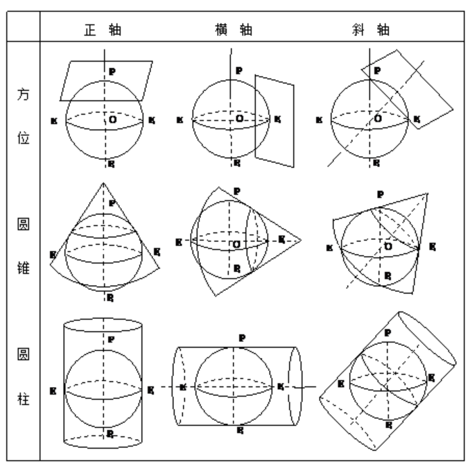

**和GIS关系**
不同地图资料根据成图目的需要不同地图投影。数据录入计算机时，必须转换，用共同地理坐标系统和直角坐标系统作为参照系来记录存储各种信息要素的地理位置和属性，保证地理数据交换/配准和共享，进行后续地理分析/处理和应用。

**地图投影选择**
+ 制图区域位置/形状和范围
+ 地图内容
  
**高斯克吕格投影**

## GIS和其他学科关系
### 测绘学
测绘学是研究测定和推算地面几何位置/地球形状和重力场，据此测量地球表面自然形态和人工设施几何分布，编制各种比例尺的地图的理论和技术的学科。包括测量和制图两部分内容。

测绘学中的大地测量/工程测量/地籍测量/航空摄影测量和遥感技术为GIS空间实体提供不同比例尺和精度的定位数据；电子速测仪/GPS全球定位技术/解析或数字摄影测量工作站/遥感图像处理系统等现代测绘技术使用，可直接快速和自动获取空间目标的数字信息，为GIS提供丰富和实时的信息源，并促使GIS向更高层次发展。GIS发展要求测绘能及时/快速/直接提供数字形式数据，这样促使常规测量仪器向数字化测量仪器发展，导致数字化测绘生产体系建立。

测绘学科在各分支学科自身发展的同时，测绘各分支学科的交叉集成已形成一个发展趋势。全球定位系统（GPS）技术在大地测量与测量工程中的普遍应用，摄影测量向遥感的发展，地图学向地理信息系统（GIS）的发展，形成了 3S 集成的明显特色。3S 集成代表了测绘学科内多种测量与遥感技术的有机融合，它不仅具有相互补充、相互促进的特点，而且能提高从数据获取到信息提取的速度，为现代测绘遥感技术的自动化、智能化和实时化创造了必要条件。而且将从根本上改变其传统测绘学科的内涵，测绘将由原来单纯提供信息的服务性工作转变为参与规划设计和决策管理的重要组成部分，将有力地推动管理的严格性，决策的科学性，规格的合理性和设计的高效率。
### 地理学
地理学是GIS的理论依托。GIS被誉为地学的第三代语言--用数字形式描述空间实体。地理学为GIS提供了有关空间分析的基本观点和方法，是地理信息系统的基础理论和依托。GIS发展也为地理问题解决提供了全新的技术手段。

## 4 地理信息系统技术基础

### 数据采集技术
保证地理信息系统数据库中的数据在内容和空间上的完整性/数值逻辑一致性正确性。
+ 传统
  实地调查/测量/现有地图/航空影像/遥感影像/资料获取
+ 日常工作中使用的空间数据
  传感器采集：室内wifi/蓝牙，基站定位，各类传感器。
  街景车
  室外定位：GPS，北斗。
+ 三维数据

  + 人工建模数据白膜数据maya/3dmax/sketch up。
  + 航测数据倾斜模型/点云数据/DSM。
  + 高精地图数据摄像头/激光雷达，经过算法提取出坐标数据。
  + 自动化建模系统

### 计算机网络

### 现代通信技术

### 软件工程技术

### 信息安全技术

### 网络空间信息传输技术

### 虚拟现实技术

## 5 地理空间数据组织和管理

### 空间信息描述方法
空间信息可以从三个方面描述：
+ 位置信息

空间信息用点/线/面等方式采用编码技术对空间物体进行特征描述和在物体间建立相互联系的数据集。具有定位性质。

+ 非位置信息（属性信息）
用属性数据记录，描述自然吸纳想/物体的质量和数量特征。

+ 时间信息
空间物体的存在形式之一，空间和时间相互联系不能分割，时间信息反应空间物体的时序变化和发展过程规律，也可以隐含在属性数据之中。

### 地理空间数据模型的概念
使用一系列能支持空间查询和分析/地图编辑和显示的数据对象来对现实世界进行抽象。
以计算机能接受和处理的数据形式，为反映空间实体的某些结构特性和行为功能，按一定方案建立起的数据逻辑组织方式，对现实世界进行抽象。

### 地理空间数据的基本特征和描述内容
+ 属性特征（非定位数据）表示实际现象或特征，如变量/级别/数量特征/名称等。如地形的坡向/坡度/某地年降水量/人口密度/交通流量。
+ 空间特征 表示现象的空间位置或现在所处的地理位置，一般以坐标数据表示。
+ 时间特征 现象或物体随时间的变化

### 空间数据的分类编码和数据分层
### 空间数据的空间索引
空间索引就是指依据空间对象的位置和形状或空间对象之间的某种空间关系按一定的顺序排列的一种数据结构，其中包含空间对象的概要信息，如对象的标识/外接矩形和指向空间对象实体的指针。空间索引介于空间操作算法和空间对象之间，通过筛选作用，大量和特定空间操作无关的空间对象被排除，从而提高空间操作的速度和效率。
自顶向下/逐级划分。
+ **格网型空间索引**
将研究区域用横竖线条划分为大小相等和不等的格网，记录各格网所包含的空间实体。
+ BSP树空间索引

+ R树和R+树

### 空间数据模型。’
空间认知模型

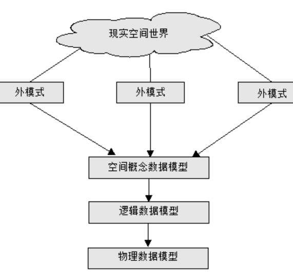

空间数据模型由概念数据模型/逻辑数据模型和物理数据模型三个层次组成。概念模型是关于实体和实体间联系的抽象概念集，逻辑数据模型表达概念模型中数据实体（或记录）及其间关系，物理模型描述数据在计算机中的物理组织/存储路径和数据库结构。

+ **概念模型**
人们对客观事物或现象的认识，也称为语义数据模型。不同人对于客观现象的抽象和描述会因为关注问题/研究对象/期望结果存在差异而形成不同的用户视图，称为外模式。
UML统一建模语言。
目前存在概念数据模型有矢量数据模型栅格数据模型和矢栅一体化数据模型。

+ **逻辑模型**
将概念模型确定的空间数据库信息内容（空间实体和空间关系）具体表现为数据项/记录等之间的关系。常用数据模型包括层次模型/网络模型/关系模型。

层次模型能反映出实体间的隶属或层次关系，网络模型能反应出实体复杂的多对多模型。

关系模型使用二维表格表达数据实体间关系，通过关系操作来查询和提取数据实体间关系。

+ **物理模型**
二进制数据处理

### 空间数据概念模型
+ 场模型：描述空间中连续分布的现象。
如地表温度/土壤湿度等连续变化的现象。连续/可微/离散。
场可以表现为在一个二维或三维空间上任意一个空间位置上，都有一个表现某现象的属性值，A = f(x, y)
+ 要素模型：用于描述各种空间地物。
基于要素的空间信息模型把信息空间分解为对象（object）或实体（entity）。实体符合三个条件：
可被识别
重要
可被描述（有特征）

+ 网络模型：可以模拟现实世界中的各种网络。和要素模型类似，都是描述不连续的地理现象，但是他需要考虑通过路径相互连接的多个地理现象之间的连通情况。

## 7 地理空间数据结构
一个模型是对现实世界的表达或描述，用空间数据结构来表示希望了解的东西。空间数据结构就是指空间数据的编排方式和组织方式，空间数据编码是空间数据结构的实现，目的是将不同的空间实体按一定的数据结构转换为适用于计算机存储和处理的过程。计算机存储和处理数据的效率，取决于数据组织方式的优劣。

### 无拓扑矢量数据结构
+ 实体数据结构

矢量数据是代表地图图形的各离散点平面坐标(x,y)的有序集合。其坐标空间假设为连续空间，不用像栅格数据结构一样进行量化处理，能精确表达实体的空间位置。

### 拓扑数据结构
topology拓扑学研究图形在连续变形下不变的整体性质。
和欧几里得几何学不同在于不涉及距离/方位或曲直等性质，即不涉及图形的量度性质。

拓扑关系指网结构元素节点/弧段/面域之间的空间关系：
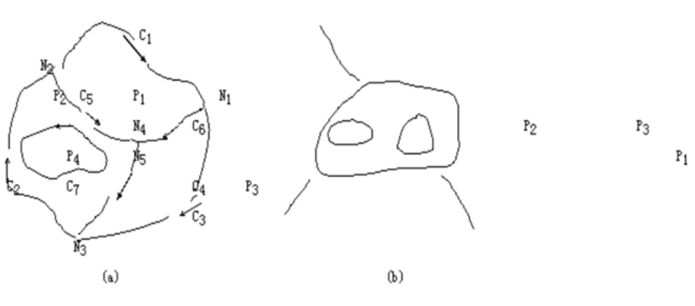

+ 拓扑邻接
拓扑邻接指存在于空间图形的**同类元素**之间的拓扑关系。 如图2-25(a)所示，结点邻接关系有N1/N4，N1/N2···等；多边形邻接关系有P1/P3，P2/P3 ···等

+ 拓扑关联
拓扑关联指存在于空间图形的**不同类元素**之间的拓扑关系。 如图2-25(a)所示，结点与弧段关联关系有N1/C1、C3、C6，N2/C1、C2、C5 ···等。 多边形与线段的关联关系有P1/C1、C5、C6，P2/C2、C4、C5、C7等

+ 拓扑包含
拓扑包含指存在于空间图形的**同类但不同级的元素**之间的拓扑关系，如图2-25(b)所示，P1包含P2和P3

意义：
根据拓扑关系，不需要利用坐标和距离，就可以确定一种地理实体相对于另一种地理实体的位置关系。
利于空间要素的查询，如查询某铁路线有哪些车站，汇入某条主流的支流有哪些，以某个交通“节点”为中心，呈辐射状的道路各通向何地。

### 栅格数据结构
将地球表面划分为大小均匀紧密相连的网格阵列，每个网格作为一个像元由行列定义，包含一个代码表示该像素的属性类型或量值，或仅包含指向其属性记录的指针。
像元是栅格数据中的最小信息单位。
特点；属性明显，定位隐含。

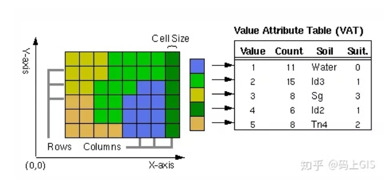

### 栅格数据分辨率类型
+ 空间分辨率
+ 时间分辨率
  对地球表面的同一地点捕获影像的频率，即重复观测周期。
+ 光谱分辨率
  描述了传感器区分电磁光谱各各波长间隔的能力。
  光谱分辨率越高，特定波段 的波长范围越短。
+ 辐射分辨率
  描述传感器在电磁光谱的同一部分中对所查看对象的区分能力。

### 影像金字塔
栅格影像数据库通过金字塔结构存放多种空格键分辨率的栅格数据，同一分辨率的栅格数据被组织到一个层面（layer）中，不同分辨率的栅格数据具有上下的垂直组织关系：
越靠近顶层，数据分辨率越小，数据量越小，只能反应原始数据概括；越靠近底层，数据分辨率越大，数据量越大，更能反映原始详情。

通过对栅格数据建立多级/多分辨率索引，可在显示和处理数据时，自动适配最佳分辨率以提高处理速度，同时减少数据处理和显示所需的内存消耗。

### 数字高程模型数据结构
### 四叉树和八叉树数据结构
### 其它数据结构。

## 8 地理空间数据库
### 数据库的概念
数据库是结构化信息或数据的有序集合，一般用电子形式存储在计算机系统中。通常用数据库管理系统（DBMS）来控制。

**和excel区别**
存储和操作数据的方式
谁可以访问数据
可存储多少数据
### 全关系型数据库管理空间数据
空间数据引擎SDE
空间数据通过二进制数据块形式存储在关系型数据库中，形成全关系型空间数据库。

应用程序通过空间数据访问接口访问空间数据库中数据，通过标准的数据库访问接口访问属性数据。

空间数据引擎是用户和异种空间数据库之间的一个开放接口，是一种处于应用程序和数据库管理系统之间的中间件技术。用户通过SDE将不同形式空间数据提交给数据库管理系统

### 数据库的系统结构
数据库体系结构分为**三级模式**和**两级映像**。
+ **三级模式**
  **模式**schema也称概念模式（conceptual schema），是对数据库中全部数据的逻辑结构和特征的描述

  **外模式**enternal schema是对数据库用户能够看见和使用的局部数据的逻辑结构和特征的描述。

  **内模式**internal schema也称存储模式（storage schema）是对数据物理结构和存储方式的描述，提供DDL来定义内模式。

+ **二级映像**
  **外模式/模式映像**
  **模式/内模式映像**

### 数据库管理系统的功能与组成
**功能**
+ **数据定义功能DDL**
+ **数据操作功能DML**
  基本CRUD
+ **数据库运行管理**
  数据库在建立/运行/维护时由数据库管理系统统一管理/统一控制，保证数据的安全性/完整性/多用户对数据并发使用和发生故障后的系统恢复。
  如：
  + 数据库完整性检查功能保证用户输入的数据满足相应的约束条件；
  + 数据库安全保护功能保证只有赋予权限的用户才能访问数据库中的数据；
  + 数据库并发控制功能保证多个用户可在同一时刻并发访问数据库中的数据；
  + 数据库系统故障恢复功能使数据库运行出现故障时可进行数据库恢复，保证数据库可靠运行。
+ **提供方便的存取数据库信息的接口和工具**
  通过编程语言和数据库间的接口进行数据库应用程序的开发
+ **数据库建立和维护功能**

**组成**
+ **语言编译处理程序**
  + 数据定义语言DDL编译程序
  + 数据操作语言DML编译程序
+ **系统运行控制程序**
  + 系统总控程序
  + 安全性控制程序
  + 完整性控制程序
  + 并发控制程序
  + 数据存取和更新程序
+ **系统建立维护程序**
+ **数据字典**
  Data Dictionary，用来描述数据库汇总有关信息的数据目录，包括数据库的三级模式/数据类型/用户名和用户权限等有关数据库系统的信息。

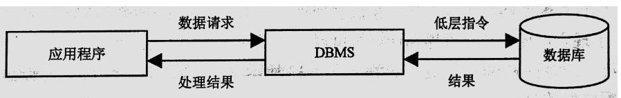
### 空间数据库管理系统的管理模式
+ **文件系统管理和属性那个数据用关系数据库管理**
+ **关系数据库同时管理空间和属性数据**
+ **对象关系型数据库管理模式**
目前，随着大量多源异构大数据，由于关系型数据库本身不足，产生非关系型数据库产品NoSQL
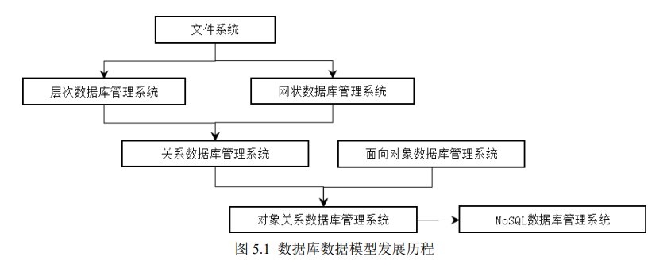

### 空间数据库设计步骤
+ **需求分析阶段**
  需求收集和分析，结果得到数据字典描述的数据请求。
  分析表达用户需求方法包括自顶向下和自底向上，自顶向下的结构化分析方法（structured analysis）从最上层系统组织机构开始，逐层分解的方法分析系统，把每一层用数据流图和数据字典描述。

**数据字典**是关于数据库中数据的描述，即元数据。

+ **概念结构设计阶段**
  通过对用户需求进行综合/归纳和抽象，形成一个独立于具体DBMS的概念模型，可用E-R图表示。

+ **逻辑结构设计阶段**
  将概念结构转换为某个DBMS所支持的数据模型（如关系模型），并对其优化。

+ **数据库物理设计阶段**
  为逻辑数据模型选择一个最适合应用环境的物理结构（存储结构和存取方法）。根据DBMS特点和处理需求，进行物理存储安排，设计索引，形成数据库内模式。

+ **数据库实施阶段**
运用DBMS提供的数据语言（如SQL）及宿主语言（如JAVA）根据逻辑设计和物理设计结果建立数据库，编制和调试应用程序，组织数据入库，并试运行。

### 地理数据库中的时间维。
arcgis地理数据库是存储在通用文件系统文件夹或多用户关系数据库管理系统（oracle/sql server/postgresql）中的各种类型数据集的集合。
geodatabase为对象关系型

**地理数据库中的数据集**
+ **要素类**
  是具有相同空间制图表达（如点/线/面）和一组通用属性列的常用要素的同类集合。
  （在数据库中支持前三种，地理数据库支持后四种）：
  + 点
  + 线
  + 面
  + 注记
  + 尺寸注记
  + 多点（管理非常大的点集合数组如激光雷达聚点）
  + 多面体

+ **栅格和镶嵌数据集**
+ **表**

### arcGIS中 的地理数据库
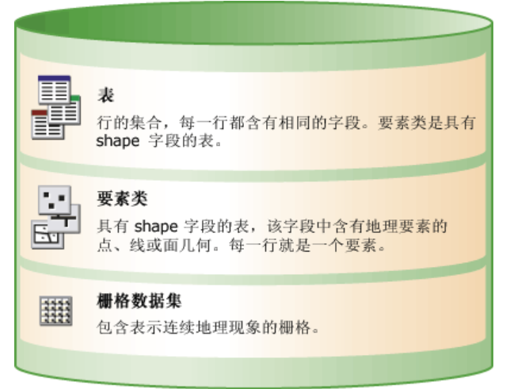
+ 要素类

## 9 地理空间数据获取
### 数据源的种类
+ **地图数据**
是gis的主要数据来源。
按内容：各种比例尺的普通地图和专题地图。
普通地图是按相对平衡的详尽程度来表示地球表面的自然地理和社会经济要素，主要表达居民地/交通网/水系/地貌/境界/土质/植被等。
专题地图是在地图底图上按照地图主题的要求，突出并完善表示和主题相关的一种或几种要素，使地图内容专门化/表达形式各异/用途专门化的地图。

+ **遥感图像**
记录各种地物电磁波大小的胶片或照片，主要分为航空像片和卫星像片。
遥感数据是一种大面积，动态，实时的数据源，是GIS数据更新的重要手段。
用于提取线划数据和生成数字正射影像数据（DOM）/DEM数据等。（ERDAS/ENVI/ARCGIS）

+ **测量数据**
野外测量目的是确定测量区域内地理实体或地面各点的平面位置和高程。
测量前，需要预选出地面上若干重要点作为控制点，精确测算出他们的平面位置和高程，作为控制和依据，详细测量其他地面各点或地理实体机器空间特征点的平面位置和高程。

+ **数字资料**
对于各种数据形式的原始资料，包括社会经济数据/人口普查数据/野外调查或监测数据，例如环境污染监测数据/磁力/重力/地震等地球物理数据，气象/水文观测数据等。
搜集这些数据，要主义包括研究对象的特征值/观测点的
几何数据和统计资料的基本统计单元。

+ **文字报告**
在专题地理信息系统中，文字报告是区域研究的参考资料。还可以研究各种类型地理信息的权势性/可靠程度和内容完整性

### 数据采集的方法

+ **野外数据采集**
  + 平板仪测量
  + 全站仪测量
  + GPS测量

+ **地图数字化**

+ **数字摄影测量**
模拟摄影测量
解析摄影测量
数字摄影测量

### 遥感影像处理。

## 10 空间数据的编辑
### 图形数据的编辑
### 图形数据的几何纠正
### 图幅的拼接
### 网络特征元素的编辑
### 文本数据的编辑。

## 11 空间数据的处理方法
### 图形屏幕编辑的基本操作算法
### 空间数据的拓扑关系自动生成
### 空间数据的压缩编码方法
+ **链式编码**
freeman编码。
由某一原点开始按某些基本方向确定的单位矢量链。

+ **行程编码**

+ **块式编码**
（四叉树编码用于碰撞检测）
quadtree广泛用于图像处理，空间数据索引/2D中的快速碰撞检测/存储稀疏数据等。
八叉树主要用于3D图像处理，应用于激光雷达点云处理/游戏编程。

把一副栅格图像等分为四部分，如果检查到某个子区内所有格网都含有相同的值（灰度或属性值），则此区域不在往下划分；否则，把这个区域再分割为四个子区域，这样递归分割，直到每个子块都只含相同的灰度或属性值为止。

**常规四叉树**

**如何 存储常规四叉树**
+ 属性值
+ 父节点指针（1个）
+ 叶节点指针（4个）

**线性四叉树**
只存储最后叶节点的信息，即节点的位置/大小和深度。
采用Morton码表示。

任何不能正好在一个节点区域内的物体会被放在父节点。

### 矢量和栅格数据结构的比较
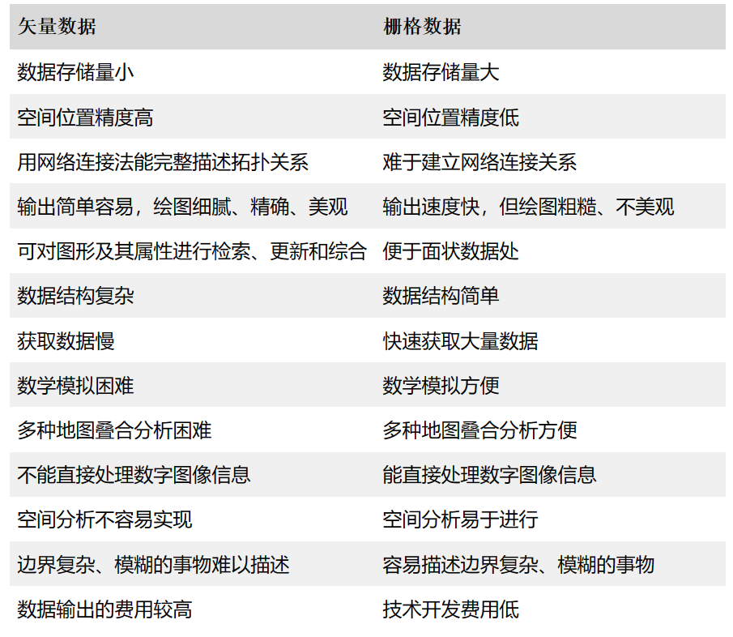

### 矢量数据和栅格数据选择
+ 矢量数据结构：
对于线划地图，用矢量数据记录比栅格图形更节省存储空间。
矢量数据有利于网络分析（交通网/供排水网/煤气管道/电缆等）应用。
矢量数据精度高
矢量数据便于产生各个独立的制图物体，并便于存储各图形元素之间的关系信息。

+ 栅格数据结构
是一种影像数据结构，便于遥感图像的处理。

大范围小比例的自然资源/环境/农业/林业/地质等区域问题，城市总体规划阶段的战略性布局研究，使用栅格模型。
城市分区或详细规划/土地管理/公共事业管理，用矢量数据模型。

### 空间数据的格式转换
### 矢量数据和栅格数据的转换
### 栅格数据转矢量数据
1.图像二值化
binary image
2.平滑
3.细化
4.链式编码
5.矢量提取

### 栅格数据镶嵌（添）
将两个或多个图像组合或合并。

**镶嵌运算符**

## 12 地理空间数据的质量
### GIS数据质量的概念
指空间数据可靠性和精度，通常用空间数据误差来度量。GIS主要功能之一是综合不同来源/不同分辨率和不同时间的数据，利用不同比例尺和数据模型进行操作分析，这些不同来源数据的综合和比例尺的改变使GIS数据误差问题变得复杂。

+ **准确性accuracy**
一个记录值（测量或观测值）和他的真实值之间的接近程度。

+ **精度precision**
对现象的描述的详细程度
+ **空间分辨率spatial resolution**
是两个可测量数值之间最小的可辨识的差距。
+ **比例尺scale**
地图上一个记录的距离和他所表现的真实世界距离之间的一个比例。
+ **误差error**
位置误差
属性误差
位置和属性误差之间的关系。
+ **不确定性uncertainty**
包括位置空间的不确定性/属性不确定性/逻辑不一致性和数据不完整性。

### 常见空间数据的误差分析
主要四大类：
几何误差/属性误差/时间误差/逻辑误差。
**逻辑误差**

**几何误差**
点误差
线误差

**地图数据质量问题**

**遥感数据质量问题**

**测量数据的质量问题**

### GIS数据质量的研究方法

+ 传统手工方法
+ 元数据方法
+ 地理相关法

### 元数据
metadata
描述数据的数据。
在地理空间数据中，是说明数据质量/内容/状况和其他有关特征的背景信息。

### 空间数据的不确定性。

## 13 空间数据分析的计算模型
### 关于分析计算模型的一般知识
### GIS的空间计算模型。
## 14 空间查询与统计方法
### GIS常用的空间统计分析模型
### 空间数据的查询
+ 基于空间关系查询
+ 基于空间关系和属性特征查询
+ 地址匹配查询
### 属性数据的查询统计。

## 15 空间分析方法

### 常见三维数据空间分析方法
通视分析
一i那英分析
坡度坡向分析
地面建筑范围分析
天际线分析

### 栅格数据分析的基本模式
### 矢量数据分析的基本方法
### 网络分析应用

**链link**：网络中流动的管线，如街道/河流/水管等，状态属性包括阻力和需求。
**节点node**：网络中链的节点，如港口/车站/电站等
+ 障碍barrier：禁止网络中链上流动的点。
+ 拐点turn：出现在网络链上的分割节点上。
+ 中心center：接受或分配资源的位置。
+ 站点stop：在路径选择中资源增减的节点。

**主要功能**
+ **路径分析**
  + 静态求最佳路径
  + N条最佳路径分析
  + 最短路径或最低耗费路径
  + 动态最佳路径分析

### dijkstra算法计算最短路径
运用贪心思想。

### 基于地形的空间分析。

### 缓冲区分析
临近度（proximity）描述了地理空间中两个地物距离相近的程度。

### 叠加分析
+ 点和多边形叠加
+ 线和多边形叠加
+ 多边形叠加

### 网络分析

路网在数学上的模型是图（graph）。
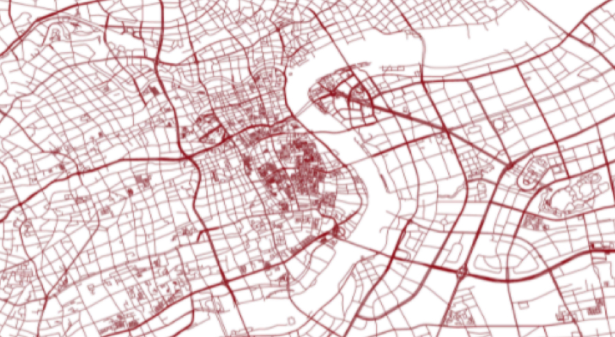

最简单的图是一个二元组，由顶点（vertex）和边（edge）成。
G = ( V , E )

在webgis 中，路网是一种有向带权图。即每条边有一些额外的属性，如路况，方向等。

+ 路径规划和导航。共同点：**起点和终点确定**

最小路径寻址算法。

+ POI检索：以某个点为中心在指定半径的圆形区域内检索特定类型的POI。

### 地理编码
指将坐标对/地址和地名等位置描述转换为地球表面上某位置的过程。

+ 用途
**地址数据分析**

## 16 地理信息系统产品输出
### 包括地理信息系统产品的输出系统
### 地理信息系统产品的类型。
## 为什么prefer gis then 自然地理

我更想用更方便的计算机应用来解决实际问题。
我也很喜欢用地理思维来解决问题。
包括我其实很喜欢玩一款游戏叫城市天际线，他里面就可以模拟一个城市的整个运作系统。
我再里面经常遇到堵车的问题，这个是游戏的AI导致的，这个时候我就会从几个方面去考虑，一个我会想工业区，住宅区，商业区之间的位置布局是否合理，看下每个区域是否过大而导致通勤车辆增多，引发交通堵塞，什么样的布局能够实现这几个区域之间的循环流通，
另一个我就会去通过修改道路来缓解交通问题，通过架设立交或者增加次干道/人行道等方式来疏导交通。

虽然我知道实际生活中肯定情况是要加倍复杂的，但我就向刚才所说的，我很喜欢通过这种可视化的方式去获取处理分析地理信息和问题。
所以这也就是我也课余花时间接触了threejs。
因为我本身后端的语言目前掌握的不是很好，接触这个库一开始是看到他用javascript也能构造出一个场景，然后网上也看到了一些案例，就想着用他去做一下我的毕业设计也蛮不错。
Group思想：一开始是绕着子组件的旋转轴，后来发现可以把父组件的旋转轴移动，

包括我其实对算法，就数据结构不是很感冒，自己觉得自己也学得不是很好，但是我那天上网无意间搜了城市天际线的汽车寻路AI，发现有个算法叫天际线算法，就是skyline problem。我就深入学习了一下这个算法，后来发现这对我用计算机语言理解建筑高度和建筑位置关系很有用。

然后包括谷歌在中国大陆禁用之前，我也是很喜欢去看谷歌地图，我就记得那个时候看到

### 为什么选择数字孪生技术方向？

新型基础测绘向实体分级转变有效助力数字孪生建设。
在空间上，融合不同形态的基础地理空间要素；在时间上，融合历史/现状和动态监测数据；在语义上，融合地理实体的基本属性/实体关系和其他社会经济信息，形成以地理实体为基本单元的时空一体化数字孪生体。

全息测绘利用空天一体倾斜摄影/激光扫描等多源传感技术获取全息地理实体要素，同故宫深度学习等AI技术自动半自动化提取建立地理实体的矢量/三维模型数据，形成地上地下/室内室外一体化全息高清/高精的结构化实体城市信息模型（CIM）。

**离线仿真逐步向实时数据驱动仿真转变**
传统仿真不具备未来预测推演功能，缺乏与实物的校验和交互，难以保证精确度和科学性。

**开发侧交互方面低代码构建技术提高开发场景效率**
数字孪生厂商将数字孪生的低代码构建作为关键竞争力要素，通过三维开发中频繁复用的功能或操作包装，实现低代码化。

### 天际线算法skyline algorithm
给一个n*n个街区组成的城市，
grid[r][c]标识坐落在r行c列的建筑物的高度。

CIM建设

### 自我介绍
各位导师们好，很荣幸能参加今年贵校的复试。

我叫于佳志，来自广西桂林，曾就读于武汉科技大学资源与环境工程学院的人文地理与城乡规划专业。
在大学里，我决心在各方面提升自己。四年下来，我的本科平均绩点为3.21，通过了英语四六级考试，全国计算机二级考试，另外我还获得过两次全国大学生英语竞赛国家级三等奖。
本科就读期间，我修读了计算机科学与技术双学位，目前主要学习并应用了前端语言，
我从小就对地理比较感兴趣，特别喜欢看地图，出门也很留心观察身边的地物，自己也绘制过很多地图。（以前拿硬纸板做过很多立体地图）在学习的过程中，我发现将地理模型展示出来令我非常着迷。大二的时候，我还做过一个我在游戏中搭建一个城市的视频，探究他的技术发现是和WEBGIS紧密相连的，所以如果我能被贵校录取，我很希望能够投身于地理建模领域。
在社会实践方面，我在大学期间做过世界军人运动会场馆引导志愿者，。。
这些活动培养了我与人交流能力和抗压能力，锻炼了我从容应对问题的能力。

在课余活动方面，我做过两年学校大艺团舞蹈队队员，也在毕业生毕业晚会上表演过。大三搬到长江边校区后，我经常。。

### 对于地信未来的发展有什么看法？

**真实感渲染**
一提到渲染，人们都会说，Sketchup、3D max、BIM等三维建模软件不是都具有很强大的渲染功能吗？Vray等渲染器不很优秀吗？然而，在三维实景中国大背景下，我们不仅要关注单体化白模、更要关心一个建筑、一个小区、一个城市、乃至一个更大区域更大规模的三维场景，还要跨界融合。

### 研究方向

### 自我评价

### 读博？
我认为自己虽然对数字孪生技术

但可能更多的知识储备能力偏向于行业应用层面很多知识知识了解水平
就是目前可能对于行业的前沿

如果未来我能发掘自己喜欢的方向，我会非常愿意进行更高阶段的学术生涯的历练，进行一些**地理信息技术底层方面**的研究。

### 掌握技能
1.线性代数

2.多学一些计算机语言

3.嗯可能会花时间去了解arcgis pro，一方面可能这是未来学术生涯经常打交道的软件，一方面我之前为了体验用过一段时间，觉得界面UI比arcgis 10.2要好看很多 XD 

### 毕业设计

那个毕业设计threejs building我发现再打开地图底图显示不出来了，好像现在被墙掉了。

## 课余爱好

### 

+ 可视化方面
  我现在也是刚了解cesium，

### 用过算法
因为双学位/gis专业课/运筹学/计量地理学都学了一遍dijkstra算法，所以对这个算法也是比较熟了。

### 对所报方向 的思考
从偏向业务场景的应用构建到偏向业务场景的可视化展示

做研究是偏向于底层的图形学理论？

## 17 可视化方面的技术？
### 可视化的概念
是将抽象数据转换为几何图形的计算方法，便于研究者通过观察其模拟和计算过程和结果。
空间信息可视化是运用计算机图形学/地图学和图像处理技术，将空间信息输入/处理/查询/分析和预测的数据和结果，用符号/图像/图形，结合图表/文字/表格/视频等可视化形式显示，并进行交互处理的理论/方法和技术。
### 可视化的技术方法
### 三维虚拟GIS（VR-GIS）的应用。

## 18 地理信息系统工程设计
### 地理信息系统工程的设计模式与程序评价模式
应用型GIS设计主要侧重于：
+ 需求分析
+ 总体结构描述
+ 软硬件配置，包括选择合适的工具性GIS软件
+ 数据来源/信息分类/规范/标准和内容的确定
+ 数据库结构设计
+ 应用方法选择和应用模式设计
+ 用户界面设计
+ 数据标准化和数据质量保证

### 地理信息系统工程设计的内容与过程

### 地理信息系统工程的系统分析
### 地理信息工程的系统设计
+ **GIS总体设计**
划分各系统功能模块/确定模块之间的联系和描述；
根据系统目标配置适当规模软硬件和计算机运行环境；
系统开发各阶段文档，即技术手册/用户手册基本要点的制定；
系统质量/性能/安全性估计。

+ **数据库概念设计**
决定数据库数据内容/选择适当数据模型/个数据内容在库中如何组织和考虑整个数据库的冗余度/一致性和完整性。
1.数据库宏观地理定义
参考基准和坐标系统（高程基准/平面坐标系统）；
地图投影；
数据库比例尺。
2.数据库数据模型的确定
确定（层次/网状/关系型/面向对象）；
考虑对数据进行分层/各层数据的表示形式/各层数据的属性内容和属性表之间的关系。

+ **GIS详细设计**
1.模块设计
从系统结构上：数据采集/数据编辑和处理/空间数据库管理/空间查询和空间分析以及结果输出；
从应用目的上：管理和存储空间对象的信息数据/作为空间分析工具在个对象层面进行逻辑运算和数学运算/根据以上两个基本功能完成的操作，对空间现象的分布发生发展和演化做出判断和决策，即空间决策支持。

2.详细设计
数据源的选择/对各种数据集的评价/对空间数据层的设计/数据字典的产生和数据库存储和管理结构的设计。

**数据源选择：**
地图
航空像片
卫星遥感像片
GPS接收数据/现有各种文件数据

**对各种数据集的评价**
数据一般评价：数据是否电子版/是否标准形式/是否和其他数据一致（覆盖地区/比例尺/投影方式/坐标系）
数据的空间特性：空间特征的表示形式是否一致/城市用点还是用多边形/河流用单线还是双线；
空间数据地理控制信息比较：用GPS点/大地控制测量点/认为划分的地理位置点；
空间地理数据系列性：不同地区信息的衔接/边界匹配。
属性数据特征的评价：属性数据存在性/属性数据和空间位置的匹配性/属性数据的编码系统和属性数据的现势性。

**空间数据层的设计**
数据库数据组织形式——数据分层和编码标准设计。

**数据字典设计**
用于描述数据库的整体结构/数据内容和定义

**存储和管理结构设计**
数据使用权限设置/数据库更新过程中的质量控制和安全性考虑

3.方法库和模型库选择  

4.数据获取和质量控制

5.输出设计

6.文档设计

### 地理信息系统开发设计（补）
+ 原型化开发
对系统的定义在逐步开发的过程中进行，而不是一开始就预知一切。
在获取一组基本需求后快速加以实现，随用户和开发人员对系统理解而加深，不断对需求进行补充和细化，是一种响应式开发方式。

+ 结构化系统分析和设计
将系统开发全过程分为若干阶段，分别确定他们的任务，同时把系统的逻辑和物理模型，即系统“做什么”和“怎么做”分开，以保证各阶段明确/实施有效。

强调运用系统工程观点，即全局观点对客观世界进行分析，自上而下，从粗到精，将系统逐级分解，最后进行综合，构成相应的概念模型。

### 地理信息系统工程的实施设计
+ 程序编制和调制
主要任务是将详细设计产生的每个模块用某种语言实现，并检验程序正确性。

+ 数据采集和数据库建立

+ 人员培训

+ 系统测试
  对新建GIS系统进行从上到下全面测试和检验，看他是否符合系统需求分析所规定的功能要求，保证系统可靠性。
  测试工作：
  设计一组测试用例
  用各个测试用例输入数据实际运行被测程序
  检验实际输出结果和预期输出结果是否一致

（开发和实施阶段会产生一系列文档资料，包括用户手册/使用手册/系统测试说明/程序设计说明书/测试报告等）。

### 地理信息系统工程的运行维护设计。
指在GIS整个运行过程中，为适应环境和其他因素的各种变化，保证系统正常工作而采取的一切活动，包括系统功能的改进和解决在系统运行期间发生的一切问题和错误。

+ 纠错
+ 数据更新
+ 完善和适应性维护
+ 硬件设备维护

## 19 地理信息系统的标准化
### 地理信息系统标准化的作用
GIS数据规范化和标准化直接影响地理信息的共享，地理信息共享直接影响到GIS经济效益和社会效益。国家制定的规范和标准是信息资源共享的基础。

### 地理信息系统标准化的内容
+ **统一的地理基础**
统一的地图投影系统（我国高斯克吕格投影）
统一的地理坐标系统
统一的地理编码系统 

+ **统一的分类编码原则**
国家规范组建议信息分类体系采用宏观的全国分类系统和详细专业间递归的分类方案，即第一季分类系统必须能归并和综合到高一级分类系统中。
+ **数据格式格式转换标准**

+ **标准的数据采集技术**
我国现已研究和制定了两个技术规格：图形数据采集技术规程和摄影测量数据采集的技术规程。

## 20 分布式地理信息系统

### GIS计算环境发展回顾
### 分布式地理信息系统的概念
distributed system 是由一组具有自治功能的独立计算机经互联网连接而成的计算机系统。
分布式特点是强调资源/任务/功能和控制的全面分布，系统中的资源/任务控制通常分布于物理上分散的若干节点上，通过互联网连接，彼此通信，构成一个统一的计算机系统。

分布式gis系统是建立在分布式计算环境下由一组分布式服务器协同为互联网客户提供地理信息服务的网络地理信息系统，是对传统WEBGIS功能的扩展。

### 分布式地理信息系统的体系结构
### 分布式地理信息系统的计算模式
### 分布式地理信息系统的计算技术

## 21 空间信息基础设施与数字工程
### 空间数据基础设施

### “数字地球”的概念与框架
### “数字城市”的概念、框架和建设技术

**如何理解元宇宙三个发展阶段：数字孪生/数字原生/虚实共生？数字原生的核心是什么？**

苏奎峰（腾讯）
元宇宙除了面对具体用户，分为两个层面——针对产业和针对消费者
在形态上，产品平台和核心技术都有差异。
数字原生：用互联网技术为基础，强调云编端一体

虚实共生：

数据流/能源流/资金流

离不开数据驱动

**陈傲寒**
从地理信息系统背景衍生较多

**b站数字孪生城市和CIM**
城市信息模型发展和建设思路CIM

CIM模型
一级模型：地表模型
二级模型：框架模型
三级模型；实景模型

CIM数据治理路线
**源数据**
1.DEM DOM DLG
2.倾斜摄影模型
3.城市三维精细模型
4.BIM
5.房屋建筑和市政设施调查
6.市政设施功能图
7.房屋楼盘表
8.房屋建筑工程图
9.城市部件普查
10.地质模型

**预处理**
1.转换数据格式
2.统一空间参考
3.修正模型几何错误
4.修正模型材质
5.检查属性数据和拓扑关系

**CIM综合模型**
1.CIM - 7级分类模型单元构成合理，语义明确
2.模型单元几何结构多样
3.模型单元基础属性完整
4.模型单元间关系信息正确

**CIM表达模型**
1.LOD多级/最高级和综合模型对应（标识代码一致）
2.几何结构轻量化为三角网格，纹理和照明重构，可做效果增强
3.属性/关系通过标识代码指向综合模型相应库
4.几何结构可做脱密处理，属性/关系可选择脱密脱敏处理

**城市级CIM基础平台基本功能**
1.基础数据接入和管理
2.BIM等模型数据汇聚和融合
3.多场景模型浏览和定位查询
4.运行维护和网络安全管理
5.支撑CIM+平台应用的开发接口

平台
表达融合场景
超大场景
精细场景
模型交互

### 关键技术
1.建模
2.仿真
3.云计算和边缘计算
4.

### “数字流域”的概念和框架
数字孪生流域主体：数字孪生平台和信息基础设施建设

数字模型的建立过程：
1.建立反映工程问题和物理问题本质的数学模型
2.寻求高效率/高准确度的计算方法，即建立针对控制方程的数值离散化方法，如有限元差分法/有限元法/有限体积法。
3.编程和计算，包括计算网格划分/初始化和边界条件输入/控制参数的设定。
4.显示计算结果。

**数学模型**
通过计算网格进行数据组织，这种网格类似GIS栅格数据和不规则三角网空间数据结构。
**接口集成**
**可视化集成**
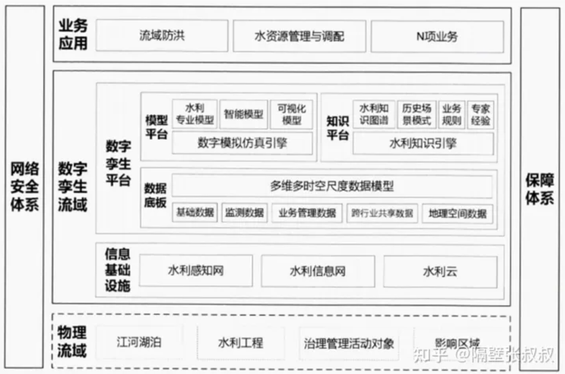
## 22 空间信息网格
### 空间信息网格的概念
spatial information grid ，是一种汇集和共享地理上分布的海量空间信息资源，对其进行一体化组织和处理，从而具按需服务/强大空间数据管理能力和信息处理能力的空间信息基础设施。
空间数据基础设施提出的交换站点在SIG中被看作网络节点，由这些分布在全球各地的各类节点形成的网络称网格。他是以空间信息传输/服务和计算为内容的特点的，因此也称**空间信息网格**
grid GIS 和传统WEBGIS相比，传统WEBGIS目的为了能在网络上发布空间数据和这些空间数据相关的一些操作，主要通过浏览器直接服务于客户；
GRID GIS目的是加ing地理上分布，系统各异的计算机，空间数据服务器，大型检索存储系统，地理信息系统，虚拟现实系统等通过Internet 连接集成起来

**网格**是信息社会的网络基础设施，把整个Internet整合成一台巨大的超级虚拟计算机，实现互联网上所有资源的互联互通，完成计算资源/存储资源/通信资源/软件资源/信息资源/知识资源等共享的技术。

### 空间信息网格的计算
### 空间信息网格技术与GIS
网格GIS实现包括中间件技术/GML互操作语言/WEB SERVICE 技术和分布式计算机技术。

+ **中间件技术**

+ **GML互操作语言**
geography markup languege是XML语言再空间地理信息领域的扩展，是由OPENGIS发布。

+ **web service 技术**

### 网格GIS的体系结构
+ 三层
数据资源层
网格服务层
应用层
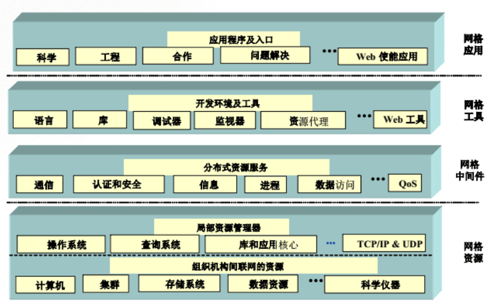

## 23 空间数据的互操作
### 空间数据互操作的概念
指对异构的数据库和平台，实现数据处理的互操作，是动态的数据共享，独立于平台，具有高度的抽象性，是空间数据的共享的发展方向。
OGC(Open GIS Consortium)

在arcgis中，用户可将GIS工作封装成多种标准化的GIS服务，包括地理数据库/地图/3D GLOBAL 文档/地理处理模型和脚本/影像目标和元数据文档等，这些GIS元素都可以发布为开放式WEB服务。

arcgis通过公开发布的geoservice REST规范提供GIS WEB服务。

### 互操作的实现技术
### 练习与思考题

## 24 GIS数据集成
### 地理信息系统集成的概念
地理信息系统集成两个方向：
系统间集成；
系统内集成

GIS和遥感集成：增强数据获取和更新能力

GIS和GPS结合：

在GIS内部，由于空间数据和属性数据在结构上差异，数据多源性/多尺度性/数据质量差别多样性需要集成。

### GPS RS GIS 集成

+ GPS用于实时快速提供目标，包括各类传感器和运载平台（车/船/飞机/卫星等）的空间位置。
1.GPS+栅格电子地图，用于导航。
2.GPS+矢量电子地图，用于导航中路径优化选择。
3.GPS（差分定位）+栅格/电子地图，用于监测网络，指挥系统。通过固定站和移动载体之间两台或多台GPS伪距差分技术，可精确定位移动载体的位置，在双方均有通信联系时，可构成导航/监测网络。
+ RS用于实时或准实时地提供目标和环境的语义或非语义信息，发现地球表main各种变化，及时对GIS进行数据更新。
+ GIS对各种来源时空数据进行综合处理/集成管理/动态存取，作为新的集成系统的基础平台，为智能化数据采集提供地学知识。

**需要解决的理论问题和关键技术**
+ 3S集成系统的实时空间定位
+ 3S集成系统的一体化数据管理
+ 语义和非语义信息的自动提取理论和方法
  研究从航空/航天遥感数据和CCD立体对象中自动/快速和实时地提取空间目标位置/形状/结构及相互关系和空间目标的语义信息的理论和方法。
+ 3S集成中的数据通讯和交换
+ 3S集成系统中的可视化技术和理论方法
  将3S集成系统中不同分辨率/不同时相的大量图形和影像数据，研究他们的多级分辨率和多尺度表示在各种介质和终端上的可视化问题。

### 多源数据的集成
+ **多源数据特点**
1.多语义性：同一个地理信息单元，在现实世界中几何特征是一致的，但对应着多种语义。因解决问题的侧重点不同，产生不同解释，造成语义分异问题。
2.多时间尺度：时间尺度是数据表示的时间周期和数据形成周期的长短。根据时间周期长短，时间尺度可分为季节尺度/年尺度/时段尺度等。
3.多分辨率：因为多数据源特性，会产生多空间分辨率/多光谱分辨率问题。
4.多比例尺
5.多空间维数
6.多参考系统

+ **多源数据集成模式**
1.数据格式转换模式
2.数据互操作模式
3.直接数据访问模式

+ **多源数据融合**
主要工作：目标编码体系统一/几何位置/形状统一/数据模型和结构的统一。
融合算法：检测层融合/时空层融合/属性层融合/符号层融合。

+ **空间数据概括（地图综合）**
在减少特定应用细节时又最大化特定应用的信息方面，实现代表现实世界不同部分模型间的转换处理。
地图自动概括算法。。。。

### GIS与专家系统的集成
建立智能化空间决策支持系统（spatial decision support systems），为决策者提供分析问题/建立模型/模拟决策过程和方案的环境，调用各种信息资源和分析工具，帮助决策者提高决策水平和质量。

### GIS与应用分析模型的集成。
在GIS技术支持下，根据应用分析模型的要求，将地理空间（研究区域）进行网格剖分，并自动获得网格节点或中心点的数据，用来表示各种模型参数的空间分布，直接形成应用分析模型所需的数据文件。
+ **源代码集成**
利用GIS二次开发语言将分析应用模型进行改写。
+ **函数库集成模式**
将开发好的应用分析模型以函数的形式保存在函数库中
+ **可执行程序集成**

+ **DDE和OLE集成**

+ **基于组件集成**

## 25 地理时空大数据和云计算
### 时空大数据
指基于统一的时空基准/活动在时间和空间中和位置直接（定位）或间接（空间分布）相关联的大数据，由时空框架数据和时空变化数据两类数据组成，具有空间位置/时间/属性/尺度/分辨率/多样性/异构型/多维/价值隐含行/快速性等特性。
是机器学习的动力。保证数据质量从而保证算法。
### 云计算
用户需要多少CPU/内存/硬盘的虚拟电脑，只要通过一种叫做“调度”scheduler的算法的调度中心，就可以在池子里找到自己需要的信息资源，即Iaas（基础设施即服务），具有时间弹性和空间弹性。

### 高精度导航

## WebGIS
应用于传统的国土/资源/环境等政府管理领域，也促进和普通人生活相关的车载导航/移动位置服务/智能交通/抢险救灾/城市设施管理/现代物流。
网络GIS从C/S结构向B/S结构发展。

### 地图渲染流程
+ 经纬度是球面坐标，日常使用警卫单位是角度（deg），在进行投影计算时要换算为弧度（rad）；
+ 墨卡托投影得到二维坐标单位是米（mi）；
+ 电子屏幕坐标单位是像素（px）；

### webgis常用算法
+ 多边形三角剖分算法

计算机图形学中只有三种基本单元：点/线段/三角形。

+ R-tree算法
在GIS领域主要用于空间数据的存储。
在绘图方面，较多用于图形冲突监测。

## 新型基础测绘和实景三维中国建设
### 新型基础测绘
以“基础地理实体”为核心
基础地理实体分类原则：
+ 基础性
+ 系统性
+ 可扩展性
+ 稳定性
**分类**
+ 自然地理实体
+ 人工地理实体
+ 管理地理实体

**几何精度指标**

**分类代码**

### 实景3维
对一定范围内人类生产、生活和生态空间进行真实、立体、时序化反映和表达的数字空间，是新型基础测绘的标准化产品，是国家重要的新型基础设施，为经济社会发展和各部门信息化提供统一的空间基底。

+ 城市级实景三维
  主要由倾斜摄影三维模型/激光点云/纹理等数据经实体化，融合实时感知数据构成，

### 语义化
用标准化范式对地理实体自身属性及实体间关系进行一致性描述，以实现计算机可识别/可理解/可操作的过程。

### 存量点/线/面数据，如何复用？如何三维化？
+ 符号化建模
  借助于建筑底面数据实现倾斜摄影分析查询。
  

+ 参数化建模
  基于python的建模/esri的cityengine建模

+ 矢量地面+ 倾斜摄影模型，实现动态单体化
  

### 如何构建可分析/可计算的三维对象？
目前常用的三维空间数据模型：
+ 对象数据模型
+ 网络数据模型
+ 场数据模型
  

### 如何支撑大规模三维数据的管理和应用？

### 不同精度的实景三维数据，在三维场景中如何融合处理？
遥感（RS，Remote Sensing）所说的数据融合（dissolve），是一个对多遥感器的图像数据和其他信息的处理过程，它着重于把那些在空间或时间上冗余或互补的多源数据，按一定的规则（或算法）进行运算处理，获得比任何单一数据更精确、更丰富的信息，生成一幅具有新的空间、波谱、时间特征的合成图像。通常情况是指将空间分辨率更高的全色波段影像与空间分辨率较低的多光谱影像想融合，产生出分辨率高、纹理特性突出的影像，以达到图像增强的目的，进而满足定性定量遥感的研究需要。

**三维数据融合**
+ **三维数据坐标转换**
  点云/倾斜摄影模型/BIM模型的坐标转换
  三维数据支持同名控制点配准
+ **多边形裁剪/多边形挖洞**
  多边形修改地形
  和三维体对象的布尔运算
+ **地形TIN的空间运算和操作**
+ 倾斜摄影模型的空间运算和操作
  地形级
  城市级
  部件级
+ 
  

## 计算机图形学
是GIS算法设计的基础。
GIS随着计算机图形学技术发展完善。
计算机图形学所处理图形数据是不包含地理属性的纯几何模型

## 空间自相关
是空间场中的数值聚集程度的一种量度。
（地理学第三定律）

## douglas-peucker算法

## 数据挖掘DATA mining
从数据中提取隐含的/先前不知道的和潜在有用的知识的过程。集成了机器学习/数据库系统/数据可视化/统计和信息理论等多领域最新的技术。
+ 数据选取
+ 数据转换
+ 数据挖掘
+ 结果解释

### 空间数据挖掘
+ 统计分析方法
+ 基于概括的方法
+ 聚类方法
+ 空间关联spatial association rule方法

## DEM

### 等高线contour line 
地形图/俯视图/阴影图上高程相等的各点所连成的闭合曲线。在等高线上标注的数字为该等高线的海拔高度。等高线按作用不同，可分为首曲线/计曲线/间曲线/助曲线四种。

## GIS空间数据格式
### 矢量数据格式
矢量图形由顶点和路径组成。基本类型是点/线/面。

+ esri形状文件

.SHP/.DBF/.SHX

所有商业和开源都接受shapefile作为GIS格式。
.shp特征几何/
.shx形状索引位置
.dbf属性数据
.prj投影系统元数据

+ geojson地理javascript表示方法
主要用于web的地图绘制。

### 栅格数据格式
+ GeoTIFF
.XML是伴随GeoTIFF的元数据
.TFW提供栅格地理定位所需的世界文件

### 地理数据库文件格式
+ esri文件地理数据库 .GDB
esri把文件地理数据库创建为存储多个属性表/矢量和栅格数据集的容器。

### shapefile文件格式局限性
+ 文件格式限制
只能存储支持的几何形式，不能存储拓扑信息。

+ 投影信息
.prj

+ 属性信息存储
属性字段名称限制字符

## 地图服务
### OGC（open geospatial consortium）
开放地理空间信息联盟，制定了数据和服务的一系列标准，GIS厂商按照这个标准进行开发可保证空间数据的互操作，提供地理信息行业软件和数据及服务的标准化工作。(❁´◡`❁)

### WMS
利用具有地理空间位置的数据制作地图，其中将地图定义为地理数据的可视化表现，能够根据用户的请求，返回相应的地图，包括PNG，GIF，JPEG等栅格格式，或SVG等矢量格式。
在arcgis中发布mxd文件服务。

### WMTS
OpenGIS web map tile service,采用预定义图块方法发布数字地图服务的标准化方案。

### arcgis 切片缓存

## GIS存储数据库

## 空间插值
### 整体内插法

## THREE.JS
城市白膜数据获取
blender

下载时提示imageio module不在，

### shp shx dbf prj
+ shp 存储矢量数据的空间信息，保存元素的几何实体
+ shx 要素几何特征的索引文件，记录每个几何体在shp文件中的位置
+ dbf 存储矢量数据的属性信息
+ prj 存储坐标系信息的文件，由arcgis使用

## 课后有没有通过什么途径了解GIS前沿知识？

+ 关注了很多地学公众号
  GIS前沿/

+ 网站
  通过osgeo中国中心了解GIS原理

  在arcgis官网上了解各种GIS空间分析，同时也

## 

总评

如果能读研，

在接下来的几个月里，我要首先将自己的标准向研究生靠近。

1.数据库方面，学习postgis相关知识。我们当时上课数据库教的是access。

2.数学方面，通过学习概率论服务计量地理学研究水平。
在线性代数方面应用于地形分析，

## TOPO建立
**两种方法**
1.必须要在要素数据集下
拓扑
设置容差
添加参与到拓扑中的要素类
添加拓扑规则

将拓扑错误拖动到图层中

按图层查看得到拓扑错误

添加拓扑工具栏
打开编辑状态
打开拓扑工具栏的错误检查器
将仅搜索可见范围花掉
立即搜索

2.在工具箱数据管理工具找到拓扑

## TOPO修正
参与拓扑检查的要素全部选中

## 空间校正

### 矢量数据空间要素矫正

选择空间校正工具
打开捕捉点
设置需要选择校正的要素

设置校正方法为相似

交点捕捉

校正效果预览

若对校正效果不满意

### 边匹配

空间校正选择边匹配
### 空间校正橡皮页匹配

对于点要素

对于曲线要素，选择多位移连接工具

选择新建标识连接工具将要素固定防止位移。

### 属性传递
用于将原图层要素属性传递给目标图层要素属性

打开编辑状态
打开空间矫正属性传递映射，选择原图层和目标图层

## 栅格数据提取 extraction s                                   sz

### 按掩模数据提取

### 栅格数据镶嵌（再看下）
打开两个航拍影像
打开工具箱镶嵌或镶嵌至新栅格
输入栅格添加要镶嵌的栅格

波段数和原始数据保持一致

### 地理配准-矢量到栅格

## 地形三维

在实际测量中，采集足够数量的离散点（如高程点），采用各种插值方法对地形进行模拟，建立GRID模型和TIN模型。

克里金法适用于科学研究地质研究

### 地形转栅格

### 坡度分析
输入数据
输出栅格
测量单位：
度degree0-90
z因子

范围代表degree

### 通视分析
分析某一位置能否从另一位置可见
或两位置之间的某一位置是否可见

观察点偏移
观察点目标是否贴合地表面（如人）
目标偏移

## 测绘新型技术
### 激光雷达
laser lidar，以发射激光束探测目标的位置/速度等特征量的雷达系统。

**radar和lidar**
lidar
light direction and ranging 
radar
radio detection and ranging
无线电探测和测量

区别：发射信号不同。
lidar采用脉冲激光，radar采用无线电波。

**工作原理：**
向目标发射探测信号（激光束），将接受到的从目标反射回来的信号（目标回波）和发射信号比较，适当处理后，获得目标的有关信息，如目标距离/方位/高度/速度/姿态等参数，从而对飞机/导弹等目标进行探测/跟踪和识别。

用于实时物体检测碰撞检测。

### 点云

点云是在和目标表面特性的海量点集合。

通常包括三维坐标和颜色信息。

### 建模方法
+ **传统建模**

+ **激光点云**
数据采集：通过三维激光扫描系统实地后的目标实体的点云数据/纹理信息
数据处理：包括多站点数据配准/拼接/去噪/重采样处理
三维建模：根据不同点云特征，建立三维模型
纹理映射：纹理信息映射到模型上，形成真实纹理。

## 面向对象

### 特征
+ **抽象性**
  忽略和当前目标无关的非本质特征，找出事物的共性，把有共性的事物划分为一类，得到一个抽象的概念。
+ **继承性**
  子类共享父类的数据和方法的机制，被继承的类称为超类，继承的类称为子类。
+ **封装性**

+ **多态性**

## 空间分析建模（舒娱琴）
空间分析建模是运用GIS空间分析建立数学模型的过程，

+ 明确问题
+ 分解问题
+ 组建模型
+ 检验模型结果
+ 应用分析结果

**模型**是对现实世界的实体或现象的抽象或简化，是对实体或现象中最重要的构成及其相互关系的表述。

### 实例：利用DEM来提取水系
+ 建立概念模型
  分析：问题简化抽象：模拟地表径流在地表的流动来产生水系。
  假设前提：此处DEM的洼地均为可填充型洼地。
  涉及参数和变量：填充后的无洼地DEM/DEM每个栅格单元的水流方向/每个栅格上游汇水面积/确定水系的阈值大小。
  数值类型的转换：由基于栅格的DEM数据转换为矢量数据。
