[toc]

372研友61 86 105 120
347莫
333彭63 68 78 124
330张65 68 74 123
328于65 76 62 125
325俞70 75 66 114
322卢68 80 57 117

## 流程
专业能力考察
英语听说能力
实验技能
学科前沿知识

## 考核标准
1.复试科目考核（100分）
2.综合素质考核（外语20分+专业素质考核60分+品德考核20分）

## 招生

**北斗研究院（9人）**
地图制图和地理信息工程
遥感科学和技术
新型测绘技术
泛在定位技术和应用

**地理科学学院（25人）**
地图制图和地理信息工程
遥感信息提取和分析
新型测绘技术
自然资源调查监测技术和应用
数字孪生技术和应用
泛在定位技术和应用
时空大数据科学技术和应用
历史GIS技术

## 导师

**陈浩东**
历史GIS

**刑汉发**
研究方向：地理时空大数据/地表覆盖/城市景观和土地利用分析
课程：
（本科）地图学/时空大数据理论方法和应用
地理信息系统原理/地理信息系统算法基础/网络地理信息系统/
地理信息共享技术/空间分析原理/地理文献阅读和协作/GIS二次开发

**舒娱琴**
研究方向：空间分析/地理过程模拟/空间数据挖掘

**樊风雷**
研究方向：城市遥感/高光谱遥感
课程：环境遥感/土地信息学

**宋涛**
测量学/数字地图制图和设计/GIS应用开发
研究方向：基于GIS的环境灾害监测和评估

**孙彩歌**
城市遥感/环境遥感

**梅志雄**
研究方向：空间分析和建模/时空数据发掘/土地利用变化模拟和优化配置
课程：
（本科）遥感概论/空间分析和应用
（研究生）地理信息科学和技术进展/空间统计学原理方法和应用

**刘亦书**
研究方向：机器学习/计算机视觉/遥感图像自动解译
课程：
（博士）机器学习
（硕士）地学遥感研究进展/多元统计分析
（本科）遥感图像处理/人工智能和机器学习/线性代数/
高等数学/C/C++程序设计/数据结构/软件工程

（需要数学能力佳者）

**刘桂林**
研究方向：环境遥感/土地系统科学/GIS和可持续发展/农产品地理标志

**李卫红**
课程：
（本科）地理信息系统/数字摄影测量
（硕士）时空数据挖掘/地理信息工程和应用/地理信息系统和科学研究进展

**丁浒**
研究方向：数字地形分析/面向对象影像分析/数字地貌特征提取和制图
课程：GIS概论/遥感软件应用技术/数字高程模型和地形分析

**朱俊锋**
研究方向：摄影测量和遥感/lidar算法

### 培养方案课程
地学遥感进展：付迎春/胡伟平/樊风雷/罗文斐/刘亦书
空间分析建模：舒娱琴
时空数据挖掘：李卫红
城市地理信息系统：胡伟平

## 经验贴https://zhuanlan.zhihu.com/p/149730659

复试20分钟

+ 第一部分 英语文章 翻译和阅读
  英语目的在于在研究生阶段快速阅读文献和书写论文。

+ 第二部分 arcgis envi上机操作
  给一个任务，如何用软件完成此任务，加载什么数据，进行什么操作。
+ 第三部分 专业问题（遥感多）

## 复试问题汇总

一）地理信息系统的科学和技术基础
1、地理信息系统的科学基础，包括地球系统科学、地球信息科学、地理信息科学、地球空间信息科学、地理信息系统。
2、地理信息系统的基础理论，包括地理系统理论、地理信息理论、地理（地球）空间认知理论。
3、地理信息系统概述，包括地理信息系统的基本概念、地理信息系统的构成、地理信息系统的功能、地理信息系统与相关学科的关系、地理信息系统发展简史。
4、地理信息系统的技术基础，包括数据采集技术、计算机网络工程技术、现代通信技术、软件工程技术、信息安全技术、网络空间信息传输技术、虚拟现实与仿真技术。
（二）地理空间数据组织与管理
5、地理空间信息基础，包括地理空间信息的描述方法、矢量数据的属性描述、矢量数据的类型和空间关系、元数据、地图投影。
6、地理空间数据模型，包括地理空间数据模型的概念、地理空间数据的基本特征和描述内容、空间数据的分类编码和数据分层、空间数据的空间索引、空间数据模型。
7、地理空间数据结构，包括无拓扑矢量数据结构、拓扑数据结构、栅格数据结构、数字高程模型数据结构、四叉树和八叉树数据结构、其它数据结构。
8、地理空间数据库，包括数据库的概念、数据库的系统结构、数据库管理系统的功能与组成、空间数据库管理系统的管理模式、地理数据库中的时间维。
（三）地理空间数据的获取与处理
9、地理空间数据获取，包括数据源的种类、数据采集的方法，遥感影像处理。
10、空间数据的编辑，包括图形数据的编辑、图形数据的几何纠正、图幅的拼接、网络特征元素的编辑、文本数据的编辑。
11、空间数据的处理方法，包括图形屏幕编辑的基本操作算法、空间数据的拓扑关系自动生成、空间数据的压缩编码方法、空间数据的格式转换、矢量数据和栅格数据的转换。
12、地理空间数据的质量，包括GIS数据质量的概念、GIS数据质量的研究方法、空间数据的不确定性。
（四）空间分析基本原理和方法
13、空间数据分析的计算模型，包括关于分析计算模型的一般知识、GIS的空间计算模型。
14、空间查询与统计方法，包括GIS常用的空间统计分析模型、空间数据的查询、属性数据的查询统计。
15、空间分析方法，包括栅格数据分析的基本模式、矢量数据分析的基本方法、网络分析应用、基于地形的空间分析。
（五）地理信息系统产品输出及可视化
16、地理信息系统产品输出，包括地理信息系统产品的输出系统、地理信息系统产品的类型。
17、空间信息可视化技术方法，包括可视化的概念、可视化的技术方法、三维虚拟GIS（VR-GIS）的应用。
（六）地理信息系统工程设计与标准化
18、地理信息系统工程设计，包括地理信息系统工程的设计模式与程序评价模式、地理信息系统工程设计的内容与过程、地理信息系统工程的系统分析、地理信息工程的系统设计、地理信息系统工程的实施设计、地理信息系统工程的运行维护设计。
19、地理信息系统的标准化，包括地理信息系统标准化的作用、地理信息系统标准化的内容。
（七）地理信息系统的高级技术
20、分布式地理信息系统，包括GIS计算环境发展回顾、分布式地理信息系统的概念、分布式地理信息系统的体系结构、分布式地理信息系统的计算模式、分布式地理信息系统的计算技术
21、空间信息基础设施与数字工程，包括空间数据基础设施、“数字地球”的概念与框架、
“数字城市”的概念、框架和建设技术、“数字流域”的概念和框架
22、空间信息网格，包括空间信息网格的概念、空间信息网格的计算、空间信息网格技术与GIS、网格GIS的体系结构
23、空间数据的互操作，包括空间数据互操作的概念、互操作的实现技术、练习与思考题。
24、地理信息系统的集成，包括地理信息系统集成的概念、“3S”技术集成、多源数据的集成、GIS与专家系统的集成、GIS与应用分析模型的集成。
25、地理时空大数据和云计算

## 地理信息系统功能

### 地理信息系统核心问题

+ 位置location
+ 条件condition
+ 变化趋势trend
+ 模式pattern
  分析与已经发生或正在发生的事件有关的因素。
+ 模型model

### 六个组成

+ 数据采集/检测/编辑
  用于获取数据，保证地理信息系统数据库的数据再内容和空间上的完整性/数值逻辑一致性和正确性。
+ 数据处理
  包括数据格式化/转换/概括。
  数据格式化是将不同数据结构的数据进行变换；
  数据转换包括数据格式转化/数据比例尺变化。
+ 数据存储和组织
  设计到空间数据和属性数据的组织。栅格/矢量
+ 空间查询和分析
  空间查询是地理信息系统和其他自动化数据处理系统最基本的分析功能，空间分析是地理系统的核心功能，也是和其他计算机系统的根本区别。可分三个方面：
  + 空间检索
  + 空间模型分析
  + 空间拓扑叠加分析

+ 图形和交互显示

## 地理信息系统的基本概念

###　信息
客观性：与客观事物先联系，保证信息的正确性和精确度。

传输性

共享性

## 地理信息系统科学基础

### 地理系统科学

研究组成地球系统的子系统间的相互联系，相互作用运转的机制。
地球系统指由水圈/大气圈/陆地圈（岩石圈/地幔/地壳）/生物圈组成的有机整体。

### 地球信息科学

以地球科学和计算机技术为基础，结合遥感技术/卫星定位技术/数字地球技术的边缘性学科。
应用：国土规划/城市建设/资源勘查和管理/灾害预防和预报/地质环境研究/

### 地理信息系统

+ 是一门学科，是描述/存储/分析和输出空间信息的理论和方法的交叉学科
+ 是一个技术系统，以地理空间数据库（geospatial database）为基础，采用地理模型分析方法，为地理研究和地理决策服务的计算机技术系统。

**特点**

## 地理信息系统基本理论

在特定地理边界约束下，一组结构有序和功能互补的要素集合。
这些要素自身地理系统间和周围环境间，不断进行物质/能量和信息的交换和传输。以流的形式（如货币流/能量流/信息流/人口流/物质流/经济流）贯穿其间，形成一个系统。

分类：自然地理系统和人文地理系统’

## 4 地理信息系统技术基础

### 数据采集技术
保证地理信息系统数据库中的数据在内容和空间上的完整性/数值逻辑一致性正确性。
+ 传统
  实地调查/测量/现有地图/航空影像/遥感影像/资料获取
+ 日常工作中使用的空间数据
  传感器采集：室内wifi/蓝牙，基站定位，各类传感器。
  街景车
  室外定位：GPS，北斗。
+ 三维数据

  + 人工建模数据白膜数据maya/3dmax/sketch up。
  + 航测数据倾斜模型/点云数据/DSM。
  + 高精地图数据摄像头/激光雷达，经过算法提取出坐标数据。
  + 自动化建模系统

### 计算机网络

### 现代通信技术

### 软件工程技术

### 信息安全技术

### 网络空间信息传输技术

### 虚拟现实技术

## 5 地理空间数据组织和管理

### 空间信息描述方法

## 地理空间数据库
### 数据库的概念
数据库是长期存储在计算机内有组织可共享的数据集合。数据库中的数据按一定的数据模型组织/描述和存储，具有较少的冗余度，较高的数据独立性和易扩展性，并可以为各类用户共享。

### 数据库的系统结构
数据库系统是由数据库/数据库管理系统/应用程序和数据库管理人员组成的存储管理处理和维护数据的系统。
### 数据库管理系统的功能与组成
### 空间数据库管理系统的管理模式
### 地理数据库中的时间维。
arcgis地理数据库是存储在通用文件系统文件夹或多用户关系数据库管理系统（oracle/sql server/postgresql）中的各种类型数据集的集合。
geodatabase为对象关系型

**地理数据库中的数据集**
+ **要素类**
  是具有相同空间制图表达（如点/线/面）和一组通用属性列的常用要素的同类集合。
  （在数据库中支持前三种，地理数据库支持后四种）：
  + 点
  + 线
  + 面
  + 注记
  + 尺寸注记
  + 多点（管理非常大的点集合数组如激光雷达聚点）
  + 多面体

+ **栅格和镶嵌数据集**
+ **表**
## 6 地理空间数据模型

### 地理空间数据模型的概念
使用一系列能支持空间查询和分析/地图编辑和显示的数据对象来对现实世界进行抽象。
以计算机能接受和处理的数据形式，为反映空间实体的某些结构特性和行为功能，按一定方案建立起的数据逻辑组织方式，对现实世界进行抽象。

### 地理空间数据的基本特征和描述内容
+ 属性特征（非定位数据）表示实际现象或特征，如变量/级别/数量特征/名称等。如地形的坡向/坡度/某地年降水量/人口密度/交通流量。
+ 空间特征 表示现象的空间位置或现在所处的地理位置，一般以坐标数据表示。
+ 时间特征 现象或物体随时间的变化

### 空间数据的分类编码和数据分层
### 空间数据的空间索引
空间索引就是指依据空间对象的位置和形状或空间对象之间的某种空间关系按一定的顺序排列的一种数据结构，其中包含空间对象的概要信息，如对象的标识/外接矩形和指向空间对象实体的指针。空间索引介于空间操作算法和空间对象之间，通过筛选作用，大量和特定空间操作无关的空间对象被排除，从而提高空间操作的速度和效率。
自顶向下/逐级划分。
+ **格网型空间索引**
将研究区域用横竖线条划分为大小相等和不等的格网，记录各格网所包含的空间实体。
+ BSP树空间索引

+ R树和R+树

### 空间数据模型。
+ 场模型：描述空间中连续分布的现象。
如地表温度/土壤湿度等连续变化的现象。连续/可微/离散。
场可以表现为在一个二维或三维空间上任意一个空间位置上，都有一个表现某现象的属性值，A = f(x, y)
+ 要素模型：用于描述各种空间地物。
基于要素的空间信息模型把信息空间分解为对象（object）或实体（entity）。实体符合三个条件：
可被识别
重要
可被描述（有特征）

+ 网络模型：可以模拟现实世界中的各种网络。和要素模型类似，都是描述不连续的地理现象，但是他需要考虑通过路径相互连接的多个地理现象之间的连通情况。

## 7 地理空间数据结构
### 无拓扑矢量数据结构
### 拓扑数据结构
### 栅格数据结构
将地球表面划分为大小均匀紧密相连的网格阵列，每个网格作为一个像元由行列定义，包含一个代码表示该像素的属性类型或量值，或仅包含指向其属性记录的指针。
像元是栅格数据中的最小信息单位。
特点；属性明显，定位隐含。

### 为甚么将数据存储为栅格（添）
数据结构更加简单，
支持连续表面的分析
利于叠置分析

### 栅格数据分辨率类型
+ 空间分辨率
+ 时间分辨率
  对地球表面的同一地点捕获影像的频率，即重复观测周期。
+ 光谱分辨率
  描述了传感器区分电磁光谱各各波长间隔的能力。
  光谱分辨率越高，特定波段 的波长范围越短。
+ 辐射分辨率
  描述传感器在电磁光谱的同一部分中对所查看对象的区分能力。

### 数字高程模型数据结构
### 四叉树和八叉树数据结构
### 其它数据结构。

## 8 地理空间数据库
### 数据库的概念
### 数据库的系统结构
### 数据库管理系统的功能与组成
### 空间数据库管理系统的管理模式
### 地理数据库中的时间维。

## 9 地理空间数据获取
### 数据源的种类

### 数据采集的方法
### 遥感影像处理。

## 10 空间数据的编辑
### 图形数据的编辑
### 图形数据的几何纠正
### 图幅的拼接
### 网络特征元素的编辑
### 文本数据的编辑。

## 11 空间数据的处理方法
### 图形屏幕编辑的基本操作算法
### 空间数据的拓扑关系自动生成
### 空间数据的压缩编码方法
### 空间数据的格式转换
### 矢量数据和栅格数据的转换
### 栅格数据转矢量数据
1.图像二值化
binary image
2.平滑
3.细化
4.链式编码
5.矢量提取

### 栅格数据镶嵌（添）
将两个或多个图像组合或合并。

**镶嵌运算符**

## 12 地理空间数据的质量
### GIS数据质量的概念
+ **准确性accuracy**
一个记录值（测量或观测值）和他的真实值之间的接近程度。

+ **精度precision**
对现象的描述的详细程度
+ **空间分辨率spatial resolution**
是两个可测量数值之间最小的可辨识的差距。
+ **比例尺scale**
地图上一个记录的距离和他所表现的真实世界距离之间的一个比例。
+ **误差error**
位置误差
属性误差
位置和属性误差之间的关系。
+ **不确定性uncertainty**
包括位置空间的不确定性/属性不确定性/逻辑不一致性和数据不完整性。

### 常见空间数据的误差分析
主要四大类：
几何误差/属性误差/时间误差/逻辑误差。
**逻辑误差**
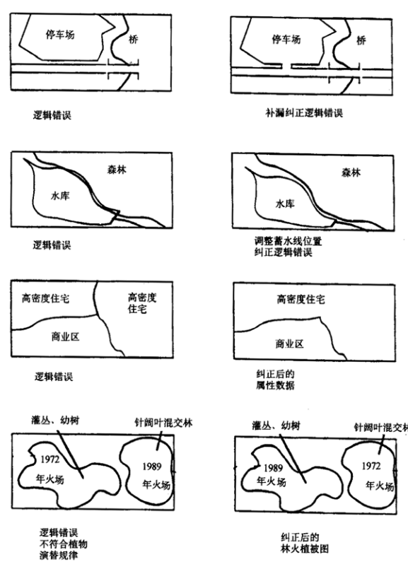
**几何误差**
点误差
线误差

**地图数据质量问题**

**遥感数据质量问题**

**测量数据的质量问题**

### GIS数据质量的研究方法

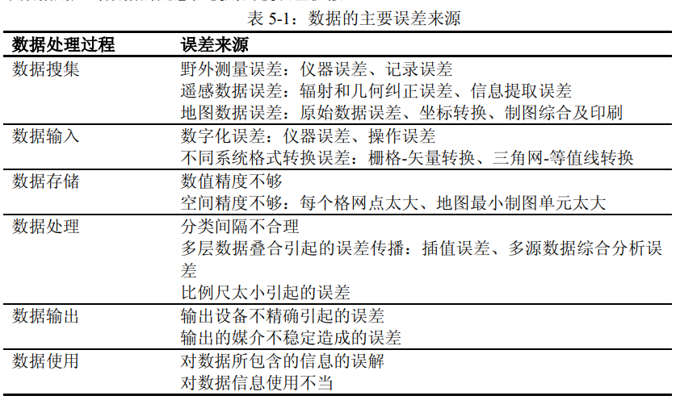

+ 传统手工方法
+ 元数据方法
+ 地理相关法

### 元数据
metadata
描述数据的数据。
在地理空间数据中，是说明数据质量/内容/状况和其他有关特征的背景信息。

### 空间数据的不确定性。

## 13 空间数据分析的计算模型
### 关于分析计算模型的一般知识
### GIS的空间计算模型。
## 14 空间查询与统计方法
### GIS常用的空间统计分析模型
### 空间数据的查询
+ 基于空间关系查询
+ 基于空间关系和属性特征查询
+ 地址匹配查询
### 属性数据的查询统计。

## 15 空间分析方法

### 常见三维数据空间分析方法
通视分析
一i那英分析
坡度坡向分析
地面建筑范围分析
天际线分析

### 栅格数据分析的基本模式
### 矢量数据分析的基本方法
### 网络分析应用

**链link**：网络中流动的管线，如街道/河流/水管等，状态属性包括阻力和需求。
**节点node**：网络中链的节点，如港口/车站/电站等
+ 障碍barrier：禁止网络中链上流动的点。
+ 拐点turn：出现在网络链上的分割节点上。
+ 中心center：接受或分配资源的位置。
+ 站点stop：在路径选择中资源增减的节点。

**主要功能**
+ **路径分析**
  + 静态求最佳路径
  + N条最佳路径分析
  + 最短路径或最低耗费路径
  + 动态最佳路径分析

### dijkstra算法计算最短路径

### 基于地形的空间分析。

### 缓冲区分析
临近度（proximity）描述了地理空间中两个地物距离相近的程度。

### 叠加分析
+ 点和多边形叠加
+ 线和多边形叠加
+ 多边形叠加
+ 
## 16 地理信息系统产品输出
### 包括地理信息系统产品的输出系统
### 地理信息系统产品的类型。
## 为什么prefer gis then 自然地理

我更想用更方便的计算机应用来解决实际问题。
我也很喜欢用地理思维来解决问题。
包括我其实很喜欢玩一款游戏叫城市天际线，他里面就可以模拟一个城市的整个运作系统。
我再里面经常遇到堵车的问题，这个是游戏的AI导致的，这个时候我就会从几个方面去考虑，一个我会想工业区，住宅区，商业区之间的位置布局是否合理，看下每个区域是否过大而导致通勤车辆增多，引发交通堵塞，什么样的布局能够实现这几个区域之间的循环流通，
另一个我就会去通过修改道路来缓解交通问题，通过架设立交或者增加次干道/人行道等方式来疏导交通。

虽然我知道实际生活中肯定情况是要加倍复杂的，但我就向刚才所说的，我很喜欢通过这种可视化的方式去获取处理分析地理信息和问题。
所以这也就是我也课余花时间接触了threejs。
因为我本身后端的语言目前掌握的不是很好，接触这个库一开始是看到他用javascript也能构造出一个场景，然后网上也看到了一些案例，就想着用他去做一下我的毕业设计也蛮不错。
Group思想：一开始是绕着子组件的旋转轴，后来发现可以把父组件的旋转轴移动，

包括我其实对算法，就数据结构不是很感冒，自己觉得自己也学得不是很好，但是我那天上网无意间搜了城市天际线的汽车寻路AI，发现有个算法叫天际线算法，就是skyline problem。我就深入学习了一下这个算法，后来发现这对我用计算机语言理解建筑高度和建筑位置关系很有用。

然后包括谷歌在中国大陆禁用之前，我也是很喜欢去看谷歌地图，我就记得那个时候看到

### 为什么选择数字孪生技术方向？

新型基础测绘向实体分级转变有效助力数字孪生建设。
在空间上，融合不同形态的基础地理空间要素；在时间上，融合历史/现状和动态监测数据；在语义上，融合地理实体的基本属性/实体关系和其他社会经济信息，形成以地理实体为基本单元的时空一体化数字孪生体。
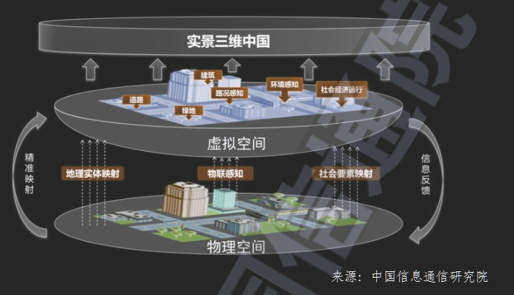
全息测绘利用空天一体倾斜摄影/激光扫描等多源传感技术获取全息地理实体要素，同故宫深度学习等AI技术自动半自动化提取建立地理实体的矢量/三维模型数据，形成地上地下/室内室外一体化全息高清/高精的结构化实体城市信息模型（CIM）。

**离线仿真逐步向实时数据驱动仿真转变**
传统仿真不具备未来预测推演功能，缺乏与实物的校验和交互，难以保证精确度和科学性。

**开发侧交互方面低代码构建技术提高开发场景效率**
数字孪生厂商将数字孪生的低代码构建作为关键竞争力要素，通过三维开发中频繁复用的功能或操作包装，实现低代码化。

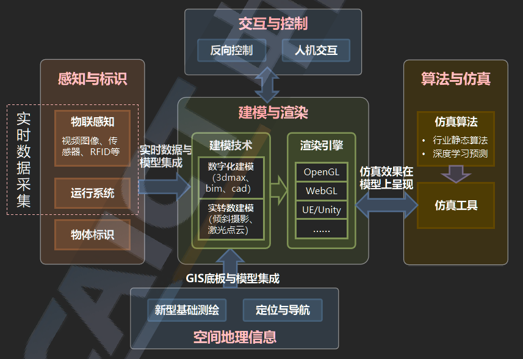

### 天际线算法skyline algorithm
给一个n*n个街区组成的城市，
grid[r][c]标识坐落在r行c列的建筑物的高度。

CIM建设

### 自我介绍
各位导师们好，很荣幸能参加今年贵校的复试。

我叫于佳志，来自广西桂林，曾就读于武汉科技大学资源与环境工程学院的人文地理与城乡规划专业。
在大学里，我决心在各方面提升自己。四年下来，我的本科平均绩点为3.21，通过了英语四六级考试，全国计算机二级考试，另外我还获得过两次全国大学生英语竞赛国家级三等奖。
本科就读期间，我修读了计算机科学与技术双学位，目前主要学习并应用了前端语言，
我从小就对地理比较感兴趣，特别喜欢看地图，出门也很留心观察身边的地物，自己也绘制过很多地图。（以前拿硬纸板做过很多立体地图）在学习的过程中，我发现将地理模型展示出来令我非常着迷。大二的时候，我还做过一个我在游戏中搭建一个城市的视频，探究他的技术发现是和WEBGIS紧密相连的，所以如果我能被贵校录取，我很希望能够投身于地理建模领域。
在社会实践方面，我在大学期间做过世界军人运动会场馆引导志愿者，。。
这些活动培养了我与人交流能力和抗压能力，锻炼了我从容应对问题的能力。

在课余活动方面，我做过两年学校大艺团舞蹈队队员，也在毕业生毕业晚会上表演过。大三搬到长江边校区后，我经常。。

### 对于地信未来的发展有什么看法？

**真实感渲染**
一提到渲染，人们都会说，Sketchup、3D max、BIM等三维建模软件不是都具有很强大的渲染功能吗？Vray等渲染器不很优秀吗？然而，在三维实景中国大背景下，我们不仅要关注单体化白模、更要关心一个建筑、一个小区、一个城市、乃至一个更大区域更大规模的三维场景，还要跨界融合。

## 课余爱好

### 

+ 可视化方面
  我现在也是刚了解cesium，

## 17 可视化方面的技术？
### 可视化的概念
是将抽象数据转换为几何图形的计算方法，便于研究者通过观察其模拟和计算过程和结果。
空间信息可视化是运用计算机图形学/地图学和图像处理技术，将空间信息输入/处理/查询/分析和预测的数据和结果，用符号/图像/图形，结合图表/文字/表格/视频等可视化形式显示，并进行交互处理的理论/方法和技术。
### 可视化的技术方法
### 三维虚拟GIS（VR-GIS）的应用。

## 18 地理信息系统工程设计
### 地理信息系统工程的设计模式与程序评价模式
### 地理信息系统工程设计的内容与过程
### 地理信息系统工程的系统分析
### 地理信息工程的系统设计
### 地理信息系统工程的实施设计
### 地理信息系统工程的运行维护设计。

## 19 理信息系统的标准化
### 地理信息系统标准化的作用
### 地理信息系统标准化的内容
## 21 空间信息基础设施与数字工程
### 空间数据基础设施

### “数字地球”的概念与框架
### “数字城市”的概念、框架和建设技术

**如何理解元宇宙三个发展阶段：数字孪生/数字原生/虚实共生？数字原生的核心是什么？**

苏奎峰（腾讯）
元宇宙除了面对具体用户，分为两个层面——针对产业和针对消费者
在形态上，产品平台和核心技术都有差异。
数字原生：用互联网技术为基础，强调云编端一体

虚实共生：

数据流/能源流/资金流

离不开数据驱动

**陈傲寒**
从地理信息系统背景衍生较多

**b站数字孪生城市和CIM**
城市信息模型发展和建设思路CIM

CIM模型
一级模型：地表模型
二级模型：框架模型
三级模型；实景模型
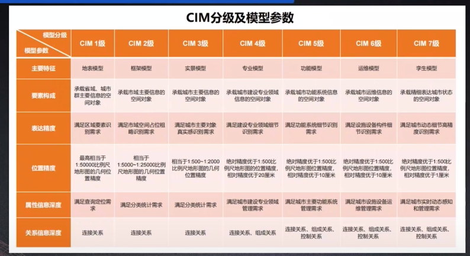

CIM数据治理路线
**源数据**
1.DEM DOM DLG
2.倾斜摄影模型
3.城市三维精细模型
4.BIM
5.房屋建筑和市政设施调查
6.市政设施功能图
7.房屋楼盘表
8.房屋建筑工程图
9.城市部件普查
10.地质模型

**预处理**
1.转换数据格式
2.统一空间参考
3.修正模型几何错误
4.修正模型材质
5.检查属性数据和拓扑关系

**CIM综合模型**
1.CIM - 7级分类模型单元构成合理，语义明确
2.模型单元几何结构多样
3.模型单元基础属性完整
4.模型单元间关系信息正确

**CIM表达模型**
1.LOD多级/最高级和综合模型对应（标识代码一致）
2.几何结构轻量化为三角网格，纹理和照明重构，可做效果增强
3.属性/关系通过标识代码指向综合模型相应库
4.几何结构可做脱密处理，属性/关系可选择脱密脱敏处理

**城市级CIM基础平台基本功能**
1.基础数据接入和管理
2.BIM等模型数据汇聚和融合
3.多场景模型浏览和定位查询
4.运行维护和网络安全管理
5.支撑CIM+平台应用的开发接口

平台
表达融合场景
超大场景
精细场景
模型交互

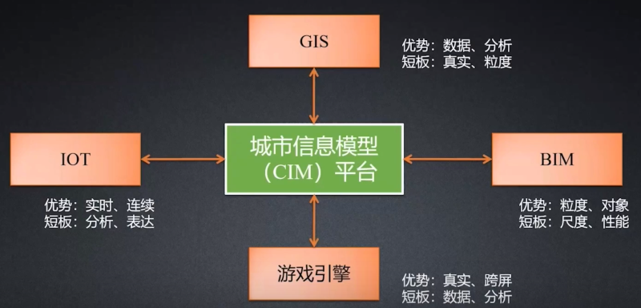

### 关键技术
1.建模
2.仿真
3.云计算和边缘计算
4.

### “数字流域”的概念和框架

## 25 地理时空大数据和云计算
### 时空大数据
指基于统一的时空基准/活动在时间和空间中和位置直接（定位）或间接（空间分布）相关联的大数据，由时空框架数据和时空变化数据两类数据组成，具有空间位置/时间/属性/尺度/分辨率/多样性/异构型/多维/价值隐含行/快速性等特性。
是机器学习的动力。保证数据质量从而保证算法。
### 云计算
用户需要多少CPU/内存/硬盘的虚拟电脑，只要通过一种叫做“调度”scheduler的算法的调度中心，就可以在池子里找到自己需要的信息资源，即Iaas（基础设施即服务），具有时间弹性和空间弹性。
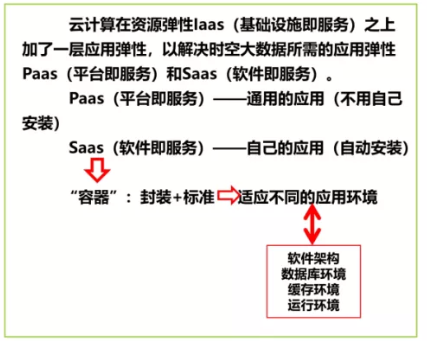

### 高精度导航
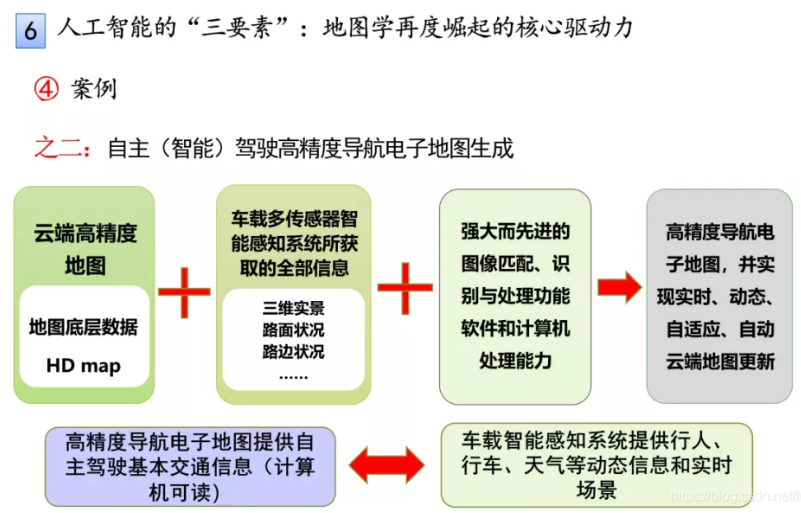

## 新型基础测绘和实景三维中国建设
### 新型基础测绘
以“基础地理实体”为核心
基础地理实体分类原则：
+ 基础性
+ 系统性
+ 可扩展性
+ 稳定性
**分类**
+ 自然地理实体
+ 人工地理实体
+ 管理地理实体

**几何精度指标**
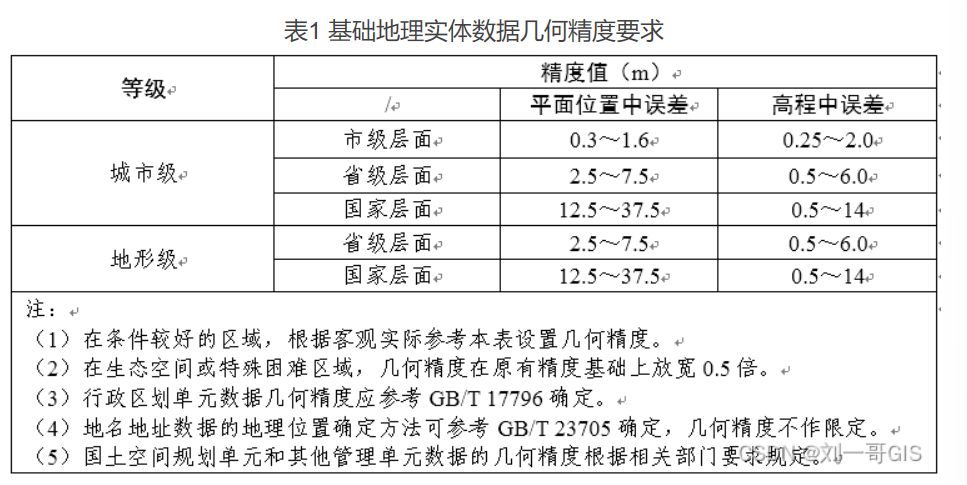

**分类代码**
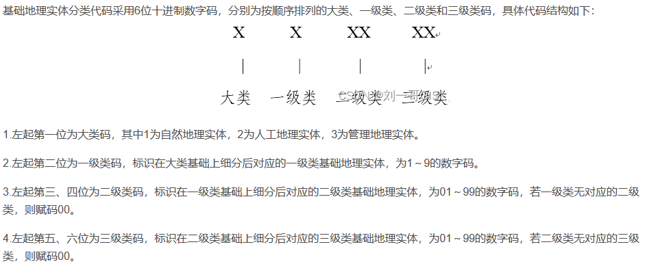

### 实景3维
对一定范围内人类生产、生活和生态空间进行真实、立体、时序化反映和表达的数字空间，是新型基础测绘的标准化产品，是国家重要的新型基础设施，为经济社会发展和各部门信息化提供统一的空间基底。

+ 城市级实景三维
  主要由倾斜摄影三维模型/激光点云/纹理等数据经实体化，融合实时感知数据构成，

### 语义化
用标准化范式对地理实体自身属性及实体间关系进行一致性描述，以实现计算机可识别/可理解/可操作的过程。

### 存量点/线/面数据，如何复用？如何三维化？
+ 符号化建模
  借助于建筑底面数据实现倾斜摄影分析查询。
  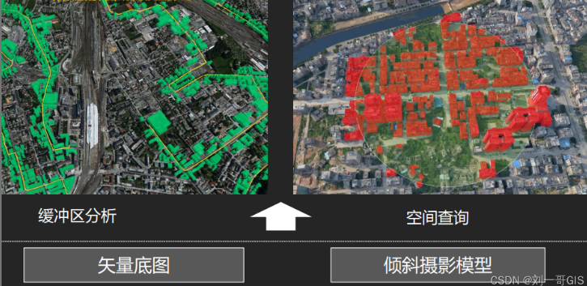

+ 参数化建模
  基于python的建模/esri的cityengine建模

+ 矢量地面+ 倾斜摄影模型，实现动态单体化
  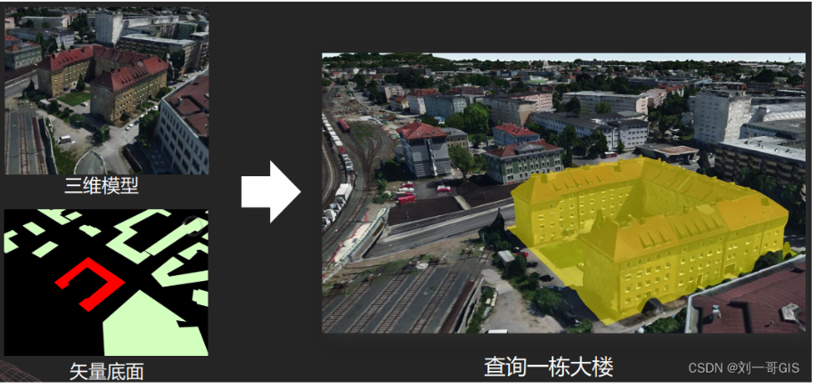

### 如何构建可分析/可计算的三维对象？
目前常用的三维空间数据模型：
+ 对象数据模型
+ 网络数据模型
+ 场数据模型
  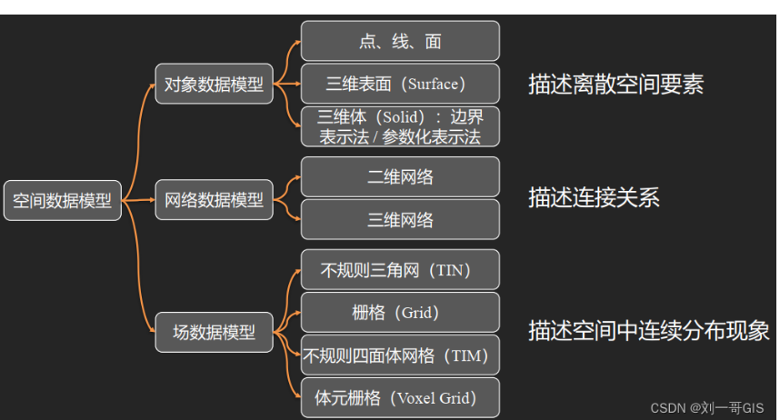

### 如何支撑大规模三维数据的管理和应用？
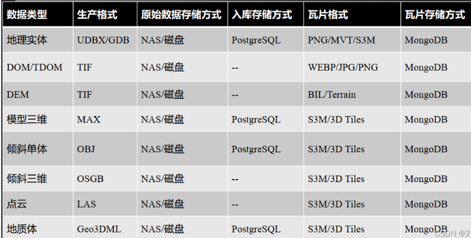

### 不同精度的实景三维数据，在三维场景中如何融合处理？
遥感（RS，Remote Sensing）所说的数据融合（dissolve），是一个对多遥感器的图像数据和其他信息的处理过程，它着重于把那些在空间或时间上冗余或互补的多源数据，按一定的规则（或算法）进行运算处理，获得比任何单一数据更精确、更丰富的信息，生成一幅具有新的空间、波谱、时间特征的合成图像。通常情况是指将空间分辨率更高的全色波段影像与空间分辨率较低的多光谱影像想融合，产生出分辨率高、纹理特性突出的影像，以达到图像增强的目的，进而满足定性定量遥感的研究需要。
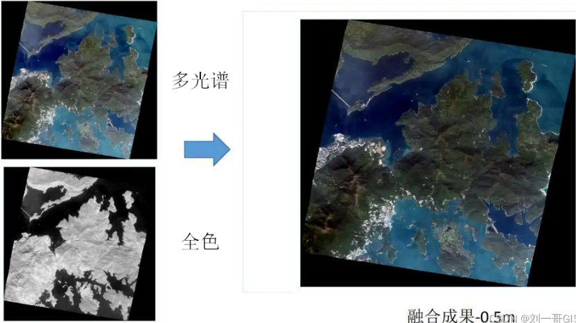

**三维数据融合**
+ **三维数据坐标转换**
  点云/倾斜摄影模型/BIM模型的坐标转换
  三维数据支持同名控制点配准
+ **多边形裁剪/多边形挖洞**
  多边形修改地形
  和三维体对象的布尔运算
+ **地形TIN的空间运算和操作**
+ 倾斜摄影模型的空间运算和操作
  地形级
  城市级
  部件级
+ 
  

## 计算机图形学
是GIS算法设计的基础。
GIS随着计算机图形学技术发展完善。
计算机图形学所处理图形数据是不包含地理属性的纯几何模型

## 空间自相关
是空间场中的数值聚集程度的一种量度。
（地理学第三定律）

## douglas-peucker算法

## 数据挖掘DATA mining
从数据中提取隐含的/先前不知道的和潜在有用的知识的过程。集成了机器学习/数据库系统/数据可视化/统计和信息理论等多领域最新的技术。
+ 数据选取
+ 数据转换
+ 数据挖掘
+ 结果解释

### 空间数据挖掘
+ 统计分析方法
+ 基于概括的方法
+ 聚类方法
+ 空间关联spatial association rule方法

## 地图服务
### OGC（open geospatial consortium）
开放地理空间信息联盟，制定了数据和服务的一系列标准，GIS厂商按照这个标准进行开发可保证空间数据的互操作，提供地理信息行业软件和数据及服务的标准化工作。(❁´◡`❁)

### WMS
利用具有地理空间位置的数据制作地图，其中将地图定义为地理数据的可视化表现，能够根据用户的请求，返回相应的地图，包括PNG，GIF，JPEG等栅格格式，或SVG等矢量格式。
在arcgis中发布mxd文件服务。

### WMTS
OpenGIS web map tile service,采用预定义图块方法发布数字地图服务的标准化方案。

### arcgis 切片缓存

## GIS存储数据库

## 空间插值
### 整体内插法

## THREE.JS
城市白膜数据获取
blender

下载时提示imageio module不在，

### shp shx dbf prj
+ shp 存储矢量数据的空间信息，保存元素的几何实体
+ shx 要素几何特征的索引文件，记录每个几何体在shp文件中的位置
+ dbf 存储矢量数据的属性信息
+ prj 存储坐标系信息的文件，由arcgis使用

## 课后有没有通过什么途径了解GIS前沿知识？

+ 关注了很多地学公众号
  GIS前沿/

## 

总评

如果能读研，

在接下来的几个月里，我要首先将自己的标准向研究生靠近。

1.数据库方面，学习postgis相关知识。我们当时上课数据库教的是access。

2.数学方面，通过学习概率论服务计量地理学研究水平。
在线性代数方面应用于地形分析，

## TOPO建立
**两种方法**
1.必须要在要素数据集下
拓扑
设置容差
添加参与到拓扑中的要素类
添加拓扑规则
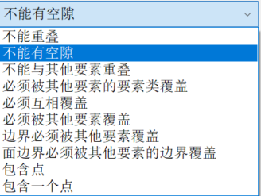

将拓扑错误拖动到图层中

按图层查看得到拓扑错误

添加拓扑工具栏
打开编辑状态
打开拓扑工具栏的错误检查器
将仅搜索可见范围花掉
立即搜索

2.在工具箱数据管理工具找到拓扑

## TOPO修正
参与拓扑检查的要素全部选中

## 空间校正

### 矢量数据空间要素矫正

选择空间校正工具
打开捕捉点
设置需要选择校正的要素
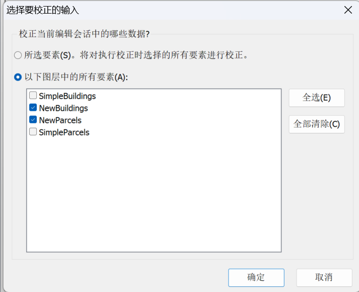
设置校正方法为相似
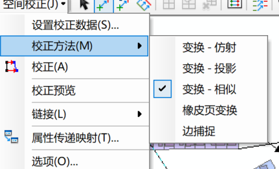

交点捕捉
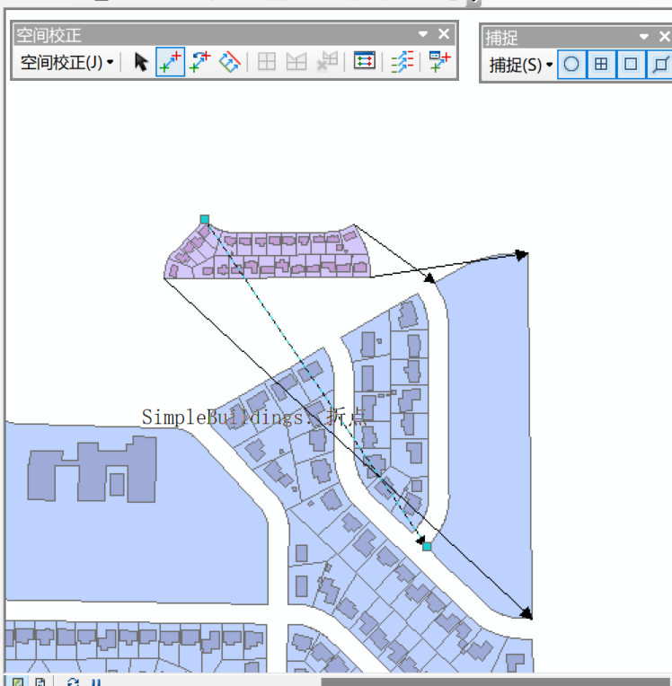

校正效果预览
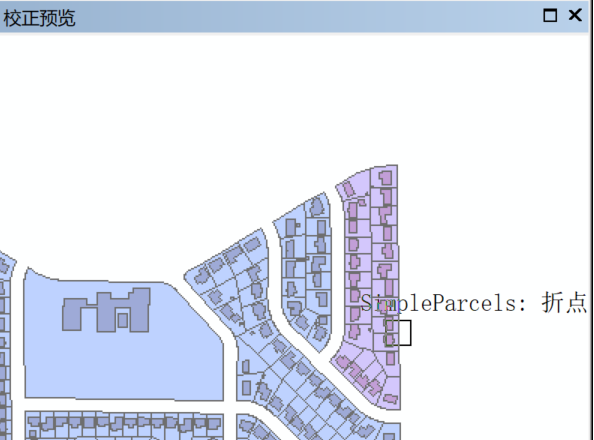

若对校正效果不满意

### 边匹配

空间校正选择边匹配
### 空间校正橡皮页匹配

对于点要素

对于曲线要素，选择多位移连接工具

选择新建标识连接工具将要素固定防止位移。

### 属性传递
用于将原图层要素属性传递给目标图层要素属性

打开编辑状态
打开空间矫正属性传递映射，选择原图层和目标图层

## 栅格数据提取 extraction s                                   sz

### 按掩模数据提取

### 栅格数据镶嵌（再看下）
打开两个航拍影像
打开工具箱镶嵌或镶嵌至新栅格
输入栅格添加要镶嵌的栅格

波段数和原始数据保持一致

### 地理配准-矢量到栅格

## 地形三维

在实际测量中，采集足够数量的离散点（如高程点），采用各种插值方法对地形进行模拟，建立GRID模型和TIN模型。

克里金法适用于科学研究地质研究

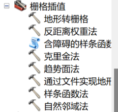

### 地形转栅格

### 坡度分析
输入数据
输出栅格
测量单位：
度degree0-90
z因子

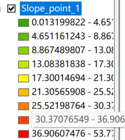

范围代表degree

### 通视分析
分析某一位置能否从另一位置可见
或两位置之间的某一位置是否可见

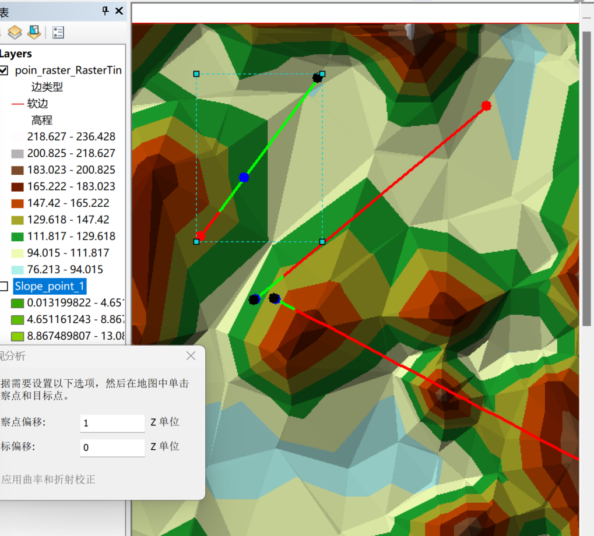
观察点偏移
观察点目标是否贴合地表面（如人）
目标偏移

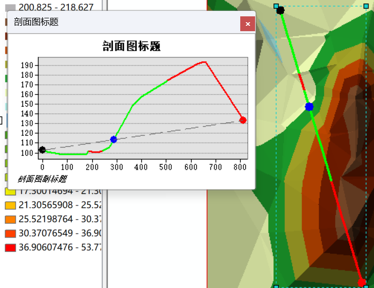

